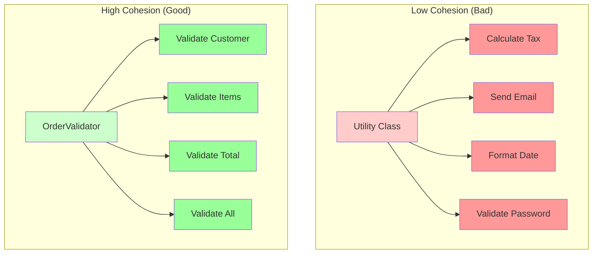

# Understanding Cohesion

**Cohesion** measures how well the elements within a single module work together to achieve a single, well-defined purpose. The goal is to achieve **high cohesion** - all elements in a module should work together toward a common goal.

## What is Cohesion?

Cohesion describes the **internal organization** of a module. When a module has high cohesion, all its elements (methods, fields, nested classes) work together to accomplish one clear purpose.

### The Core Idea

> **High Cohesion: All elements in a module work together toward a single, well-defined purpose.**

A cohesive module does one thing and does it well. All its parts contribute to that single purpose.

## Types of Cohesion

Cohesion can be categorized from worst to best:

### 1. Coincidental Cohesion (Worst)

Elements are grouped together arbitrarily with no meaningful relationship.

```java
// Bad: Coincidental Cohesion
public class Utility {
    public void calculateTax(double amount) {
        // Tax calculation
    }
    
    public void sendEmail(String address) {
        // Email sending
    }
    
    public void formatDate(Date date) {
        // Date formatting
    }
    
    public void validatePassword(String password) {
        // Password validation
    }
}
```

**Problems:**
- No clear purpose
- Elements are unrelated
- Hard to understand what the class does
- Changes to one element don't relate to others

### 2. Logical Cohesion

Elements are grouped because they perform similar operations, but they work on different data types.

```java
// Bad: Logical Cohesion
public class DataProcessor {
    public void processString(String data) {
        // Process string
    }
    
    public void processNumber(int data) {
        // Process number
    }
    
    public void processDate(Date data) {
        // Process date
    }
    
    public void processBoolean(boolean data) {
        // Process boolean
    }
}
```

**Problems:**
- Methods are similar in structure but work on different types
- No clear single purpose
- Hard to understand when to use which method

### 3. Temporal Cohesion

Elements are grouped because they are executed at the same time, but they're not otherwise related.

```java
// Bad: Temporal Cohesion
public class Initialization {
    public void initializeDatabase() {
        // Database setup
    }
    
    public void initializeCache() {
        // Cache setup
    }
    
    public void initializeLogger() {
        // Logger setup
    }
    
    public void initializeEmailService() {
        // Email service setup
    }
}
```

**Problems:**
- Elements are related only by timing
- No functional relationship
- Hard to maintain (what if initialization order changes?)

### 4. Procedural Cohesion

Elements are grouped because they execute in a specific sequence, but they work on different data.

```java
// Bad: Procedural Cohesion
public class OrderWorkflow {
    public void validateOrder(Order order) {
        // Validation
    }
    
    public void calculateTotal(Order order) {
        // Calculation
    }
    
    public void sendConfirmation(Order order) {
        // Sending
    }
    
    public void updateInventory(Order order) {
        // Inventory update
    }
}
```

**Problems:**
- Elements are related by sequence, not by purpose
- Each method could belong to a different class
- Hard to reuse individual steps

### 5. Communicational Cohesion

Elements are grouped because they operate on the same data, but they don't necessarily work toward the same goal.

```java
// Bad: Communicational Cohesion
public class UserData {
    private User user;
    
    public void updateName(String name) {
        user.setName(name);
    }
    
    public void updateEmail(String email) {
        user.setEmail(email);
    }
    
    public void printUser() {
        System.out.println(user);
    }
    
    public void validateUser() {
        // Validation
    }
    
    public void sendWelcomeEmail() {
        // Email sending
    }
}
```

**Problems:**
- Methods work on same data but serve different purposes
- Mixing data access, validation, and communication
- Not a single, clear responsibility

### 6. Sequential Cohesion

Elements are grouped because the output of one is the input of the next, forming a pipeline.

```java
// Better: Sequential Cohesion
public class DataPipeline {
    public String readData() {
        // Read from source
    }
    
    public String transformData(String data) {
        // Transform
    }
    
    public void saveData(String data) {
        // Save transformed data
    }
}
```

**Still not ideal:**
- Elements are related by data flow, but serve different purposes
- Could be split into separate classes (Reader, Transformer, Writer)

### 7. Functional Cohesion (Best)

All elements work together to accomplish a single, well-defined task.

```java
// Good: Functional Cohesion
public class OrderValidator {
    private boolean isValidCustomer(Order order) {
        return order.getCustomer() != null;
    }
    
    private boolean isValidItems(Order order) {
        return !order.getItems().isEmpty();
    }
    
    private boolean isValidTotal(Order order) {
        return order.getTotal() > 0;
    }
    
    public boolean validate(Order order) {
        return isValidCustomer(order) 
            && isValidItems(order) 
            && isValidTotal(order);
    }
}
```

**Benefits:**
- All methods work toward one purpose: validation
- Clear, single responsibility
- Easy to understand and test
- Easy to reuse

## Problems with Low Cohesion

### 1. Hard to Understand

Low cohesion makes it unclear what a module does:

```java
// What does this class do?
public class Utility {
    public void calculateTax(double amount) { }
    public void sendEmail(String address) { }
    public void formatDate(Date date) { }
    public void validatePassword(String password) { }
    public void processPayment(Payment payment) { }
    public void generateReport(Data data) { }
}
```

### 2. Hard to Maintain

Changes to one element don't relate to others:

```java
// Changing email logic doesn't relate to tax calculation
public class Utility {
    public void calculateTax(double amount) {
        // Tax logic changes
    }
    
    public void sendEmail(String address) {
        // Email logic - unrelated to tax
    }
}
```

### 3. Hard to Reuse

You can't reuse parts independently:

```java
// Want to use tax calculation? Must include email, date formatting, etc.
public class Utility {
    // Everything bundled together
}
```

### 4. Violates Single Responsibility

Low cohesion often means multiple responsibilities:

```java
// Does validation, calculation, communication, and persistence
public class OrderProcessor {
    public void validate(Order order) { }
    public void calculate(Order order) { }
    public void sendEmail(Order order) { }
    public void save(Order order) { }
}
```

## Achieving High Cohesion

### 1. Single Responsibility

Each class should have one reason to change:

```java
// Good: High Cohesion - Single Responsibility
public class OrderValidator {
    public boolean validate(Order order) {
        return isValidCustomer(order) 
            && isValidItems(order) 
            && isValidTotal(order);
    }
    
    private boolean isValidCustomer(Order order) { }
    private boolean isValidItems(Order order) { }
    private boolean isValidTotal(Order order) { }
}
```

### 2. Group Related Functionality

Keep related methods together:

```java
// Good: All methods work together for order calculation
public class OrderCalculator {
    public double calculateSubtotal(Order order) {
        // Calculate subtotal
    }
    
    public double calculateTax(Order order) {
        // Calculate tax
    }
    
    public double calculateShipping(Order order) {
        // Calculate shipping
    }
    
    public double calculateTotal(Order order) {
        return calculateSubtotal(order) 
            + calculateTax(order) 
            + calculateShipping(order);
    }
}
```

### 3. Extract Unrelated Functionality

Move unrelated methods to separate classes:

```java
// Bad: Low Cohesion
public class OrderService {
    public void processOrder(Order order) { }
    public void sendEmail(String address) { }  // Unrelated!
    public void generateReport(Data data) { }   // Unrelated!
}

// Good: High Cohesion
public class OrderService {
    public void processOrder(Order order) { }
}

public class EmailService {
    public void sendEmail(String address) { }
}

public class ReportService {
    public void generateReport(Data data) { }
}
```

### 4. Use Helper Methods

Break down complex operations into related helper methods:

```java
// Good: High Cohesion - Helper methods support main purpose
public class OrderProcessor {
    public void processOrder(Order order) {
        validateOrder(order);
        calculateTotals(order);
        applyDiscounts(order);
        saveOrder(order);
    }
    
    private void validateOrder(Order order) { }
    private void calculateTotals(Order order) { }
    private void applyDiscounts(Order order) { }
    private void saveOrder(Order order) { }
}
```

## Visualizing Cohesion



## Summary

Cohesion measures how well elements within a module work together:

- **Low Cohesion (Bad):** Elements are unrelated or serve multiple purposes
- **High Cohesion (Good):** All elements work toward a single, clear purpose

To achieve high cohesion:
- Follow Single Responsibility Principle
- Group related functionality
- Extract unrelated functionality
- Use helper methods to support main purpose

High cohesion makes your code easier to understand, maintain, and reuse.

