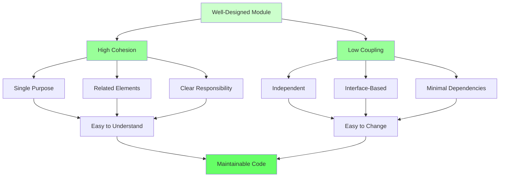

# The Relationship: Coupling and Cohesion Together

Coupling and Cohesion work together to create well-designed software. Understanding their relationship is key to achieving good design.

## The Fundamental Relationship

> **Low Coupling and High Cohesion are complementary goals.**

They work together to create modules that are:
- **Independent** (low coupling) - Can change without affecting others
- **Focused** (high cohesion) - Have a single, clear purpose

## The Design Matrix

You can visualize the relationship between coupling and cohesion:

```
                    High Cohesion          Low Cohesion
                  
High Coupling    │  ❌ Worst Case      │  ❌ Very Bad
                 │  Tightly connected  │  Tightly connected
                 │  but focused        │  and unfocused
                 │                     │
                 ├─────────────────────┼─────────────────────
                 │                     │
Low Coupling     │  ✅ Best Case       │  ⚠️  Acceptable
                 │  Independent        │  Independent
                 │  and focused        │  but unfocused
```

### Best Case: Low Coupling + High Cohesion

```java
// Low Coupling: Depends on interface, not implementation
// High Cohesion: All methods work together for order validation
public class OrderValidator {
    private IOrderRepository repository;  // Interface, not concrete class
    
    public OrderValidator(IOrderRepository repository) {
        this.repository = repository;  // Dependency injection
    }
    
    public boolean validate(Order order) {
        return isValidCustomer(order) 
            && isValidItems(order) 
            && isValidTotal(order)
            && isNotDuplicate(order);
    }
    
    private boolean isValidCustomer(Order order) {
        return order.getCustomer() != null;
    }
    
    private boolean isValidItems(Order order) {
        return !order.getItems().isEmpty();
    }
    
    private boolean isValidTotal(Order order) {
        return order.getTotal() > 0;
    }
    
    private boolean isNotDuplicate(Order order) {
        return !repository.exists(order.getId());
    }
}
```

**Benefits:**
- Easy to test (can inject mock repository)
- Easy to change (can swap repository implementation)
- Easy to understand (single, clear purpose)
- Easy to reuse (independent and focused)

### Worst Case: High Coupling + Low Cohesion

```java
// High Coupling: Directly depends on concrete classes
// Low Cohesion: Mixes validation, calculation, email, and persistence
public class OrderProcessor {
    private MySQLDatabase database;  // Concrete class, not interface
    private GmailEmailService emailService;  // Concrete class
    private FileLogger logger;  // Concrete class
    
    public void processOrder(Order order) {
        // Validation (should be separate)
        if (order.getCustomer() == null) {
            throw new IllegalArgumentException();
        }
        
        // Calculation (should be separate)
        double total = 0;
        for (Item item : order.getItems()) {
            total += item.getPrice();
        }
        
        // Email (should be separate)
        emailService.sendGmail(order.getCustomer().getEmail(), "Order confirmed");
        
        // Persistence (should be separate)
        database.executeSQL("INSERT INTO orders ...");
        
        // Logging (should be separate)
        logger.writeToFile("Order processed: " + order.getId());
    }
}
```

**Problems:**
- Hard to test (requires real database, email service, file system)
- Hard to change (tightly coupled to specific implementations)
- Hard to understand (does too many things)
- Hard to reuse (can't use parts independently)

## How They Work Together

### High Cohesion Enables Low Coupling

When modules are highly cohesive (focused on one thing), they need fewer connections to other modules:

```java
// High Cohesion: OrderValidator only validates
public class OrderValidator {
    public boolean validate(Order order) {
        // Only needs order data, nothing else
        return isValid(order);
    }
}

// Low Coupling: Other modules only depend on validation result
public class OrderService {
    private OrderValidator validator;
    
    public void processOrder(Order order) {
        if (validator.validate(order)) {  // Simple interface
            // Process order
        }
    }
}
```

### Low Coupling Enables High Cohesion

When modules are loosely coupled (independent), they can focus on their own responsibility:

```java
// Low Coupling: OrderService doesn't know about database details
public class OrderService {
    private IRepository repository;  // Interface, not implementation
    
    public void processOrder(Order order) {
        // High Cohesion: Focuses only on order processing logic
        validateOrder(order);
        calculateTotals(order);
        applyDiscounts(order);
        repository.save(order);  // Simple interface
    }
}
```

## The Trade-off

Sometimes you face a choice between coupling and cohesion:

### Example: Data Transfer Objects

```java
// Option 1: Low Coupling, Lower Cohesion
public class OrderService {
    public void processOrder(String customerName, String customerEmail, 
                           List<String> itemNames, List<Double> itemPrices) {
        // Many parameters = lower cohesion
        // But doesn't depend on Order class = lower coupling
    }
}

// Option 2: Higher Coupling, Higher Cohesion
public class OrderService {
    public void processOrder(Order order) {
        // Single parameter = higher cohesion
        // But depends on Order class = higher coupling
    }
}
```

**Solution:** Use a DTO (Data Transfer Object) to balance both:

```java
// Best: Low Coupling (interface), High Cohesion (single parameter)
public interface IOrder {
    String getCustomerName();
    String getCustomerEmail();
    List<IItem> getItems();
}

public class OrderService {
    public void processOrder(IOrder order) {  // Interface, not concrete class
        // High cohesion: Single, focused parameter
        // Low coupling: Depends on interface, not implementation
    }
}
```

## Practical Guidelines

### 1. Start with High Cohesion

Design modules with a single, clear purpose:

```java
// Good: High Cohesion
public class OrderValidator {
    // All methods work together for validation
}
```

### 2. Then Achieve Low Coupling

Connect modules through well-defined interfaces:

```java
// Good: Low Coupling
public class OrderService {
    private IOrderValidator validator;  // Interface, not concrete class
}
```

### 3. When in Doubt, Favor High Cohesion

High cohesion is often more important than low coupling:

```java
// Better: High Cohesion (even with some coupling)
public class OrderProcessor {
    public void processOrder(Order order) {
        // All methods work together
        validate(order);
        calculate(order);
        save(order);
    }
}

// Worse: Low Cohesion (even with low coupling)
public class Utility {
    public void calculateTax(double amount) { }
    public void sendEmail(String address) { }
    public void formatDate(Date date) { }
}
```

## Visualizing the Relationship



## Summary

Coupling and Cohesion work together:

- **High Cohesion** makes modules focused and clear
- **Low Coupling** makes modules independent and flexible
- **Together** they create maintainable, testable, reusable code

**The Goal:** Low Coupling + High Cohesion = Well-Designed Software

When designing:
1. Start with high cohesion (single purpose)
2. Then achieve low coupling (independent interfaces)
3. Balance both for optimal design

