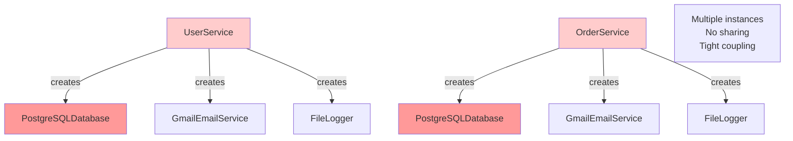

# The Problem: Direct Dependencies

Without dependency injection, classes create their own dependencies. This creates several problems that make code hard to test, maintain, and change.

## The Anti-Pattern: "New is Glue"

The problem is using the `new` keyword inside classes to create dependencies:

```java
// Bad: Creating dependencies directly
public class UserService {
    private Database database;
    
    public UserService() {
        this.database = new PostgreSQLDatabase();  // "New is glue"
    }
    
    public void saveUser(User user) {
        database.save(user);
    }
}
```

This is the **"New is Glue"** anti-pattern - your class is permanently glued to that specific implementation.

## Problem 1: Hard to Test

The biggest problem: **You cannot unit test without real dependencies.**

```java
public class UserService {
    private Database database;
    
    public UserService() {
        this.database = new PostgreSQLDatabase();  // Real database!
    }
    
    public void saveUser(User user) {
        database.save(user);
    }
}

// Testing is difficult:
@Test
public void testSaveUser() {
    UserService service = new UserService();
    // Problem: This creates a REAL database connection!
    // - Requires database to be running
    // - Requires database setup/teardown
    // - Tests are slow
    // - Tests are fragile
    service.saveUser(new User("John", "john@example.com"));
}
```

**Problems:**
- Requires real database to be running
- Tests are slow (database I/O)
- Tests are fragile (database state issues)
- Cannot test in isolation
- Cannot test error scenarios easily

## Problem 2: Tight Coupling

Classes are tightly coupled to specific implementations:

```java
public class UserService {
    private PostgreSQLDatabase database;  // Concrete class!
    
    public UserService() {
        this.database = new PostgreSQLDatabase();
    }
}

// If you want to switch to MySQL:
public class UserService {
    private MySQLDatabase database;  // Must change the class!
    
    public UserService() {
        this.database = new MySQLDatabase();  // Must change code!
    }
}
```

**Problems:**
- Must modify code to change implementations
- Violates Open/Closed Principle
- Creates ripple effects through the codebase

## Problem 3: Hard to Reuse

Classes cannot be reused in different contexts:

```java
public class OrderService {
    private PostgreSQLDatabase database;
    
    public OrderService() {
        this.database = new PostgreSQLDatabase();  // Always PostgreSQL
    }
}

// Cannot use OrderService with:
// - Different database
// - In-memory database for testing
// - Mock database for unit tests
// - Different environment (dev, test, prod)
```

## Problem 4: Violates Dependency Inversion Principle

Direct dependencies violate DIP:

```java
// High-level module depends on low-level module
public class UserService {  // High-level (business logic)
    private PostgreSQLDatabase database;  // Low-level (infrastructure)
    
    public UserService() {
        this.database = new PostgreSQLDatabase();
    }
}
```

**DIP Violation:**
- High-level `UserService` depends directly on low-level `PostgreSQLDatabase`
- Should depend on abstraction instead

## Problem 5: Hidden Dependencies

Dependencies are hidden inside the class:

```java
public class UserService {
    private Database database;
    private EmailService emailService;
    private Logger logger;
    
    public UserService() {
        this.database = new PostgreSQLDatabase();  // Hidden!
        this.emailService = new GmailEmailService();  // Hidden!
        this.logger = new FileLogger();  // Hidden!
    }
    
    public void createUser(User user) {
        database.save(user);
        emailService.sendWelcomeEmail(user.getEmail());
        logger.log("User created: " + user.getName());
    }
}
```

**Problems:**
- Cannot see what dependencies a class has
- Cannot control dependencies from outside
- Hard to understand class requirements
- Hard to configure for different environments

## Problem 6: Lifecycle Management

Classes manage the lifecycle of their dependencies:

```java
public class UserService {
    private Database database;
    
    public UserService() {
        this.database = new PostgreSQLDatabase();
        // Who closes the database?
        // When does it close?
        // What if multiple services use the same database?
    }
}
```

**Problems:**
- Each service creates its own database connection
- No shared resources
- No control over lifecycle
- Resource leaks possible

## Visualizing the Problem



## The "Testing Wall"

The most practical problem: **The Testing Wall**

If you use `new` inside your class, you **cannot** unit test that class without:
- Real database connections
- Real network services
- Real file systems
- Real external dependencies

This makes testing:
- **Slow** - Real I/O operations
- **Fragile** - External dependencies can fail
- **Complex** - Requires setup and teardown
- **Expensive** - Requires infrastructure

## Summary

Direct dependencies (creating objects with `new`) cause:

1. **Hard to test** - Cannot inject mocks
2. **Tight coupling** - Glued to specific implementations
3. **Hard to change** - Must modify code to swap implementations
4. **Hard to reuse** - Cannot use in different contexts
5. **Violates DIP** - Depends on concrete classes, not abstractions
6. **Hidden dependencies** - Dependencies are not visible
7. **Lifecycle issues** - No control over resource management

The solution is **Dependency Injection** - provide dependencies from outside rather than creating them inside.

