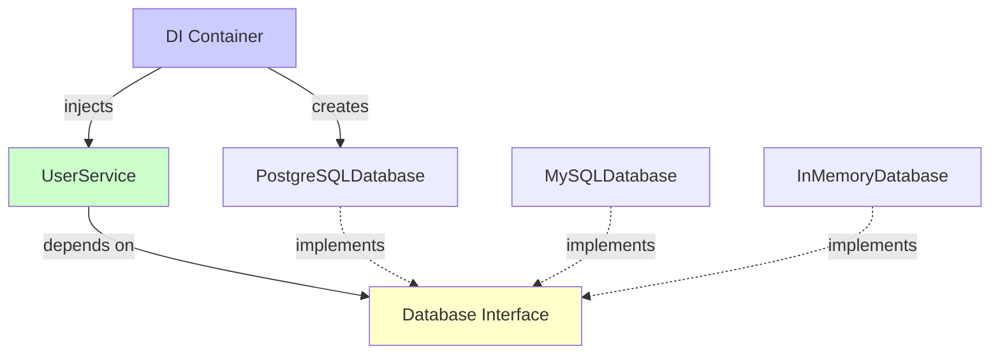

# The Solution: Dependency Injection

Dependency Injection solves the problems of direct dependencies by providing dependencies from outside the class.

## The Core Concept

Instead of a class creating its own dependencies, dependencies are **injected** into the class:

```java
// Bad: Class creates dependencies
public class UserService {
    private Database database;
    
    public UserService() {
        this.database = new PostgreSQLDatabase();  // Creates it
    }
}

// Good: Dependencies are injected
public class UserService {
    private Database database;
    
    public UserService(Database database) {  // Receives it
        this.database = database;
    }
}
```

## Three Ways to Inject Dependencies

There are three main ways to inject dependencies:

### 1. Constructor Injection (Recommended)

Dependencies are provided through the constructor:

```java
public class UserService {
    private Database database;
    private EmailService emailService;
    
    // Dependencies injected via constructor
    public UserService(Database database, EmailService emailService) {
        this.database = database;
        this.emailService = emailService;
    }
    
    public void createUser(User user) {
        database.save(user);
        emailService.sendWelcomeEmail(user.getEmail());
    }
}

// Usage:
Database db = new PostgreSQLDatabase();
EmailService email = new GmailEmailService();
UserService service = new UserService(db, email);  // Inject dependencies
```

**Benefits:**
- Dependencies are required (cannot create object without them)
- Immutable (dependencies don't change after construction)
- Clear what dependencies are needed
- Easy to test

### 2. Setter Injection

Dependencies are provided through setter methods:

```java
public class UserService {
    private Database database;
    private EmailService emailService;
    
    // Dependencies injected via setters
    public void setDatabase(Database database) {
        this.database = database;
    }
    
    public void setEmailService(EmailService emailService) {
        this.emailService = emailService;
    }
    
    public void createUser(User user) {
        database.save(user);
        emailService.sendWelcomeEmail(user.getEmail());
    }
}

// Usage:
UserService service = new UserService();
service.setDatabase(new PostgreSQLDatabase());
service.setEmailService(new GmailEmailService());
```

**Benefits:**
- Dependencies can be changed after construction
- Optional dependencies possible
- More flexible

**Drawbacks:**
- Dependencies might not be set (null checks needed)
- Object can be in invalid state
- Less clear what's required

### 3. Interface Injection

Dependencies are provided through an interface:

```java
public interface DatabaseInjectable {
    void injectDatabase(Database database);
}

public class UserService implements DatabaseInjectable {
    private Database database;
    
    @Override
    public void injectDatabase(Database database) {
        this.database = database;
    }
}
```

**Note:** This is less common and usually not recommended. Constructor injection is preferred.

## Constructor Injection: The Best Practice

Constructor injection is generally the best choice because:

1. **Required Dependencies** - Cannot create object without them
2. **Immutable** - Dependencies don't change after construction
3. **Clear Contract** - Constructor signature shows what's needed
4. **Easy to Test** - Simple to provide mocks in tests
5. **Thread-Safe** - No setter race conditions

```java
// Best Practice: Constructor Injection
public class UserService {
    private final Database database;  // final = immutable
    private final EmailService emailService;
    
    public UserService(Database database, EmailService emailService) {
        if (database == null || emailService == null) {
            throw new IllegalArgumentException("Dependencies cannot be null");
        }
        this.database = database;
        this.emailService = emailService;
    }
}
```

## How Dependency Injection Solves Problems

### Problem 1: Testing → Solved

```java
// Easy to test with mocks
@Test
public void testCreateUser() {
    // Inject mock dependencies
    Database mockDb = mock(Database.class);
    EmailService mockEmail = mock(EmailService.class);
    
    UserService service = new UserService(mockDb, mockEmail);
    
    User user = new User("John", "john@example.com");
    service.createUser(user);
    
    // Verify interactions
    verify(mockDb).save(user);
    verify(mockEmail).sendWelcomeEmail("john@example.com");
}
```

### Problem 2: Tight Coupling → Solved

```java
// Depends on interface, not implementation
public class UserService {
    private Database database;  // Interface!
    
    public UserService(Database database) {
        this.database = database;  // Any implementation works
    }
}

// Can use any Database implementation:
UserService service1 = new UserService(new PostgreSQLDatabase());
UserService service2 = new UserService(new MySQLDatabase());
UserService service3 = new UserService(new InMemoryDatabase());
```

### Problem 3: Hard to Change → Solved

```java
// Change implementation without modifying code
// Just inject different implementation:
Database db = new MySQLDatabase();  // Changed here
UserService service = new UserService(db);
```

### Problem 4: DIP Violation → Solved

```java
// High-level module depends on abstraction
public class UserService {  // High-level
    private Database database;  // Abstraction (interface)
    
    public UserService(Database database) {
        this.database = database;
    }
}

// Low-level module implements abstraction
public class PostgreSQLDatabase implements Database {  // Low-level
    // Implementation
}
```

## Dependency Injection Containers

For larger applications, you might use a **Dependency Injection Container** (also called IoC Container):

### Manual Injection (Small Projects)

```java
// Create dependencies manually
Database db = new PostgreSQLDatabase();
EmailService email = new GmailEmailService();
UserService service = new UserService(db, email);
```

### DI Container (Larger Projects)

```java
// Container manages dependencies
@Configuration
public class AppConfig {
    @Bean
    public Database database() {
        return new PostgreSQLDatabase();
    }
    
    @Bean
    public EmailService emailService() {
        return new GmailEmailService();
    }
    
    @Bean
    public UserService userService(Database db, EmailService email) {
        return new UserService(db, email);
    }
}

// Container automatically injects dependencies
@Autowired
private UserService userService;  // Dependencies injected automatically
```

**Popular DI Containers:**
- Spring (Java)
- Guice (Java)
- Dagger (Java/Android)
- Unity (C#)
- Ninject (.NET)

## Visualizing the Solution



## Summary

Dependency Injection solves the problems of direct dependencies:

1. **Constructor Injection** - Best practice, dependencies required
2. **Setter Injection** - More flexible, but less safe
3. **Interface Injection** - Less common

**Benefits:**
- Easy to test (inject mocks)
- Loose coupling (depend on interfaces)
- Easy to change (swap implementations)
- Follows DIP (depend on abstractions)
- Clear dependencies (constructor shows requirements)

**The key:** Dependencies come from outside, not from inside.

