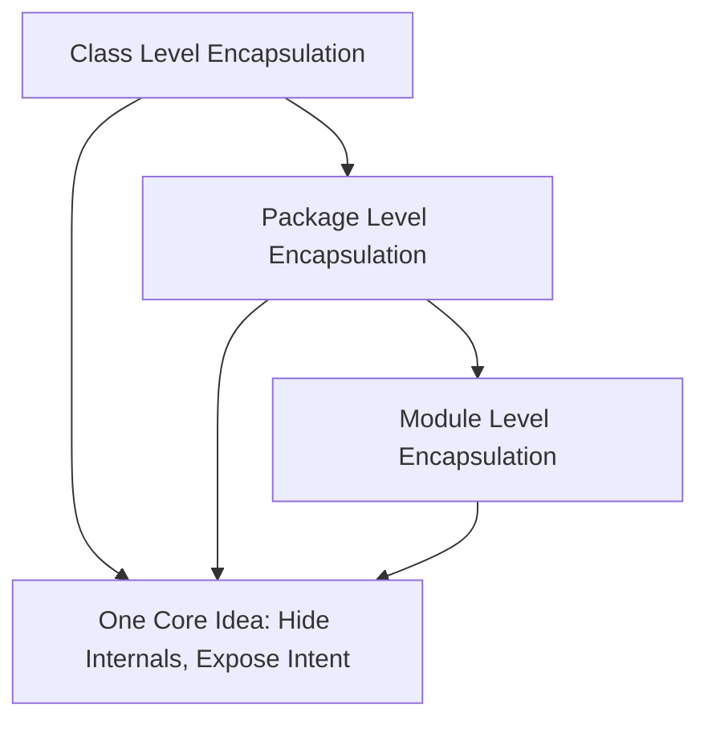

# Encapsulation Across Levels

You already know encapsulation at class level: fields are private, behavior (methods) is public, and internal details are hidden.

This allows us to rework the internal details of the class, without breaking the code that uses the class.

In this learning path, we lift that same idea to larger boundaries:

- class level
- package level
- module level (briefly)

## Encapsulation Is Not Only About `private`

**At class level:**

- Internal state is hidden, i.e. private fields.
- Public methods define what others can do.
- Callers use behavior, not internal details.

**At package level:**

- Internal classes and sub-packages should be treated as implementation details.
- A package should expose a clear and small public surface.
- Other packages should depend on that surface, not on nested internals.


Consider a package tree, like this:

```console
src/
└── com/example/shop/
    ├── presentation/
    ├── application/
    │   ├── api/
    │   │   ├── PlaceOrderUseCase.java
    │   │   └── GetOrderUseCase.java
    │   └── internal/
    │       ├── validation/
    │       │   ├── OrderValidationRule.java
    │       │   └── PaymentValidationRule.java
    │       └── workflow/
    │           ├── order/
    │           │   ├── creation/
    │           │   │   └── OrderCreationWorkflow.java
    │           │   └── cancellation/
    │           │       └── OrderCancellationWorkflow.java
    │           └── payment/
    │               ├── authorization/
    │               │   └── PaymentAuthorizationWorkflow.java
    │               └── settlement/
    │                   └── PaymentSettlementWorkflow.java
    └── persistence/
```

The `application` package defines a _layer_. And we can say the `api` package is the public surface of that layer. Other deeper packages are internal to the layer, and should not be used by other layers.

Often the surface is a package of interfaces and DTOs (Data Transfer Objects). This acts as a boundary between layers.

**At module level:**

A module is a larger boundary than a package. It is a collection of packages that are related to each other. In Java it is called a module, in .NET it is called a project. Different languages have different names for this. But seems to be a common concept.

- Multiple packages can be grouped into larger boundaries.
- The same idea still applies: expose intended parts, hide internals.

## Why This Matters in Layered Architecture

In a three-layer architecture, we usually have packages like this:

```console
src/
└── com/example/shop/
    ├── presentation/
    ├── application/
    └── domain/
```

As systems grow, each layer often gets nested packages. That is where accidental "leakage" often starts.


## Big Picture



## Quick Summary

Encapsulation is the same design idea repeated at different scales: define a boundary, expose intentional behavior, and hide implementation details behind that boundary.

