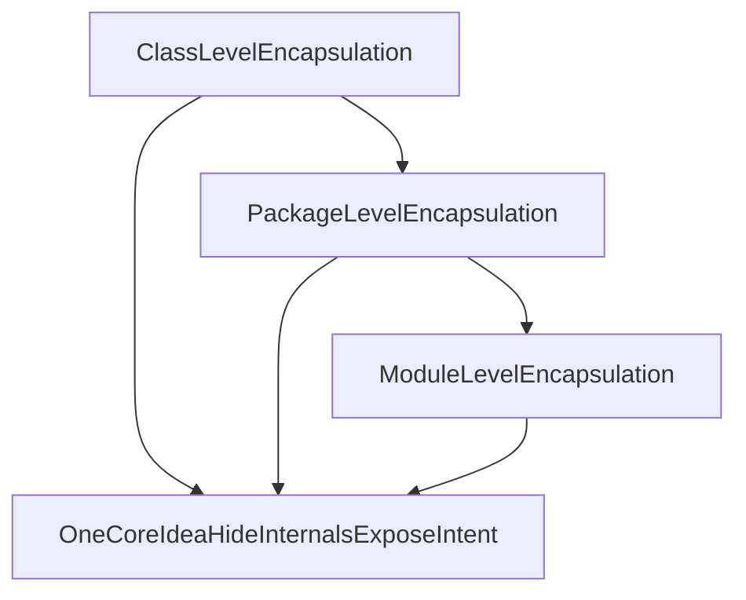

# Encapsulation Across Levels

You already know encapsulation at class level: fields are private, behavior is public, and internal details are hidden.

In this learning path, we lift that same idea to larger boundaries:

- class level
- package level
- module level (briefly)

## Encapsulation Is Not Only About `private`

At class level:

- Internal state is hidden.
- Public methods define what others can do.
- Callers use behavior, not internal details.

At package level:

- Internal classes and sub-packages should be treated as implementation details.
- A package should expose a clear and small public surface.
- Other packages should depend on that surface, not on nested internals.

At module level:

- Multiple packages can be grouped into larger boundaries.
- The same idea still applies: expose intended parts, hide internals.

## Why This Matters in Layered Architecture

In a three-layer architecture, we usually have packages like this:

```console
src/
└── com/example/shop/
    ├── presentation/
    ├── application/
    └── domain/
```

As systems grow, each layer often gets nested packages. That is where accidental leakage often starts.

## Learning Path Overview

In the next articles, we will cover:

1. Package-level encapsulation and public package surface.
2. Shallow vs deep package references.
3. Leakage through return types (a subtle but common problem).
4. Problems caused by deep references and leakage.
5. A short abstract lift to module-level encapsulation in Java.

## Big Picture



## Quick Summary

Encapsulation is the same design idea repeated at different scales: define a boundary, expose intentional behavior, and hide implementation details behind that boundary.

