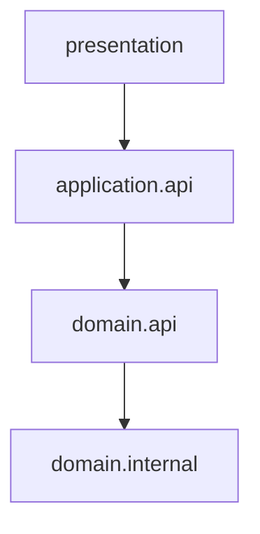

# Package-level Encapsulation

At class level, a class hides fields and exposes methods.

At package level, a package should hide internal structure and expose a small, stable API to other packages.

## Public Surface vs Internal Structure

Think of a package as having two zones:

- **Public package surface**: what other packages are allowed to use.
- **Internal package structure**: implementation details that may change.

## Package Top Level as an Interface

A useful analogy:

- A class interface defines what callers may use.
- A package top-level API defines what other packages may use.

So the top level of a package acts like an interface boundary:

- stable
- intentional
- minimal

This is the package "public access" idea: other packages should depend on exposed package API types, not on nested internal types.

## Example Package Tree

```console
src/
└── com/example/shop/
    ├── presentation/
    │   └── orderui/
    ├── application/
    │   ├── api/
    │   │   ├── PlaceOrderUseCase.java
    │   │   └── GetOrderUseCase.java
    │   └── internal/
    │       ├── validation/
    │       └── workflow/
    └── domain/
        ├── api/
        │   ├── OrderFacade.java
        │   └── OrderSummaryView.java
        └── internal/
            ├── model/
            ├── pricing/
            └── persistence/
```

In this structure:

- `domain.api` is a package-level public surface.
- `domain.internal.*` is implementation detail.
- `application` and `presentation` should avoid direct dependencies on `domain.internal.*`.

## Allowed Direction (High Level)



The internal part is used from inside the boundary, not from outside layers.

## Naming and Boundary Tips

- Use `api` package for public package surface.
- Use `internal` package for implementation details.
- Avoid exposing entities from `internal` as method parameters or return types.
- Keep public package API small and purpose-driven.

## Quick Summary

Package-level encapsulation means treating package boundaries like class boundaries: expose only what clients need, keep internals private to the package boundary.

