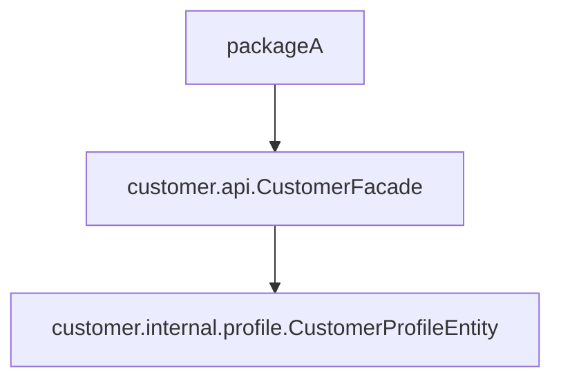
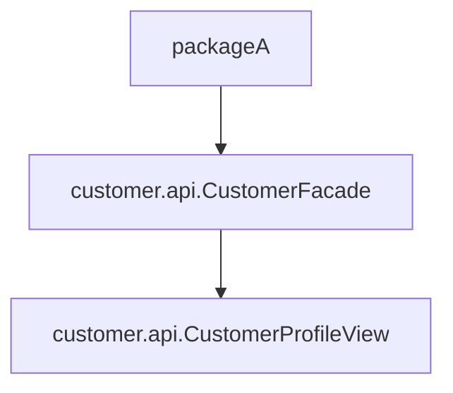

# Shallow vs Deep References

When one package uses another package, the dependency can be shallow or deep.

## Shallow Reference

A shallow reference targets the package's intended public surface.

Example:

```java
import com.example.customer.api.CustomerFacade;
import com.example.customer.api.CustomerProfileView;
```

This is usually good because callers depend on stable API types.

## Deep Reference

A deep reference reaches into nested internal packages.

Example:

```java
import com.example.customer.internal.profile.CustomerProfileEntity;
```

This is risky because callers now depend on implementation details.

## Important: Transitive Leakage

Even if package A references package B *shallowly*, leakage still happens if B returns deep internal types.

### Problem Example

```java
// package: com.example.customer.api
public class CustomerFacade {
    public CustomerProfileEntity getCustomerProfile(String customerId) {
        // ...
    }
}
```

Package A only calls `CustomerFacade` (looks shallow), but the returned type is:

```java
com.example.customer.internal.profile.CustomerProfileEntity
```

So package A is forced to know and depend on B's internals. This is leakage.

## Better Version (No Leakage)

```java
// package: com.example.customer.api
public class CustomerFacade {
    public CustomerProfileView getCustomerProfile(String customerId) {
        // Map internal entity to API view
    }
}
```

Now callers depend only on:

```java
com.example.customer.api.CustomerProfileView
```

## Package Tree View

### Leaking Version

```console
src/
└── com/example/customer/
    ├── api/
    │   └── CustomerFacade.java   // returns internal.profile.CustomerProfileEntity
    └── internal/
        └── profile/
            └── CustomerProfileEntity.java
```

### Encapsulated Version

```console
src/
└── com/example/customer/
    ├── api/
    │   ├── CustomerFacade.java   // returns api.CustomerProfileView
    │   └── CustomerProfileView.java
    └── internal/
        └── profile/
            └── CustomerProfileEntity.java
```

## Dependency Comparison



The above is leakage through return type.



The above keeps dependency shallow.

## Quick Decision Rule

Before exposing a type from a package method, ask:

1. Is this type part of the package's intentional public surface?
2. Would I be comfortable if many packages depended on this type?
3. Is this type stable enough to be public API?

If the answer is no, do not expose it.

