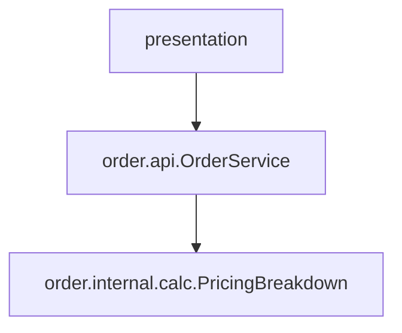
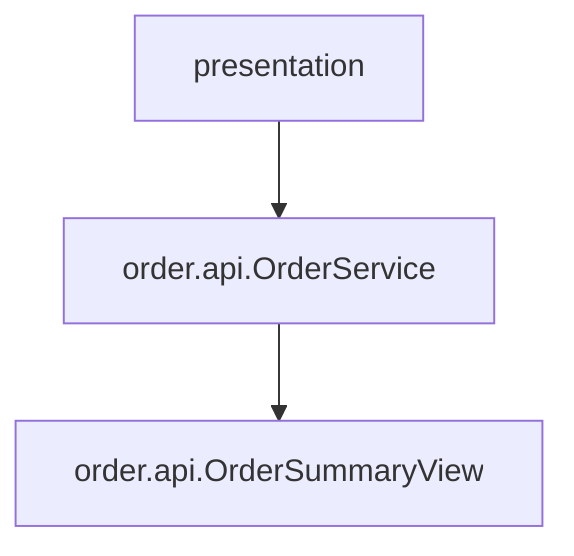

# Problems with Deep References

Deep package references create tight coupling to implementation details. Over time, this causes fragile architecture and expensive change.

## The Leakage Problem Through Return Types

Consider this method:

```java
// package: com.example.order.api
public class OrderService {
    public PricingBreakdown getOrderSummary(String orderId) {
        // ...
    }
}
```

The returned type is:

```java
com.example.order.internal.calc.PricingBreakdown
```

Even if callers use `order.api.OrderService`, they are now coupled to `order.internal.calc`.

## Why This Hurts

### 1) Dependency Spread

Once one caller starts using `PricingBreakdown`, others copy the pattern. Internal types spread across layers.

### 2) Ripple Effects

If internal pricing model changes, many external packages break because they imported internal types.

### 3) Architecture Erosion

Layer boundaries become blurry. Presentation and application layers start knowing domain internals.

### 4) Harder Testing and Refactoring

Tests and mocks must understand internal structures that should have remained hidden.

## Before/After Example

### Before (Leaking Internal Type)

```java
// package: com.example.order.api
import com.example.order.internal.calc.PricingBreakdown;

public class OrderService {
    public PricingBreakdown getOrderSummary(String orderId) {
        PricingEngine engine = new PricingEngine();
        return engine.calculate(orderId);
    }
}
```

```java
// package: com.example.presentation.orderui
import com.example.order.api.OrderService;
import com.example.order.internal.calc.PricingBreakdown;

public class OrderScreen {
    public void show(OrderService service, String orderId) {
        PricingBreakdown breakdown = service.getOrderSummary(orderId);
        System.out.println(breakdown.total());
    }
}
```

### After (API Type, No Leakage)

```java
// package: com.example.order.api
public record OrderSummaryView(String orderId, double subtotal, double tax, double total) {}
```

```java
// package: com.example.order.api
public class OrderService {
    public OrderSummaryView getOrderSummary(String orderId) {
        // map internal model to api view
        // return new OrderSummaryView(...);
    }
}
```

```java
// package: com.example.presentation.orderui
import com.example.order.api.OrderService;
import com.example.order.api.OrderSummaryView;

public class OrderScreen {
    public void show(OrderService service, String orderId) {
        OrderSummaryView summary = service.getOrderSummary(orderId);
        System.out.println(summary.total());
    }
}
```

## Package Tree Comparison

### Before

```console
src/
└── com/example/order/
    ├── api/
    │   └── OrderService.java        // returns internal.calc.PricingBreakdown
    └── internal/
        └── calc/
            └── PricingBreakdown.java
```

### After

```console
src/
└── com/example/order/
    ├── api/
    │   ├── OrderService.java        // returns api.OrderSummaryView
    │   └── OrderSummaryView.java
    └── internal/
        └── calc/
            └── PricingBreakdown.java
```

## Diagram: Problem vs Solution





## Mitigation Patterns

- **Facade package:** expose use-case methods and API types from `*.api`.
- **Internal discipline:** treat `*.internal.*` as non-public package implementation.
- **Mapping layer:** map internal entities to public view/DTO types at package boundary.
- **Anti-corruption boundary:** when crossing boundaries, translate types instead of leaking them.

## Quick Summary

Deep references are problematic, but deep return-type leakage is even trickier because it looks shallow at call site. If returned or accepted types come from nested internals, encapsulation has already been broken.

