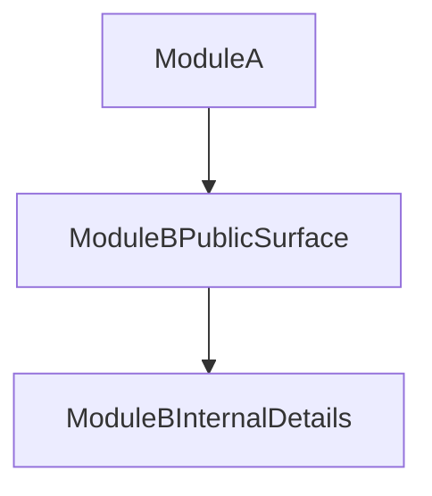

# Lift to Module Level in Java

So far, we discussed encapsulation at class and package level.

The same idea can be lifted one step higher: Java code can be grouped into modules.

## Same Principle, Bigger Boundary

At module level, think in the same pattern:

- A module has intended public parts.
- A module has internal implementation details.
- Other modules should depend on public parts, not internals.

This is package-level encapsulation applied at a larger scale.

## Why This Matters

As codebases grow:

- Teams own different parts of the system.
- Boundaries must stay clear over time.
- Encapsulation should be enforced consistently, not only at class level.

Module thinking helps preserve architecture by making boundaries explicit and intentional.

## Conceptual View

The relationship should be: depend on `ModuleBPublicSurface`, not `ModuleBInternalDetails`.

## Final Takeaway

Encapsulation is one design principle repeated at multiple levels:

1. Class: expose methods, hide fields/state.
2. Package: expose package API, hide nested internal structure.
3. Module: expose intended module surface, hide internal implementation.

If students carry this one idea across levels, they make systems easier to change, test, and maintain.

