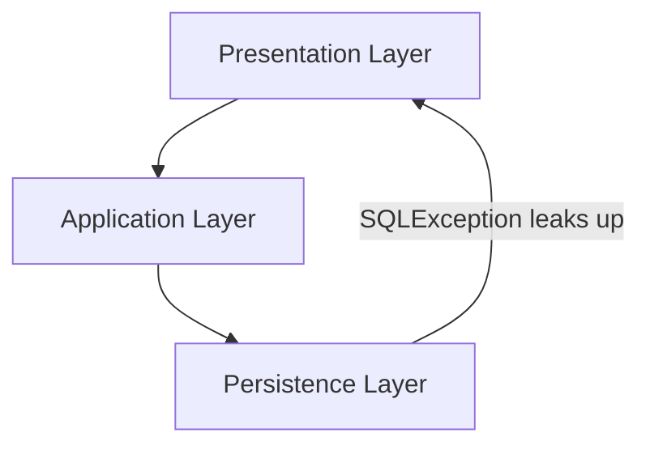

# Leaky Abstractions Through Exceptions

When we talk about package-level encapsulation, we usually focus on classes and return types.

But exceptions are also part of the boundary contract.

If technical exceptions from a lower layer escape into upper layers, the abstraction leaks.

Assume your persistence layer throws a `SQLException`, because it uses a database, and your presentation layer catches it. This is a leaky abstraction. What if you change data storage? SQLExceptions are no longer thrown, you have to update your presentation layer to catch the new exceptions.

## The Problem

In layered architecture, persistence details should stay inside the persistence layer.

If persistence throws technical exceptions like `SQLException` or `IOException`, then upper layers must know those technologies:

- application layer starts importing SQL or file I/O exceptions
- presentation layer may end up handling infrastructure errors directly
- switching persistence technology causes ripple effects in upper layers

That is coupling through exception types.

## Package Tree (Leaking Version)

```console
src/
└── com/example/spaceexplorer/
    ├── presentation/
    │   └── planet/
    │       └── PlanetController.java
    ├── application/
    │   └── planet/
    │       └── PlanetService.java                 // catches IOException (leak)
    └── persistence/
        ├── api/
        │   └── PlanetRepository.java
        └── internal/
            ├── file/
            │   └── FilePlanetRepository.java      // throws IOException
            └── mapper/
                └── PlanetFileMapper.java
```



## Before: Leaky Exception Contract

Here is a DAO, with a method to find all planets. It throws an `IOException`, because it uses a file.

```java
// package: com.example.spaceexplorer.persistence.api

public interface PlanetDao {
    List<Planet> findAll() throws IOException;
}
```

And the implementation, when reading from a file in line 6, an exception might be thrown, if the file does not exist.

```java
// package: com.example.spaceexplorer.persistence.internal.file

public class FilePlanetDao implements PlanetDao {
    @Override
    public List<Planet> findAll() throws IOException {
        String raw = Files.readString(Path.of("planets.txt"));
        return parsePlanets(raw);
    }
}
```

The service class, which is in the application layer, catches the exception, and rethrows it as a `RuntimeException`.

```java
// package: com.example.spaceexplorer.application.planet
import java.io.IOException;
import java.util.List;

public class PlanetService {

    // ...

    public List<PlanetDTO> getPlanets() {
        try {
            return planetDao.findAll().stream()
                .map(PlanetDTO::fromPlanet)
                .collect(Collectors.toList());
        } catch (IOException e) {
            throw new RuntimeException("Could not load planets", e);
        }
    }
}
```

`PlanetService` now knows file I/O concerns. The persistence detail leaked.

Notice the import statement of the specific exception type.


## Solution: Translate Exceptions at the Boundary

Catch technical exceptions inside persistence, and translate them to a more general exception type. Maybe you just use a RuntimeException. Or maybe you create your own exception type, often extending RuntimeException.

## Package Tree (Encapsulated Version)

```console
src/
└── com/example/spaceexplorer/
    ├── presentation/
    │   └── planet/
    │       └── PlanetController.java
    ├── application/
    │   └── planet/
    │       └── PlanetService.java                 // catches PlanetDaoException
    └── persistence/
        ├── interface/
        │   ├── PlanetDao.java
        │   └── PlanetDaoException.java
        └── file/
            └── FilePlanetDao.java      // catches IOException internally
```

## After: Boundary Exception Contract

```java
// package: com.example.spaceexplorer.persistence.api

public interface PlanetDao {
    List<Planet> findAll();
}
```

```java
// package: com.example.spaceexplorer.persistence.api
public class PlanetDaoException extends RuntimeException {
    public PlanetDaoException(String message, Throwable cause) {
        super(message, cause);
    }
}
```

```java
// package: com.example.spaceexplorer.persistence.internal.file
import java.io.IOException;
import java.nio.file.Files;
import java.nio.file.Path;
import java.util.List;

public class FilePlanetDao implements PlanetDao {
    @Override
    public List<Planet> findAll() {
        try {
            String raw = Files.readString(Path.of("planets.txt"));
            return parsePlanets(raw);
        } catch (IOException e) {
            throw new PlanetDaoException("Failed to read planet file", e);
        }
    }
}
```

```java
// package: com.example.spaceexplorer.application.planet
import java.util.List;

public class PlanetService {

    // ...

    public List<PlanetDTO> getPlanets() {
        try {
            return planetDao.findAll().stream()
                .map(PlanetDTO::fromPlanet)
                .collect(Collectors.toList());
        } catch (PlanetDaoException e) {
            throw new ApplicationException("Could not load planets right now", e);
        }
    }
}
```

Now the application layer depends on persistence API/surface semantics, not on file technology details.

## Practical Solutions

- **Translate at boundary:** convert `SQLException`/`IOException` to package API exceptions before crossing layers.
- **Wrap and keep cause:** keep root cause for debugging (`new PlanetRepositoryException("...", e)`).
- **Expose only boundary exceptions:** upper layers should catch semantic exceptions, not technical infrastructure exceptions.
- **Keep internals internal:** `persistence.internal.*` handles technical concerns; `persistence.api.*` defines what leaves the layer.
- **Alternative style:** for some use cases, return a result/error object instead of throwing.

## Connection to Earlier Encapsulation Topics

Leaking return types and leaking exception types are the same boundary problem:

- return type leakage exposes internal data structures
- exception leakage exposes internal failure mechanisms

In both cases, package encapsulation is broken because internal details become part of the public contract.

