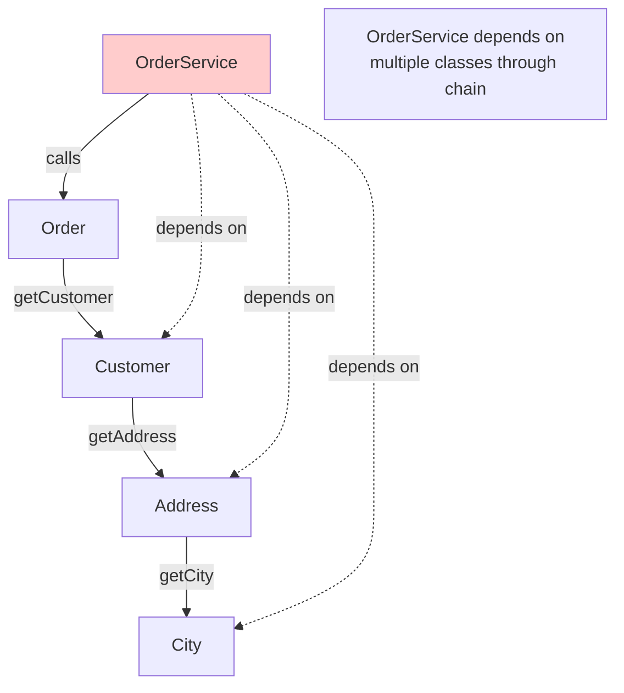

# The Problem: Violations of the Law of Demeter

When you violate the Law of Demeter, you create code that is tightly coupled, fragile, and hard to maintain.

## The "Train Wreck" Pattern

The most common violation is the **"train wreck"** - a chain of method calls:

```java
// Violation: Chain of method calls
String city = order.getCustomer().getAddress().getCity();
```

This is called a "train wreck" because it looks like a train of connected cars: `order` → `customer` → `address` → `city`.

## Why Train Wrecks Are Problems

### Problem 1: Tight Coupling

```java
// Violation: Tightly coupled to internal structure
public class OrderService {
    public void processOrder(Order order) {
        // Knows about Order → Customer → Address → City
        String city = order.getCustomer().getAddress().getCity();
        
        if (city.equals("New York")) {
            applySpecialTax(order);
        }
    }
}
```

**Problems:**
- `OrderService` knows about `Customer`'s internal structure
- `OrderService` knows about `Address`'s internal structure
- If `Customer` or `Address` changes, `OrderService` breaks
- High coupling - depends on multiple classes

### Problem 2: Fragile Code

```java
// If the internal structure changes, this breaks:
String city = order.getCustomer().getAddress().getCity();

// What if:
// - Customer no longer has an Address?
// - Address structure changes?
// - getCity() is renamed?
// - Any link in the chain changes?
```

**Result:** Code breaks when any part of the chain changes.

### Problem 3: Hard to Test

```java
// Hard to test because you need to mock the entire chain
@Test
public void testProcessOrder() {
    Order order = mock(Order.class);
    Customer customer = mock(Customer.class);
    Address address = mock(Address.class);
    
    when(order.getCustomer()).thenReturn(customer);
    when(customer.getAddress()).thenReturn(address);
    when(address.getCity()).thenReturn("New York");
    
    // Complex setup for a simple test
}
```

**Problem:** Must mock every object in the chain.

### Problem 4: Violates Encapsulation

```java
// Exposes internal structure
String city = order.getCustomer().getAddress().getCity();
// This reveals:
// - Order has a Customer
// - Customer has an Address
// - Address has a City
```

**Problem:** Internal structure is exposed, breaking encapsulation.

## Common Violation Patterns

### Pattern 1: Navigation Through Objects

```java
// Bad: Navigating through object structure
public void printCustomerInfo(Order order) {
    String name = order.getCustomer().getName();
    String email = order.getCustomer().getEmail();
    String city = order.getCustomer().getAddress().getCity();
}
```

### Pattern 2: Method Chaining

```java
// Bad: Long chain of method calls
public void process(Order order) {
    order.getCustomer().getAddress().getCountry().getTaxRate();
}
```

### Pattern 3: Nested Method Calls

```java
// Bad: Nested calls
public void sendEmail(Order order) {
    emailService.send(
        order.getCustomer().getEmail(),
        order.getCustomer().getAddress().getCity()
    );
}
```

## Real-World Example: Order Processing

### Violation

```java
public class OrderService {
    public void processOrder(Order order) {
        // Violation: Chain of calls
        String customerName = order.getCustomer().getName();
        String customerEmail = order.getCustomer().getEmail();
        String customerCity = order.getCustomer().getAddress().getCity();
        String customerCountry = order.getCustomer().getAddress().getCountry();
        
        // Process order
        double tax = calculateTax(order, customerCountry);
        sendConfirmation(customerEmail, customerName, customerCity);
    }
    
    private double calculateTax(Order order, String country) {
        // Tax calculation
    }
    
    private void sendConfirmation(String email, String name, String city) {
        // Send email
    }
}
```

**Problems:**
- Tightly coupled to `Customer` and `Address` structure
- If `Customer` changes, this breaks
- If `Address` changes, this breaks
- Hard to test (must mock entire chain)
- Exposes internal structure

## The Ripple Effect

When you violate the Law of Demeter, changes ripple through the system:

```java
// Original code
String city = order.getCustomer().getAddress().getCity();

// If Address structure changes:
public class Address {
    // Before: getCity() returns String
    // After: getCity() returns City object
    public City getCity() { ... }
}

// Now this breaks:
String city = order.getCustomer().getAddress().getCity();  // Returns City, not String!
```

**Result:** One change breaks multiple places.

## Visualizing the Problem



## Summary

Violations of the Law of Demeter cause:

1. **Tight Coupling** - Depends on multiple classes through chains
2. **Fragile Code** - Breaks when any part of chain changes
3. **Hard to Test** - Must mock entire chain
4. **Violates Encapsulation** - Exposes internal structure
5. **Ripple Effects** - Changes propagate through system

The solution is to **avoid chains** and **talk directly** to the objects you need.

