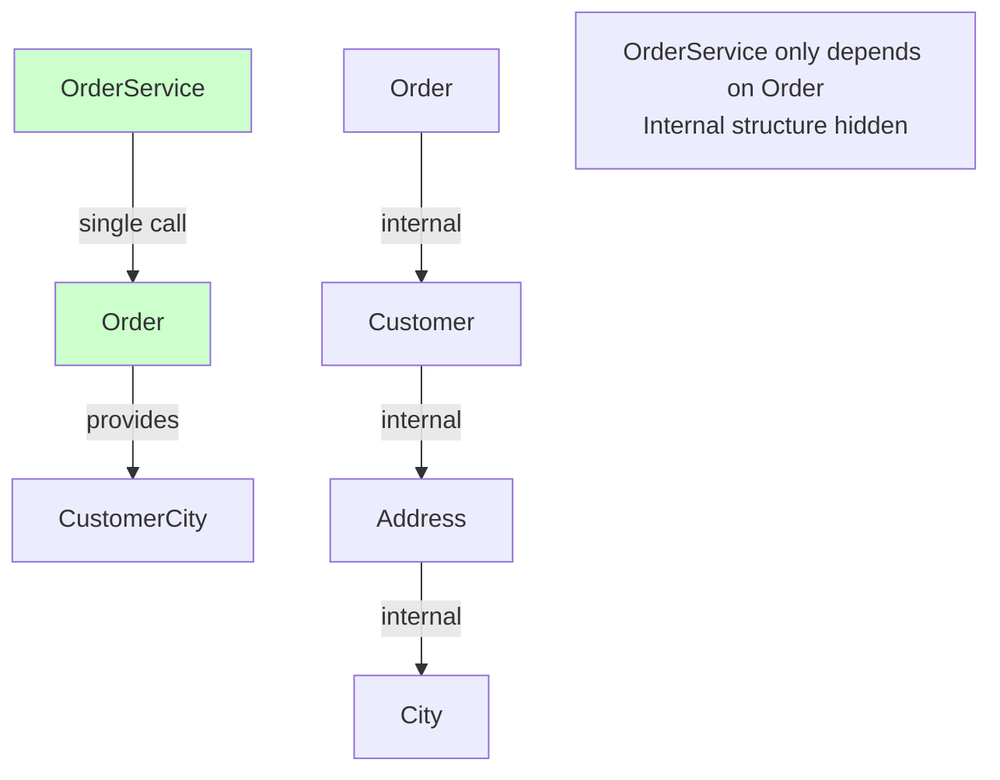

# The Solution: Following the Law of Demeter

The solution is to **avoid chains** and have objects provide what you need directly.

## The Core Strategy

Instead of navigating through object chains, ask the object you know to provide what you need.

### The Pattern

**Bad:** Navigate through objects
```java
String city = order.getCustomer().getAddress().getCity();
```

**Good:** Ask the object you know
```java
String city = order.getCustomerCity();
```

## Solution 1: Delegate to the Object

Have the object you know provide the information you need:

### Example

```java
// Bad: Chain of calls
public class OrderService {
    public void processOrder(Order order) {
        String city = order.getCustomer().getAddress().getCity();
        // Use city
    }
}

// Good: Order provides what's needed
public class Order {
    private Customer customer;
    
    // Delegate method - provides what callers need
    public String getCustomerCity() {
        return customer.getAddress().getCity();
    }
}

public class OrderService {
    public void processOrder(Order order) {
        String city = order.getCustomerCity();  // Direct call
        // Use city
    }
}
```

**Benefits:**
- `OrderService` only depends on `Order`
- If `Customer` or `Address` structure changes, only `Order` needs to change
- Encapsulation preserved
- Easier to test

## Solution 2: Use Data Transfer Objects (DTOs)

Create simple objects that contain only the data you need:

### Example

```java
// Bad: Chain of calls
public void sendConfirmation(Order order) {
    String email = order.getCustomer().getEmail();
    String name = order.getCustomer().getName();
    String city = order.getCustomer().getAddress().getCity();
    sendEmail(email, name, city);
}

// Good: Use a DTO
public class CustomerInfo {
    private String email;
    private String name;
    private String city;
    
    // Constructor and getters
}

public class Order {
    public CustomerInfo getCustomerInfo() {
        Customer customer = this.customer;
        Address address = customer.getAddress();
        return new CustomerInfo(
            customer.getEmail(),
            customer.getName(),
            address.getCity()
        );
    }
}

public void sendConfirmation(Order order) {
    CustomerInfo info = order.getCustomerInfo();  // Single call
    sendEmail(info.getEmail(), info.getName(), info.getCity());
}
```

**Benefits:**
- Single method call
- Only depends on `Order` and `CustomerInfo`
- Internal structure hidden
- Easy to test

## Solution 3: Tell, Don't Ask

Instead of asking for data and doing something with it, tell the object to do it:

### Example

```java
// Bad: Ask for data, then do something
public class OrderService {
    public void processOrder(Order order) {
        String email = order.getCustomer().getEmail();
        String name = order.getCustomer().getName();
        sendConfirmationEmail(email, name);
    }
}

// Good: Tell the object to do it
public class Order {
    private Customer customer;
    
    public void sendConfirmation() {
        String email = customer.getEmail();
        String name = customer.getName();
        emailService.sendConfirmation(email, name);
    }
}

public class OrderService {
    public void processOrder(Order order) {
        order.sendConfirmation();  // Tell, don't ask
    }
}
```

**Benefits:**
- Behavior stays with the object that has the data
- No chain of calls
- Better encapsulation
- Follows Single Responsibility Principle

## Solution 4: Flatten the Structure

Sometimes the structure itself is the problem. Consider flattening it:

### Example

```java
// Bad: Deep nesting
public class Order {
    private Customer customer;  // Customer has Address
}

public class Customer {
    private Address address;  // Address has City
}

public class Address {
    private String city;
}

// Good: Flatten if appropriate
public class Order {
    private Customer customer;
    private String customerCity;  // Store directly if needed frequently
}
```

**Note:** Only flatten if it makes sense for your domain. Don't flatten just to avoid chains.

## Real-World Example: Fixing the Order Service

### Before: Violation

```java
public class OrderService {
    public void processOrder(Order order) {
        // Violation: Multiple chains
        String customerName = order.getCustomer().getName();
        String customerEmail = order.getCustomer().getEmail();
        String customerCity = order.getCustomer().getAddress().getCity();
        String customerCountry = order.getCustomer().getAddress().getCountry();
        
        double tax = calculateTax(order, customerCountry);
        sendConfirmation(customerEmail, customerName, customerCity);
    }
}
```

### After: Following LoD

```java
// Option 1: Delegate methods
public class Order {
    private Customer customer;
    
    public String getCustomerName() {
        return customer.getName();
    }
    
    public String getCustomerEmail() {
        return customer.getEmail();
    }
    
    public String getCustomerCity() {
        return customer.getAddress().getCity();
    }
    
    public String getCustomerCountry() {
        return customer.getAddress().getCountry();
    }
}

public class OrderService {
    public void processOrder(Order order) {
        // Single level of calls
        String customerName = order.getCustomerName();
        String customerEmail = order.getCustomerEmail();
        String customerCity = order.getCustomerCity();
        String customerCountry = order.getCustomerCountry();
        
        double tax = calculateTax(order, customerCountry);
        sendConfirmation(customerEmail, customerName, customerCity);
    }
}

// Option 2: Tell, don't ask (even better)
public class Order {
    private Customer customer;
    private TaxCalculator taxCalculator;
    private EmailService emailService;
    
    public void process() {
        double tax = taxCalculator.calculate(this);
        emailService.sendConfirmation(this);
    }
    
    // Getters for what's needed
    public String getCustomerName() {
        return customer.getName();
    }
    
    public String getCustomerEmail() {
        return customer.getEmail();
    }
    
    public String getCustomerCity() {
        return customer.getAddress().getCity();
    }
}

public class OrderService {
    public void processOrder(Order order) {
        order.process();  // Tell, don't ask
    }
}
```

## The "One Dot" Rule

A simple guideline: **Limit yourself to one dot (method call).**

```java
// Bad: Multiple dots
order.getCustomer().getAddress().getCity();  // 3 dots

// Good: One dot
order.getCustomerCity();  // 1 dot
```

**Note:** This is a guideline, not a strict rule. Sometimes two dots are acceptable, but chains of three or more are usually a problem.

## Visualizing the Solution



## Summary

To follow the Law of Demeter:

1. **Delegate methods** - Have objects provide what callers need
2. **Use DTOs** - Create simple data objects
3. **Tell, don't ask** - Tell objects to do things, don't ask for data
4. **Flatten structure** - If appropriate for your domain
5. **One dot rule** - Limit method call chains

**The key:** Objects should provide what callers need, not force callers to navigate internal structure.

