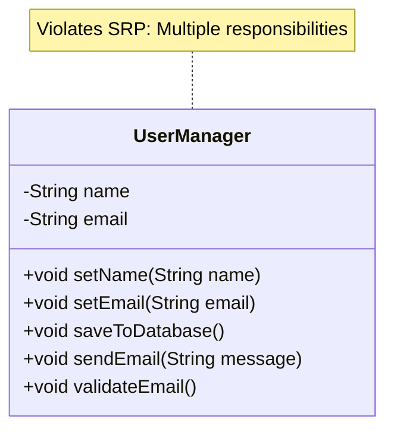

# Single Responsibility Principle - Violations

Let's examine an example of a class that violates the Single Responsibility Principle and understand the problems it causes.

## Example: User Class with Multiple Responsibilities

Consider a `User` class that handles user data, email sending, and database operations.


Here's a diagram showing the difference between a class that violates SRP and one that follows it:



And the code something like this:

```java
public class User {
    private String name;
    private String email;
    private String password;
    
    // User data management
    public void setName(String name) {
        this.name = name;
    }
    
    public void setEmail(String email) {
        this.email = email;
    }
    
    public String getName() {
        return name;
    }
    
    public String getEmail() {
        return email;
    }
    
    // Email sending responsibility
    public void sendWelcomeEmail() {
        String subject = "Welcome!";
        String body = "Welcome to our system, " + name + "!";
        // Email sending logic here
        System.out.println("Sending email to " + email + ": " + subject);
        System.out.println("Body: " + body);
    }
    
    // Database persistence responsibility
    public void saveToDatabase() {
        // Database connection and save logic
        System.out.println("Saving user to database: " + name + ", " + email);
    }
    
    public void loadFromDatabase(int userId) {
        // Database connection and load logic
        System.out.println("Loading user from database with ID: " + userId);
    }
    
    // Validation responsibility
    public boolean validateEmail() {
        return email != null && email.contains("@");
    }
}
```

## The Problem

This class violates SRP because it has **multiple reasons to change**:

1. **User data structure changes** - If we need to add a phone number field
2. **Email sending logic changes** - If we need to change email format or add HTML emails
3. **Database schema changes** - If we need to change how users are stored
4. **Validation rules change** - If email validation becomes more complex

## Problems Caused by This Violation

### 1. Hard to Test

Testing email functionality requires understanding database operations, and vice versa:

```java
// To test email sending, we need to set up database state
User user = new User();
user.setName("John");
user.setEmail("john@example.com");
user.saveToDatabase(); // Why do we need this to test email?
user.sendWelcomeEmail();
```

### 2. Hard to Maintain

If you need to change how emails are sent (e.g., add HTML support), you must modify the `User` class, which also contains database and validation code. This increases the risk of breaking unrelated functionality.

### 3. Hard to Reuse

You can't reuse the email sending logic without also bringing in user data management and database code. If you want to send emails for other entities (like orders or notifications), you can't reuse this code.

### 4. Tight Coupling

The `User` class is tightly coupled to:
- Email sending implementation
- Database implementation
- Validation logic

Changes to any of these affect the entire class.

### 5. Violates Other Principles

This violation often leads to violations of other SOLID principles:
- **Open Closed Principle** - Can't extend email functionality without modifying User
- **Dependency Inversion** - User depends on concrete email and database implementations

## Real-World Scenario

Imagine you need to:
- Change email format to HTML
- Switch from MySQL to PostgreSQL
- Add phone number validation

With the current design, you'd modify the `User` class for all three changes, even though they're unrelated. This increases the chance of introducing bugs and makes the code harder to understand.

## Recognizing SRP Violations

Signs that a class violates SRP:

1. **The class name contains "And" or "Or"** - e.g., `UserAndEmailManager`
2. **You can't describe the class in one sentence** without using "and"
3. **The class has multiple groups of related methods** that don't interact
4. **Changes to one feature require understanding unrelated code**
5. **You hesitate to modify the class** because you're not sure what else might break
