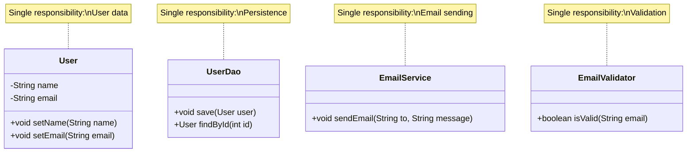

# Single Responsibility Principle - Fix

Let's refactor the `User` class to follow the Single Responsibility Principle by separating each responsibility into its own class.

## The Solution

We'll split the responsibilities into separate classes:

1. **User** - Manages user data only
2. **EmailService** - Handles email sending
3. **UserRepository** - Handles database operations
4. **EmailValidator** - Handles email validation



**Solution:** Each class has one clear responsibility.

## Identifying Responsibilities

To identify if a class violates SRP, ask:

1. **Can I describe this class's purpose in one sentence?** (without "and" or "or")
2. **How many reasons does this class have to change?**
3. **If I need to change X, do I also need to understand Y and Z?**
4. **Can I test this class's functionality independently?**

If you find multiple answers or concerns, the class likely has multiple responsibilities.


## Refactored Code

### User Class (User Data Only)

```java
public class User {
    private String name;
    private String email;
    private String password;
    
    public User(String name, String email, String password) {
        this.name = name;
        this.email = email;
        this.password = password;
    }
    
    public void setName(String name) {
        this.name = name;
    }
    
    public void setEmail(String email) {
        this.email = email;
    }
    
    public String getName() {
        return name;
    }
    
    public String getEmail() {
        return email;
    }
    
    // Only user data management - single responsibility
}
```

### EmailService Class (Email Sending Only)

```java
public class EmailService {
    public void sendWelcomeEmail(User user) {
        String subject = "Welcome!";
        String body = "Welcome to our system, " + user.getName() + "!";
        // Email sending logic here
        System.out.println("Sending email to " + user.getEmail() + ": " + subject);
        System.out.println("Body: " + body);
    }
    
    public void sendEmail(String to, String subject, String body) {
        // Generic email sending
        System.out.println("Sending email to " + to + ": " + subject);
        System.out.println("Body: " + body);
    }
}
```

### UserRepository Class (Database Operations Only)

```java
public class UserRepository {
    public void save(User user) {
        // Database connection and save logic
        System.out.println("Saving user to database: " + user.getName() + ", " + user.getEmail());
    }
    
    public User findById(int userId) {
        // Database connection and load logic
        System.out.println("Loading user from database with ID: " + userId);
        // Return loaded user
        return null; // Simplified for example
    }
    
    public void delete(int userId) {
        // Database delete logic
        System.out.println("Deleting user from database with ID: " + userId);
    }
}
```

### EmailValidator Class (Validation Only)

```java
public class EmailValidator {
    public boolean isValid(String email) {
        if (email == null || email.isEmpty()) {
            return false;
        }
        return email.contains("@") && email.contains(".");
    }
    
    public boolean isValidDomain(String email) {
        // More complex validation logic
        return email.endsWith(".com") || email.endsWith(".org");
    }
}
```

## Benefits of the Refactored Design

### 1. Easy to Test

Each class can be tested independently:

```java
// Test email service independently
EmailService emailService = new EmailService();
User user = new User("John", "john@example.com", "password");
emailService.sendWelcomeEmail(user);

// Test validator independently
EmailValidator validator = new EmailValidator();
assertTrue(validator.isValid("test@example.com"));
```

### 2. Easy to Maintain

If you need to change email format, you only modify `EmailService`. The `User` class remains unchanged.

### 3. Easy to Reuse

`EmailService` can be used to send emails for any entity (users, orders, notifications). It's not tied to the `User` class.

### 4. Loose Coupling

Classes depend on each other only when necessary. `User` doesn't know about emails or databases.

### 5. Single Responsibility

Each class has one clear reason to change:
- **User** changes when user data structure changes
- **EmailService** changes when email sending logic changes
- **UserRepository** changes when database schema changes
- **EmailValidator** changes when validation rules change

## Handling Changes

Now, when requirements change:

**Change email to HTML format:**
- Modify only `EmailService`
- No impact on `User`, `UserRepository`, or `EmailValidator`

**Switch database:**
- Modify only `UserRepository`
- No impact on other classes

**Add phone number:**
- Modify only `User`
- No impact on other classes

## Summary

By separating responsibilities:
- **User** - User data only
- **EmailService** - Email sending only
- **UserRepository** - Database operations only
- **EmailValidator** - Validation only

Each class now:
- Has one reason to change
- Is easy to test
- Is easy to maintain
- Is reusable
- Follows the Single Responsibility Principle


