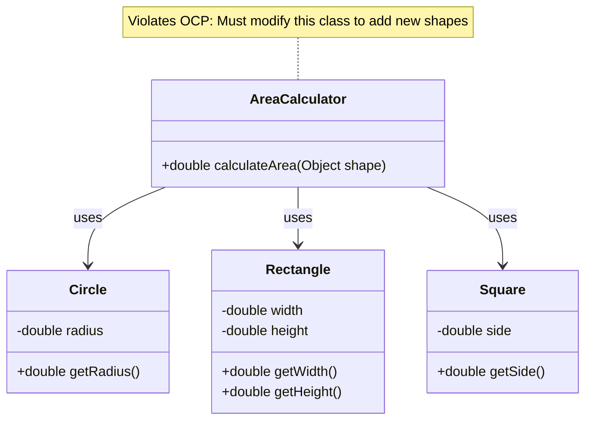

# Open Closed Principle - Violations

Let's examine a real example that violates the Open Closed Principle and understand the problems it causes.

## Example: Shape Area Calculator

Consider a system that calculates the area of different shapes. Here's a design that violates OCP:

```java
public class AreaCalculator {
    public double calculateArea(Object shape) {
        if (shape instanceof Circle) {
            Circle circle = (Circle) shape;
            return Math.PI * circle.getRadius() * circle.getRadius();
        } else if (shape instanceof Rectangle) {
            Rectangle rectangle = (Rectangle) shape;
            return rectangle.getWidth() * rectangle.getHeight();
        } else if (shape instanceof Square) {
            Square square = (Square) shape;
            return square.getSide() * square.getSide();
        }
        throw new IllegalArgumentException("Unknown shape type");
    }
}

```

## The Problem

This design violates OCP because:

1. **To add a new shape** (e.g., Triangle), you must **modify** the `calculateArea` method
2. **Existing code changes** every time you add functionality
3. **Risk of breaking** existing functionality increases with each modification

## Visualizing the Violation



## Problems Caused by This Violation

### 1. Must Modify Working Code

Every time you add a new shape, you must modify the `calculateArea` method:

```java{9}
// To add Triangle, you must modify existing code
public double calculateArea(Object shape) {
    if (shape instanceof Circle) {
        // ... existing code
    } else if (shape instanceof Rectangle) {
        // ... existing code
    } else if (shape instanceof Square) {
        // ... existing code
    } else if (shape instanceof Triangle) {  // NEW: Modification required
        Triangle triangle = (Triangle) shape;
        return 0.5 * triangle.getBase() * triangle.getHeight();
    }
    throw new IllegalArgumentException("Unknown shape type");
}
```

**Problem:** You're changing code that was already working, which risks introducing bugs.

### 2. Risk of Breaking Existing Functionality

When you modify `calculateArea` to add Triangle support, you might accidentally break Circle or Rectangle calculations. Every modification is a risk.

Yes, this example is contrived and simple, but it is a real problem. You might accidentally break something else, because you are modifying the code that was already working.

### 3. Violates Single Responsibility

The `AreaCalculator` class is responsible for:
- Knowing about all shape types
- Calculating area for each shape type
- Deciding which calculation to use

This is too many responsibilities.

### 4. Hard to Test

To test the calculator, you need to test all shape types together. You can't easily test new shapes in isolation.

### 5. Tight Coupling

`AreaCalculator` is tightly coupled to every concrete shape class. It must know about Circle, Rectangle, Square, and any future shapes.

### 6. Violates Other Principles

This design also violates:
- **Single Responsibility** - Calculator knows about all shapes
- **Dependency Inversion** - Depends on concrete classes, not abstractions


## Another Example: Discount Calculator

Here's another common violation:

```java
public class DiscountCalculator {
    public double calculateDiscount(String customerType, double price) {
        if (customerType.equals("REGULAR")) {
            return price * 0.1;  // 10% discount
        } else if (customerType.equals("PREMIUM")) {
            return price * 0.2;  // 20% discount
        } else if (customerType.equals("VIP")) {
            return price * 0.3;  // 30% discount
        }
        return 0;
    }
}
```

**Problem:** To add a new customer type (e.g., "STUDENT"), you must modify this method.

## Recognizing OCP Violations

Signs that code violates OCP:

1. **If-else or switch statements** that check types to determine behavior
2. **Modifying existing methods** to add new functionality
3. **Type checking** with `instanceof` or similar
4. **Long methods** with multiple conditional branches
5. **Frequent modifications** to the same class for new features

If your class or method is generally doing to much, it is tempting to just add more and more functionality to it. This started out as a violation of SRP, and then became a violation of OCP.


## Summary

The `AreaCalculator` class violates OCP because:
- Adding new shapes requires **modifying** existing code
- This creates **risk** of breaking working functionality
- The class is **tightly coupled** to all shape types
- It's **hard to test** and maintain

Next, we'll see how to fix this by using abstraction and polymorphism.

