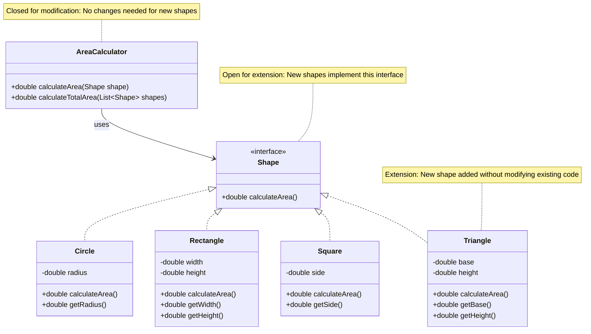

# Open Closed Principle - Fix

Let's refactor the shape area calculator to follow the Open Closed Principle by using abstraction and polymorphism.

## The Solution

We'll use an interface to define a contract that all shapes must follow. New shapes can be added by implementing this interface, without modifying existing code.

Interfaces are often a solution to OCP violations. But there are other solutions. Generally following SRP is also a good start. Instead of updating an existing method, you might just add a new method. Instead of updating an existing class, you might just add a new class.

## Refactored Code

### Shape Interface (Abstraction)

```java
public interface Shape {
    double calculateArea();
}
```

### Shape Implementations

```java
public class Circle implements Shape {
    // ...
}

public class Rectangle implements Shape {
    // ...
}

public class Square implements Shape {
    // ...
}
```

### AreaCalculator (Closed for Modification)

```java
import java.util.List;

public class AreaCalculator {
    public double calculateArea(Shape shape) {
        return shape.calculateArea();
    }
    
    public double calculateTotalArea(List<Shape> shapes) {
        double total = 0;
        for (Shape shape : shapes) {
            total += shape.calculateArea();
        }
        return total;
    }
}
```

## Adding New Shapes (Extension)

Now, to add a new shape like Triangle, you **extend** the system without modifying existing code:

```java
public class Triangle implements Shape {
    private double base;
    private double height;
    
    public Triangle(double base, double height) {
        this.base = base;
        this.height = height;
    }
    
    @Override
    public double calculateArea() {
        return 0.5 * base * height;
    }
    
    public double getBase() {
        return base;
    }
    
    public double getHeight() {
        return height;
    }
}
```

**No modification needed!** The `AreaCalculator` works with Triangle automatically because it implements `Shape`.

## Visualizing the Fix



## Benefits of the Refactored Design

### 1. No Modification Required

To add Triangle, you create a new class. You don't modify `AreaCalculator` or any existing shape classes.

### 2. Existing Code Remains Stable

Circle, Rectangle, and Square code never change. This reduces the risk of introducing bugs.

### 3. Easy to Extend

Adding new shapes is straightforward:

```java
public class Ellipse implements Shape {
    private double a, b;  // semi-major and semi-minor axes
    
    public Ellipse(double a, double b) {
        this.a = a;
        this.b = b;
    }
    
    @Override
    public double calculateArea() {
        return Math.PI * a * b;
    }
}
```

### 4. Polymorphism Works Automatically

The `AreaCalculator` works with any `Shape` implementation:

```java
AreaCalculator calculator = new AreaCalculator();

Shape circle = new Circle(5);
Shape rectangle = new Rectangle(4, 6);
Shape triangle = new Triangle(3, 4);

System.out.println(calculator.calculateArea(circle));     // Works
System.out.println(calculator.calculateArea(rectangle));  // Works
System.out.println(calculator.calculateArea(triangle));   // Works automatically!
```

### 5. Easy to Test

Each shape can be tested independently:

```java
@Test
public void testCircleArea() {
    Circle circle = new Circle(5);
    assertEquals(78.54, circle.calculateArea(), 0.01);
}

@Test
public void testTriangleArea() {
    Triangle triangle = new Triangle(3, 4);
    assertEquals(6.0, triangle.calculateArea(), 0.01);
}
```

### 6. Follows Other Principles

This design also follows:
- **Single Responsibility** - Each class has one job
- **Dependency Inversion** - Depends on abstraction (Shape interface)


## Comparison

**Before (Violates OCP):**
- Add Triangle → Modify `AreaCalculator.calculateArea()`
- Risk of breaking existing code
- Must retest all shapes

**After (Follows OCP):**
- Add Triangle → Create new `Triangle` class
- No risk to existing code
- Test Triangle independently

## Summary

By using abstraction (the `Shape` interface):
- **New shapes extend** the system by implementing `Shape`
- **Existing code remains unchanged** (closed for modification)
- **AreaCalculator works** with any `Shape` implementation
- **Easy to add** new shapes without risk
- **Follows OCP** - open for extension, closed for modification

The system is now extensible without modification, following the Open Closed Principle.


