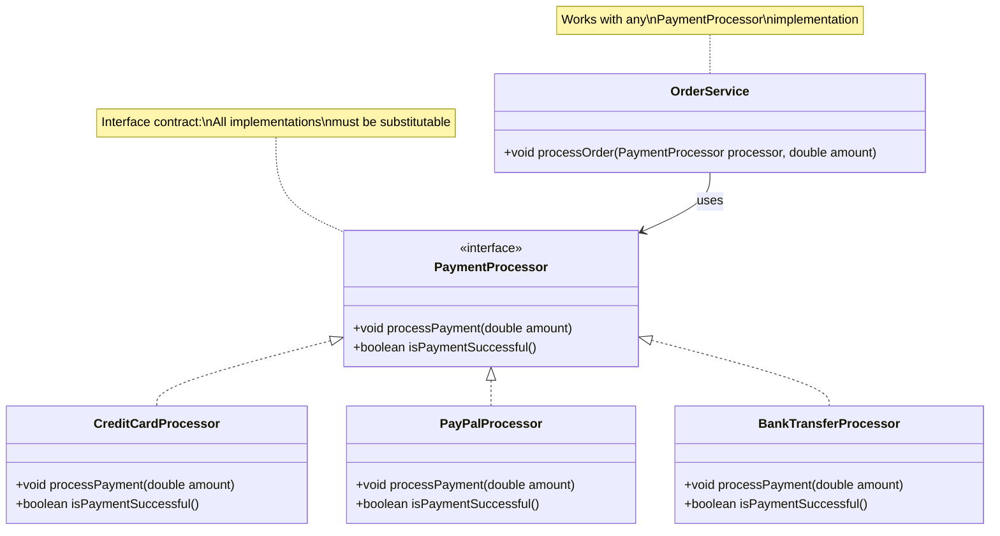

# Liskov Substitution Principle - Introduction

The **Liskov Substitution Principle (LSP)** is the third principle in SOLID. It ensures that implementations of interfaces can be used interchangeably without breaking functionality.

The original SOLID princples are fairly "old", around 2000. Things have changed a little since then, and especially the interface-focused version of LSP is more common today.

Original definition:

> "Subtypes must be substitutable for their base types"

This is more about inheritance, and not about interfaces. It is still relevant, but the modern understanding is more about interfaces. Here is an updated "paraphrase" of the principle:

> A program that uses an interface must not be confused by an implementation of that interface.

## Definition

**Implementations of an interface must be substitutable for each other without breaking the program.**

This is the modern, interface-focused version of LSP. The traditional definition focused on inheritance ("Subtypes must be substitutable for their base types"), but the modern understanding emphasizes interface contracts.

## The Core Idea

When you have an interface, any class that implements that interface should be able to replace any other implementation without causing errors or unexpected behavior. The code using the interface should work correctly regardless of which implementation is used.

Sure, if you change from file-based data manager to an in-memory data manager, or to using a database, you data would end up in a different place. But the class _using_ your interface should not notice a difference. Data is stored and retrieved. And so, we can consider the interface a _contract_, which promises certain behavior. Classes implementing the interface must fulfill this contract!

## Interface Contracts

An interface defines a **contract** - a promise about what methods are available and what behavior they provide. All implementations must fulfill this contract completely and correctly.

```java
public interface PaymentProcessor {
    void processPayment(double amount);
    boolean isPaymentSuccessful();
}
```

Any class implementing `PaymentProcessor` must:
- Provide `processPayment(double amount)` method
- Provide `isPaymentSuccessful()` method
- Fulfill the expected behavior of these methods

## Behavioral Compatibility

LSP is about **behavioral compatibility**, not just method signatures. Implementations must not only have the right methods, but also behave in ways that are compatible with the interface's contract.

### What This Means

If code works with one implementation of an interface, it should work with **any** implementation of that interface:

```java
public void processOrder(PaymentProcessor processor, double amount) {
    processor.processPayment(amount);
    if (processor.isPaymentSuccessful()) {
        // Complete order
    } else {
        // Handle failure
    }
}
```

This code should work whether `processor` is:
- A `CreditCardProcessor`
- A `PayPalProcessor`
- A `BankTransferProcessor`
- Any other implementation of `PaymentProcessor`

## Benefits of LSP

Following the Liskov Substitution Principle provides several benefits:

### 1. Reliable Polymorphism

You can use different implementations interchangeably, enabling true polymorphism.

### 2. Predictable Behavior

Code behaves predictably regardless of which implementation is used.

### 3. Easy Testing

You can substitute mock implementations for testing without changing the code being tested.

### 4. Flexibility

You can swap implementations (e.g., different payment processors) without modifying code that uses the interface.

### 5. Correctness

Prevents runtime errors and unexpected behavior from incompatible implementations.

## Visualizing LSP

Here's a diagram showing proper interface implementation:



## What LSP Requires

For implementations to be substitutable, they must:

### 1. Implement All Methods

All methods in the interface must be implemented. No missing methods. No "empty" methods.

### 2. Maintain Preconditions

If the interface method has requirements (preconditions), implementations must meet them.

### 3. Maintain Postconditions

If the interface method promises certain results (postconditions), implementations must deliver them.

### 4. Not Throw Unexpected Exceptions

Implementations shouldn't throw exceptions that the interface doesn't specify, unless they're subtypes of specified exceptions. This is the "guideline". We will violate this a lot, though. So... again, that comment about recommendation vs strict law.

### 5. Maintain Behavioral Contracts

The behavior must be compatible with what code using the interface expects.


## Summary

- **Definition:** Implementations of an interface must be substitutable
- **Key idea:** Any implementation should work wherever the interface is expected
- **Focus:** Interface contracts and behavioral compatibility
- **Benefits:** Reliable polymorphism, predictable behavior, flexibility
- **Question to ask:** "Can I swap implementations without breaking anything?"


