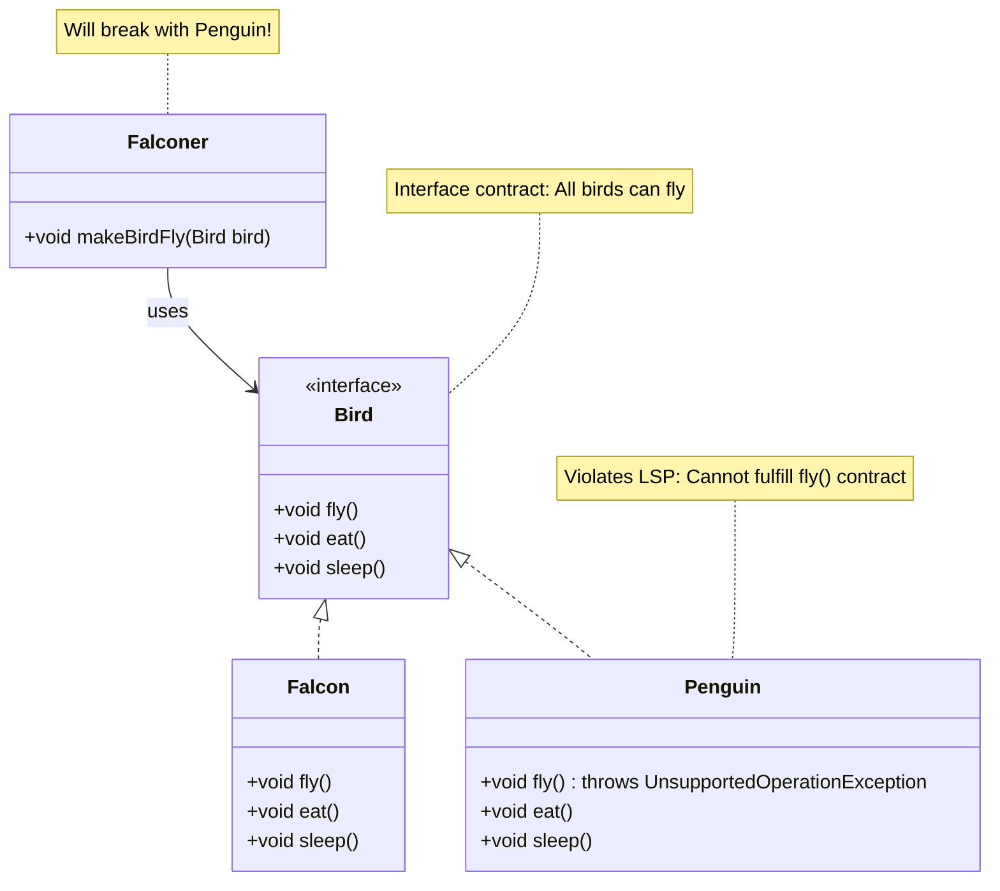
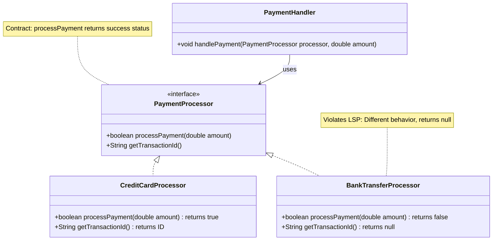

# Liskov Substitution Principle - Violations

Let's examine examples that violate the Liskov Substitution Principle and understand the problems they cause.

## Example 1: Bird Interface with Fly Method

Yet another contrived example. But they are a simple way to start. Consider a `Bird` interface that includes a `fly()` method:

```java
public interface Bird {
    void fly();
    void eat();
    void sleep();
}

public class Sparrow implements Bird {
    @Override
    public void fly() {
        System.out.println("Sparrow is flying");
    }
    
    @Override
    public void eat() {
        System.out.println("Sparrow is eating");
    }
    
    @Override
    public void sleep() {
        System.out.println("Sparrow is sleeping");
    }
}

public class Penguin implements Bird {
    @Override
    public void fly() {
        throw new UnsupportedOperationException("Penguins cannot fly!");
    }
    
    @Override
    public void eat() {
        System.out.println("Penguin is eating");
    }
    
    @Override
    public void sleep() {
        System.out.println("Penguin is sleeping");
    }
}
```

## The Problem

The `Penguin` class violates LSP because:

1. **It can't fulfill the contract** - The `fly()` method throws an exception
2. **It's not substitutable** - Code that expects birds to fly will break with Penguin
3. **Unexpected behavior** - Using a Penguin where a Bird is expected causes runtime errors

## Visualizing the Violation




## Problems Caused by This Violation

### 1. Runtime Errors

Code that uses the `Bird` interface will crash when given a `Penguin`:

```java
public class BirdController {
    public void makeBirdFly(Bird bird) {
        bird.fly();  // Crashes if bird is a Penguin!
    }
}

// Usage
BirdController controller = new BirdController();
Bird falcon = new Falcon();
controller.makeBirdFly(falcon);  // Works fine

Bird penguin = new Penguin();
controller.makeBirdFly(penguin);  // Throws UnsupportedOperationException!
```

### 2. Not Substitutable

You cannot substitute a `Penguin` for a `Falcon` without breaking the program. This violates the core idea of LSP.

### 3. Violates Interface Contract

The `Bird` interface promises that all birds can fly, but `Penguin` cannot fulfill this promise.

### 4. Unpredictable Behavior

Code using `Bird` cannot rely on `fly()` working - it might throw an exception.

## Example 2: Rectangle and Square

Here's a classic violation using inheritance (which also applies to interfaces):

```java
public interface Shape {
    void setWidth(double width);
    void setHeight(double height);
    double getArea();
}

public class Rectangle implements Shape {
    private double width;
    private double height;
    
    @Override
    public void setWidth(double width) {
        this.width = width;
    }
    
    @Override
    public void setHeight(double height) {
        this.height = height;
    }
    
    @Override
    public double getArea() {
        return width * height;
    }
}

public class Square implements Shape {
    private double side;
    
    @Override
    public void setWidth(double width) {
        this.side = width;
    }
    
    @Override
    public void setHeight(double height) {
        this.side = height;  // Problem: ignores width!
    }
    
    @Override
    public double getArea() {
        return side * side;
    }
}
```

## The Problem

The `Square` class violates LSP because:

1. **Different behavior** - Setting width and height doesn't work as expected
2. **Breaks expectations** - Code that sets width and height separately expects them to be independent

```java
public void resizeShape(Shape shape) {
    shape.setWidth(5);
    shape.setHeight(10);
    // Expects area to be 5 * 10 = 50
    // But with Square, area is 10 * 10 = 100 (only height matters!)
    System.out.println("Area: " + shape.getArea());
}

// Usage
Shape rectangle = new Rectangle();
resizeShape(rectangle);  // Works: Area = 50

Shape square = new Square();
resizeShape(square);  // Breaks: Area = 100, not 50!
```

## Example 3: Payment Processor with Different Behavior

```java
public interface PaymentProcessor {
    boolean processPayment(double amount);
    String getTransactionId();
}

public class CreditCardProcessor implements PaymentProcessor {
    @Override
    public boolean processPayment(double amount) {
        // Process payment
        return true;  // Always succeeds (simplified)
    }
    
    @Override
    public String getTransactionId() {
        return "CC-" + System.currentTimeMillis();
    }
}

public class BankTransferProcessor implements PaymentProcessor {
    @Override
    public boolean processPayment(double amount) {
        // Bank transfers take time
        // Return false immediately, transaction happens later
        return false;  // Problem: Different behavior!
    }
    
    @Override
    public String getTransactionId() {
        return null;  // Problem: Returns null when payment "fails"
    }
}
```

## The Problem

`BankTransferProcessor` violates LSP because:

1. **Different return behavior** - Returns `false` when payment is actually processing
2. **Returns null** - `getTransactionId()` returns null, breaking code that expects a transaction ID
3. **Incompatible semantics** - The meaning of `processPayment` is different

```java
public void handlePayment(PaymentProcessor processor, double amount) {
    if (processor.processPayment(amount)) {
        String id = processor.getTransactionId();
        System.out.println("Payment successful: " + id);
    } else {
        System.out.println("Payment failed");
    }
}

// Usage
PaymentProcessor creditCard = new CreditCardProcessor();
handlePayment(creditCard, 100);  // Works: "Payment successful: CC-..."

PaymentProcessor bankTransfer = new BankTransferProcessor();
handlePayment(bankTransfer, 100);  // Breaks: Says "failed" but payment is processing!
// Also crashes if getTransactionId() is called on "failed" payment
```

## Visualizing the Payment Violation



## Recognizing LSP Violations

Signs that code violates LSP:

1. **Throwing exceptions** in methods that shouldn't throw them
2. **Returning null** when a value is expected
3. **Different behavior** for the same method call
4. **Requiring special handling** for specific implementations
5. **Type checking** with `instanceof` to handle different implementations
6. **Empty implementations** that don't fulfill the contract

## Summary

LSP violations occur when:
- **Implementations can't fulfill the contract** (Penguin can't fly)
- **Different behavior** for the same method (Square's setWidth/setHeight)
- **Incompatible semantics** (BankTransfer returns false for processing)
- **Not substitutable** - Code breaks when implementations are swapped

These violations cause:
- **Runtime errors** when unexpected implementations are used
- **Unpredictable behavior** that's hard to debug
- **Broken polymorphism** - can't trust the interface contract


