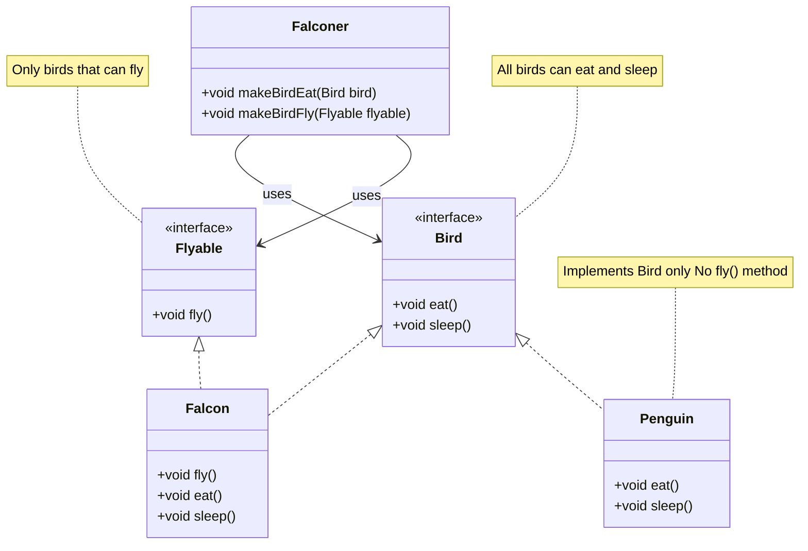
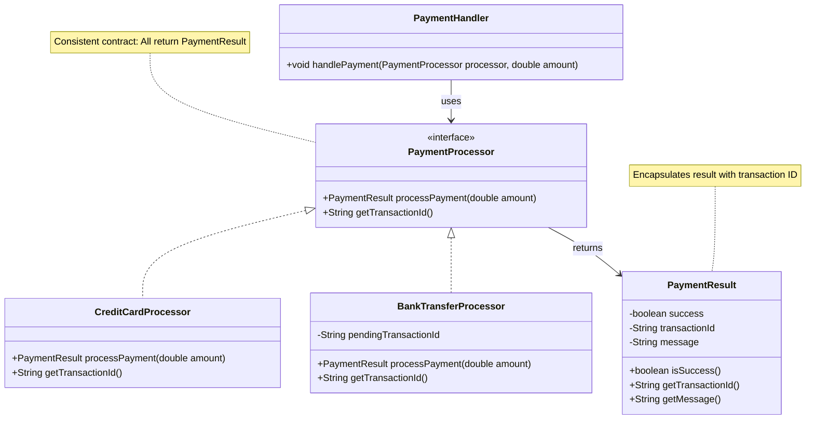

# Liskov Substitution Principle - Fix

Let's fix the LSP violations by redesigning interfaces to match actual capabilities and ensure all implementations can properly fulfill their contracts.

## Fix 1: Bird Interface - Separate Capabilities

Instead of forcing all birds to implement `fly()`, we separate flying capability into its own interface.

### Refactored Code

```java
public interface Bird {
    void eat();
    void sleep();
}

public interface Flyable {
    void fly();
}

public class Falcon implements Bird, Flyable {
    @Override
    public void fly() {
        System.out.println("Falcon is flying");
    }
    
    @Override
    public void eat() {
        System.out.println("Falcon is eating");
    }
    
    @Override
    public void sleep() {
        System.out.println("Falcon is sleeping");
    }
}

public class Penguin implements Bird {
    @Override
    public void eat() {
        System.out.println("Penguin is eating");
    }
    
    @Override
    public void sleep() {
        System.out.println("Penguin is sleeping");
    }
    // No fly() method - Penguins don't implement Flyable
}
```

### Using the Refactored Code

```java
public class Falconer {
    public void makeBirdEat(Bird bird) {
        bird.eat();  // Works with any Bird
    }
    
    public void makeBirdFly(Flyable flyable) {
        flyable.fly();  // Only works with birds that can fly
    }
}

// Usage
Falconer controller = new Falconer();

Bird falcon = new Falcon();
controller.makeBirdEat(falcon);  // Works
if (falcon instanceof Flyable) {
    controller.makeBirdFly((Flyable) falcon);  // Works
}

Bird penguin = new Penguin();
controller.makeBirdEat(penguin);  // Works - no exception!
// Penguin doesn't implement Flyable, so we don't try to make it fly
```

Here is the updated diagram:



## Fix 2: Shape Interface - Remove Incompatible Methods

There is not really a great fix here, the Rectangle and Square are not really the same thing. But we can make them more similar. This will change the behaviour of the code, and is a bit patchworky, but I just want to plant the idea in your mind that sometimes you have to make trade-offs.

Instead of having `setWidth` and `setHeight` that don't work for squares, we use a more flexible approach.\
Let's introduce a `resize()` method that resizes the shape proportionally.

```java
public interface Shape {
    double getArea();
    void resize(double factor);
}
```

Now all implementations can be resized. The Rectangle still has the methods for setting the width and height, but the Square only has the method for setting the side.

### Refactored Code

```java
public class Rectangle implements Shape {
    private double width;
    private double height;
    
    public Rectangle(double width, double height) {
        this.width = width;
        this.height = height;
    }
    
    @Override
    public double getArea() {
        return width * height;
    }
    
    @Override
    public void resize(double factor) {
        this.width *= factor;
        this.height *= factor;
    }
    
    // Specific methods for rectangles
    public void setWidth(double width) {
        this.width = width;
    }
    
    public void setHeight(double height) {
        this.height = height;
    }
}

public class Square implements Shape {
    private double side;
    
    public Square(double side) {
        this.side = side;
    }
    
    @Override
    public double getArea() {
        return side * side;
    }
    
    @Override
    public void resize(double factor) {
        this.side *= factor;
    }
    
    // Specific method for squares
    public void setSide(double side) {
        this.side = side;
    }
}
```

## Fix 3: Payment Processor - Consistent Behavior

Redesign the payment processor to handle asynchronous payments properly.

### Refactored Code

```java
public interface PaymentProcessor {
    PaymentResult processPayment(double amount);
    String getTransactionId();
}

public class PaymentResult {
    private boolean success;
    private String transactionId;
    private String message;
    
    public PaymentResult(boolean success, String transactionId, String message) {
        this.success = success;
        this.transactionId = transactionId;
        this.message = message;
    }
    
    public boolean isSuccess() {
        return success;
    }
    
    public String getTransactionId() {
        return transactionId;
    }
    
    public String getMessage() {
        return message;
    }
}

public class CreditCardProcessor implements PaymentProcessor {
    @Override
    public PaymentResult processPayment(double amount) {
        // Process payment immediately
        String transactionId = "CC-" + System.currentTimeMillis();
        return new PaymentResult(true, transactionId, "Payment processed");
    }
    
    @Override
    public String getTransactionId() {
        // For credit cards, transaction ID is available immediately
        return "CC-" + System.currentTimeMillis();
    }
}

public class BankTransferProcessor implements PaymentProcessor {
    private String pendingTransactionId;
    
    @Override
    public PaymentResult processPayment(double amount) {
        // Initiate bank transfer
        pendingTransactionId = "BT-" + System.currentTimeMillis();
        // Bank transfers are asynchronous, but we return a result
        return new PaymentResult(true, pendingTransactionId, 
            "Bank transfer initiated. Processing...");
    }
    
    @Override
    public String getTransactionId() {
        // Always returns a transaction ID (even for pending transfers)
        return pendingTransactionId != null ? pendingTransactionId : "BT-PENDING";
    }
}
```




## Benefits of the Fixes

### 1. All Implementations Are Substitutable

- `Falcon` and `Penguin` can both be used as `Bird`
- `CreditCardProcessor` and `BankTransferProcessor` can both be used as `PaymentProcessor`

### 2. No Runtime Errors

- No exceptions thrown for unsupported operations
- No null returns when values are expected
- Consistent behavior across implementations

### 3. Clear Contracts

- Interfaces define what implementations **can** do, not what they **must** do
- Separate interfaces for separate capabilities
- All methods fulfill their contracts

### 4. Predictable Behavior

- Code using interfaces can rely on consistent behavior
- No need for special-case handling
- True polymorphism works correctly

## Summary

By redesigning interfaces to match actual capabilities:

- **Separate concerns** - Use multiple interfaces for different capabilities (Bird + Flyable)
- **Consistent behavior** - All implementations fulfill the contract the same way
- **No exceptions** - Methods don't throw "not supported" exceptions
- **Proper contracts** - Interfaces define what implementations can do

All implementations are now **substitutable** - you can swap them without breaking functionality, following the Liskov Substitution Principle.


