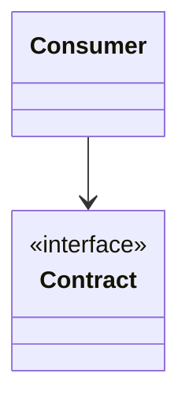
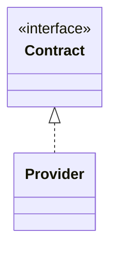
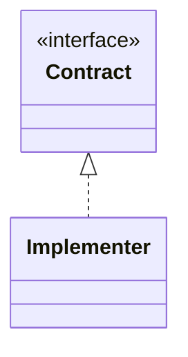

# Interface Segregation Principle - Introduction

The **Interface Segregation Principle (ISP)** is the fourth principle in SOLID. It guides how to design interfaces that are focused and easy to use. It is closely related to the Single Responsibility Principle, but focused on interfaces instead of classes.

## The contract

An interface is often considered a _contract_ between the class using the interface and the class implementing the interface. The class using the interface can expect certain methods to be implemented with certain behaviour. The class implementing the interface is the _provider_ of the contract, and has to fulfil the agreed upon behaviour.

## The Core Message

> **Interfaces should be small, granular and focused.**

Instead of creating one large interface with many methods, use multiple smaller interfaces, each serving a specific purpose. This principle ensures that classes only depend on the interfaces they actually use.

## Three Perspectives

The Interface Segregation Principle can be understood from (at least) three distinct perspectives, each highlighting different aspects of the same core idea. They all end up at roughly the same message, though: small interfaces.

### 1. The Consumer Side

**"I only want to depend on the small slice of behavior I actually use."**

From the consumer's perspective, ISP is about avoiding unnecessary coupling. A class that uses an interface should not be forced to depend on methods it doesn't call. This leads to **Role Interfaces** - interfaces defined by what the consumer needs, not what the provider has.

### 2. The Provider Side

**"I must define a contract that groups behaviors logically."**

Sometimes you write code, others will use. You define the interface to expose the behaviour of your code. This makes you the architect of this particular library or framework.

From the provider/architect's perspective, ISP is about creating well-organized, cohesive interfaces. Instead of creating "kitchen sink" interfaces that bundle unrelated functionality, interfaces should group related behaviors together. This ensures **Interface Cohesion** - all methods in an interface have a strong logical relationship.

### 3. The Implementer Side

**"I should only be required to fulfill a contract if it matches my actual capabilities."**

From the implementer's perspective, ISP is about avoiding the "Tax to Enter" problem. Classes should not be forced to implement methods they cannot meaningfully support. Granular interfaces allow classes to implement only what they can honestly provide, avoiding empty methods, exceptions, or "lying code."

## Relationship to Other Principles

ISP works closely with:
- **Single Responsibility Principle** - Interfaces should have one responsibility
- **Liskov Substitution Principle** - Segregated interfaces help ensure implementations can fulfill contracts honestly
- **Dependency Inversion Principle** - Consumers depend on focused interfaces

## Summary

The Interface Segregation Principle ensures that:
- **Interfaces are small and focused** - Each interface has a clear, single purpose
- **Classes depend only on what they use** - No unnecessary coupling
- **Implementations are honest** - No forced empty methods or exceptions
- **Designs are flexible** - Classes can mix and match interfaces as needed

In the following sections, we'll explore each of the three perspectives in detail to understand how ISP applies in different scenarios.
