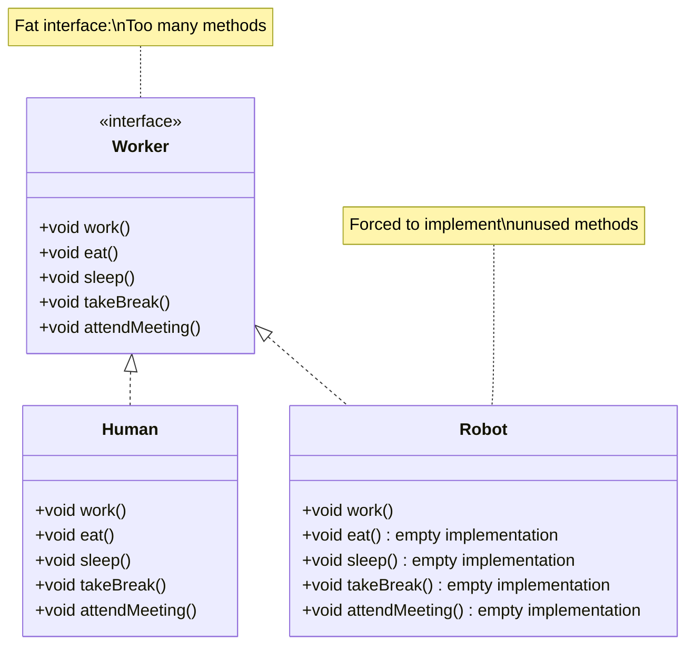
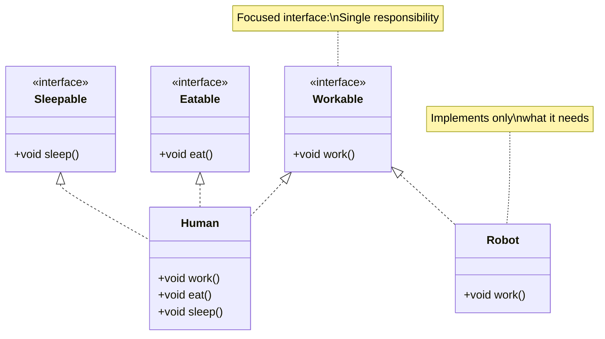

# Interface Segregation Principle - Introduction

The **Interface Segregation Principle (ISP)** is the fourth principle in SOLID. It guides how to design interfaces that are focused and easy to use.

## Definition

**Clients should not be forced to depend on interfaces they don't use.**

This means interfaces should be **small and focused** rather than large and general. Instead of one "fat" interface with many methods, use multiple smaller interfaces, each serving a specific purpose.

## The Core Idea

When a class implements an interface, it should only be required to implement methods that are relevant to it. If an interface contains methods that a class doesn't need, that class is forced to implement them anyway (often with empty implementations or exceptions), which is a design smell.

## Fat Interface Problem

A **fat interface** (also called a "bloated" or "polluted" interface) contains too many methods, forcing implementers to provide implementations for methods they don't need.

```java
// Fat interface - too many responsibilities
public interface Worker {
    void work();
    void eat();
    void sleep();
    void takeBreak();
    void attendMeeting();
    void writeCode();
    void designSystem();
}
```

**Problem:** A `Robot` class that implements `Worker` must implement `eat()` and `sleep()`, which don't make sense for robots.

## Segregated Interfaces Solution

Instead of one fat interface, use **multiple focused interfaces**:

```java
// Segregated interfaces - each has a specific purpose
public interface Workable {
    void work();
}

public interface Eatable {
    void eat();
}

public interface Sleepable {
    void sleep();
}

public interface Codeable {
    void writeCode();
}
```

**Solution:** Classes implement only the interfaces they need. A `Robot` implements `Workable` and `Codeable`, but not `Eatable` or `Sleepable`.

## Benefits of ISP

Following the Interface Segregation Principle provides several benefits:

### 1. No Empty Implementations

Classes don't need to implement methods they don't use. No more empty method bodies or "not supported" exceptions.

### 2. Clearer Contracts

Each interface has a clear, focused purpose. It's obvious what each interface is for.

### 3. Easier to Understand

Small interfaces are easier to understand than large ones. You can see at a glance what an interface does.

### 4. More Flexible

Classes can implement exactly the interfaces they need. You're not forced into a one-size-fits-all solution.

### 5. Better Cohesion

Interfaces are cohesive - all methods in an interface are related to a single purpose.

### 6. Easier to Change

Changes to one interface don't affect classes that don't use it.

## Visualizing ISP

Here's a diagram showing the difference:



**Problem:** Robot is forced to implement methods it doesn't need.



**Solution:** Each interface is focused, and classes implement only what they need.

## How to Apply ISP

### 1. Identify Client Needs

Look at what methods clients actually use. If different clients use different subsets of methods, consider splitting the interface.

### 2. Split by Responsibility

Group methods by responsibility. Each interface should have one clear purpose.

### 3. Keep Interfaces Small

Prefer many small interfaces over one large interface. Each interface should be as small as possible while still being useful.

### 4. Use Multiple Interfaces

Classes can implement multiple interfaces. This gives you flexibility without forcing unused methods.

## Example: Good Interface Design

```java
// Small, focused interfaces
public interface Readable {
    String read();
}

public interface Writable {
    void write(String data);
}

public interface Deletable {
    void delete();
}

// Classes implement what they need
public class ReadOnlyFile implements Readable {
    public String read() {
        // Implementation
    }
}

public class ReadWriteFile implements Readable, Writable {
    public String read() {
        // Implementation
    }
    
    public void write(String data) {
        // Implementation
    }
}
```

## When ISP Applies

ISP is especially important when:
- Different clients need different subsets of functionality
- Some implementations can't support all methods
- You want to avoid empty implementations
- You want clearer, more focused contracts

## Relationship to Other Principles

ISP works closely with:
- **Single Responsibility** - Interfaces should have one responsibility
- **Liskov Substitution** - Segregated interfaces help ensure implementations can fulfill contracts
- **Dependency Inversion** - Clients depend on focused interfaces

## Summary

- **Definition:** Clients shouldn't depend on interfaces they don't use
- **Key idea:** Many small, focused interfaces instead of one large interface
- **Benefits:** No empty implementations, clearer contracts, more flexible
- **Question to ask:** "Does this class need all methods in this interface?"

Next, we'll look at examples of ISP violations and the problems they cause.

