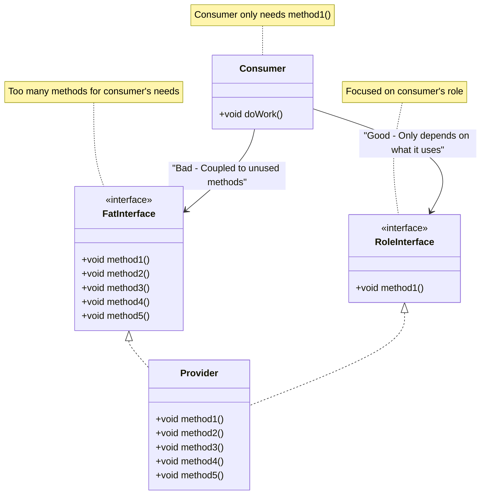

# Interface Segregation Principle - Consumer Side

The **Consumer Side** of the Interface Segregation Principle focuses on the perspective of classes that *use* interfaces. This is often called the **Client-Owned Interfaces** or **Role Interfaces** approach.

This is actually the most common perspective, as the principle states:


## The Consumer Perspective

> **"I only want to depend on the small slice of behavior I actually use."**

When you're writing a class that needs some functionality, you should define an interface based on what *you* need, not what the provider has. This naturally results in small, focused interfaces.

## The Pressure: Coupling

The main concern from the consumer's perspective is **coupling**. If an interface is too large, the consumer becomes coupled to methods it doesn't call, or shouldn't have access to.

### The Problem

If the interface changes a method that the consumer doesn't use, the consumer might still need to be recompiled or retested. This creates unnecessary dependencies and makes the system more fragile.

**Example:** A `ProfilePictureViewer` class that only needs to display a user's profile picture shouldn't have to depend on methods related to "Admin Rights" or "Account Management" just because they're in the same `IUser` interface.

## The Solution: Role Interfaces

The consumer should define the interface it needs based on the *role* the object plays for the consumer, not the identity of the object itself.

### Key Concept: Role Interfaces

A **Role Interface** describes a specific *role* that an object plays for the consumer, not what the object is. For example:
- `IImageProvider` - describes something that can provide an image
- `IReadable` - describes something that can be read
- `IAuthenticator` - describes something that can authenticate

The same object might implement multiple role interfaces, playing different roles for different consumers.

## Example: Document Previewer

Imagine a **Document Management System** where you have a `DocumentPreviewer` class that needs to show a thumbnail.

### Bad ISP: Fat Interface

```java
public interface IDocument {
    String read();
    void delete();
    void encrypt();
    void edit();
    void archive();
    void print();
    // ... many more methods
}

public class DocumentPreviewer {
    private IDocument document;  // Forced to depend on ALL methods
    
    public void showThumbnail() {
        // I only need read(), but I'm coupled to delete(), encrypt(), etc.
        String content = document.read();
        displayThumbnail(content);
    }
}
```

**Problem:** The `DocumentPreviewer` is coupled to methods like `delete()` and `encrypt()` that it will never use. If any of those methods change, this class might be affected.

### Good ISP: Role Interface

```java
// Consumer defines what it needs
public interface IReadable {
    String read();
}

public class DocumentPreviewer {
    private IReadable document;  // Only depends on what it uses
    
    public void showThumbnail() {
        String content = document.read();
        displayThumbnail(content);
    }
}
```

**Benefit:** The `DocumentPreviewer` only depends on `read()`. It's not affected by changes to `delete()`, `encrypt()`, or any other methods.

## Example: Profile Picture Viewer

Consider a class that only needs to display a user's profile picture:

### Bad ISP

```java
public interface IUser {
    String getProfilePicture();
    String getName();
    String getEmail();
    void setAdminRights(boolean admin);
    void changePassword(String newPassword);
    void deleteAccount();
    // ... many more methods
}

public class ProfilePictureViewer {
    private IUser user;  // Forced to depend on ALL user methods
    
    public void displayPicture() {
        String picture = user.getProfilePicture();
        render(picture);
    }
}
```

**Problem:** The viewer is coupled to admin rights, password changes, and account deletion - none of which it needs.

### Good ISP

```java
// Consumer defines the role it needs
public interface IImageProvider {
    String getProfilePicture();
}

public class ProfilePictureViewer {
    private IImageProvider imageSource;  // Only depends on image provision
    
    public void displayPicture() {
        String picture = imageSource.getProfilePicture();
        render(picture);
    }
}
```

**Benefit:** The viewer is decoupled from all user management concerns. It only knows about image provision.

## Visualizing the Consumer Side



## The Mindset

When following the consumer-side approach:

- **Think:** "I am a class doing a job. I need a helper. I don't care who the helper is, but they must be able to do *X*."
- **Result:** You define an interface based on what the consumer needs, not what the provider has.
- **Outcome:** This naturally results in small, focused interfaces that satisfy ISP.

## Benefits

Following ISP from the consumer side provides:

1. **Safety** - Consumers can't accidentally call methods they shouldn't use
2. **Low Coupling** - Consumers aren't affected by changes to methods they don't use
3. **Clear Intent** - The interface clearly communicates what the consumer needs
4. **Flexibility** - Any object that can play the role can be used, regardless of its other capabilities

## Relationship to Dependency Inversion

The consumer-side view of ISP is closely related to the **Dependency Inversion Principle**. When consumers define their own interfaces (required interfaces), they're inverting the dependency - they're not depending on concrete implementations, but on abstractions they control.

## Summary

From the consumer's perspective, ISP means:

- **Define interfaces based on what you need** - Not what the provider has
- **Use Role Interfaces** - Describe the role, not the identity
- **Avoid unnecessary coupling** - Don't depend on methods you don't use
- **Think "required interface"** - What does my class require to do its job?

By following this approach, you naturally create small, focused interfaces that make your code more maintainable and flexible.

