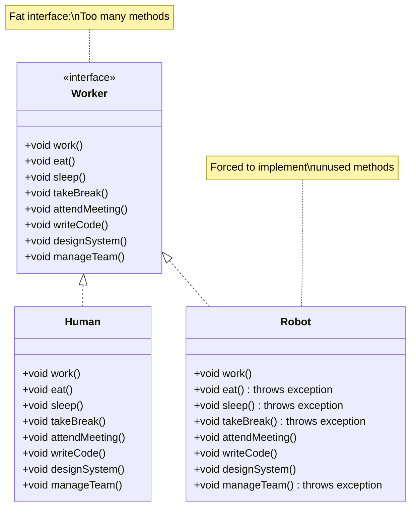

# Interface Segregation Principle - Violations

Let's examine examples that violate the Interface Segregation Principle and understand the problems they cause.

## Example 1: Worker Interface

Consider a `Worker` interface that includes methods for all possible worker activities:

```java
public interface Worker {
    void work();
    void eat();
    void sleep();
    void takeBreak();
    void attendMeeting();
    void writeCode();
    void designSystem();
    void manageTeam();
}
```

Now, let's see how different classes implement this interface:

```java
public class Human implements Worker {
    @Override
    public void work() {
        System.out.println("Human is working");
    }
    
    @Override
    public void eat() {
        System.out.println("Human is eating");
    }
    
    @Override
    public void sleep() {
        System.out.println("Human is sleeping");
    }
    
    @Override
    public void takeBreak() {
        System.out.println("Human is taking a break");
    }
    
    @Override
    public void attendMeeting() {
        System.out.println("Human is attending a meeting");
    }
    
    @Override
    public void writeCode() {
        System.out.println("Human is writing code");
    }
    
    @Override
    public void designSystem() {
        System.out.println("Human is designing a system");
    }
    
    @Override
    public void manageTeam() {
        System.out.println("Human is managing a team");
    }
}

public class Robot implements Worker {
    @Override
    public void work() {
        System.out.println("Robot is working");
    }
    
    @Override
    public void eat() {
        // Robots don't eat!
        throw new UnsupportedOperationException("Robots cannot eat");
    }
    
    @Override
    public void sleep() {
        // Robots don't sleep!
        throw new UnsupportedOperationException("Robots cannot sleep");
    }
    
    @Override
    public void takeBreak() {
        // Robots don't take breaks!
        throw new UnsupportedOperationException("Robots cannot take breaks");
    }
    
    @Override
    public void attendMeeting() {
        System.out.println("Robot is attending a meeting");
    }
    
    @Override
    public void writeCode() {
        System.out.println("Robot is writing code");
    }
    
    @Override
    public void designSystem() {
        System.out.println("Robot is designing a system");
    }
    
    @Override
    public void manageTeam() {
        // Robots don't manage teams!
        throw new UnsupportedOperationException("Robots cannot manage teams");
    }
}
```

## The Problem

The `Worker` interface violates ISP because:

1. **Forces unused implementations** - `Robot` must implement methods it doesn't need
2. **Empty or exception-throwing methods** - `Robot` throws exceptions for methods it can't support
3. **Confusing contract** - The interface suggests all workers can do everything
4. **Tight coupling** - Classes are coupled to methods they don't use

## Visualizing the Violation



## Problems Caused by This Violation

### 1. Empty or Exception-Throwing Implementations

Classes must implement methods they don't need, leading to:
- Empty method bodies (doing nothing)
- Throwing exceptions (indicating "not supported")
- Confusing code that suggests functionality that doesn't exist

### 2. Confusing Contracts

The interface suggests that all workers can eat, sleep, and manage teams, but this isn't true for robots. The contract is misleading.

### 3. Runtime Errors

Code using the interface might call methods that throw exceptions:

```java
public class WorkerManager {
    public void manageWorker(Worker worker) {
        worker.work();
        worker.eat();  // Crashes if worker is a Robot!
        worker.sleep();  // Crashes if worker is a Robot!
    }
}

// Usage
WorkerManager manager = new WorkerManager();
Worker robot = new Robot();
manager.manageWorker(robot);  // Throws UnsupportedOperationException!
```

### 4. Hard to Maintain

If you add a new method to `Worker`, all implementing classes must be updated, even if they don't need the new method.

### 5. Violates Other Principles

This also violates:
- **Liskov Substitution** - Robot can't properly fulfill the Worker contract
- **Single Responsibility** - Interface has multiple responsibilities

## Example 2: File Operations Interface

Here's another common violation:

```java
public interface FileOperations {
    String read();
    void write(String data);
    void delete();
    void rename(String newName);
    void copy(String destination);
    void move(String destination);
    void compress();
    void encrypt();
}

public class ReadOnlyFile implements FileOperations {
    @Override
    public String read() {
        return "File content";
    }
    
    @Override
    public void write(String data) {
        throw new UnsupportedOperationException("Read-only file");
    }
    
    @Override
    public void delete() {
        throw new UnsupportedOperationException("Read-only file");
    }
    
    @Override
    public void rename(String newName) {
        throw new UnsupportedOperationException("Read-only file");
    }
    
    @Override
    public void copy(String destination) {
        throw new UnsupportedOperationException("Read-only file");
    }
    
    @Override
    public void move(String destination) {
        throw new UnsupportedOperationException("Read-only file");
    }
    
    @Override
    public void compress() {
        throw new UnsupportedOperationException("Read-only file");
    }
    
    @Override
    public void encrypt() {
        throw new UnsupportedOperationException("Read-only file");
    }
}
```

**Problem:** `ReadOnlyFile` is forced to implement methods it can't support, throwing exceptions for most operations.

## Example 3: Printer Interface

```java
public interface Printer {
    void print(String document);
    void scan();
    void fax(String document);
    void copy(String document);
}

public class BasicPrinter implements Printer {
    @Override
    public void print(String document) {
        System.out.println("Printing: " + document);
    }
    
    @Override
    public void scan() {
        throw new UnsupportedOperationException("Basic printer cannot scan");
    }
    
    @Override
    public void fax(String document) {
        throw new UnsupportedOperationException("Basic printer cannot fax");
    }
    
    @Override
    public void copy(String document) {
        throw new UnsupportedOperationException("Basic printer cannot copy");
    }
}
```

**Problem:** A basic printer is forced to implement scan, fax, and copy methods it doesn't support.

## Recognizing ISP Violations

Signs that an interface violates ISP:

1. **Classes implementing empty methods** - Methods that do nothing
2. **Classes throwing "not supported" exceptions** - Methods that throw exceptions
3. **Large interfaces** - Interfaces with many methods
4. **Different clients use different subsets** - Some clients only use some methods
5. **Implementations that can't support all methods** - Some methods don't make sense for some implementations

## Summary

ISP violations occur when:
- **Interfaces are too large** - Contain too many methods
- **Classes implement unused methods** - Forced to provide implementations they don't need
- **Empty or exception-throwing methods** - Indicate methods that shouldn't be in the interface
- **Confusing contracts** - Interface suggests capabilities that don't exist

These violations cause:
- **Runtime errors** when unused methods are called
- **Confusing code** with empty or exception-throwing methods
- **Maintenance problems** when interfaces change
- **Violations of other principles** (LSP, SRP)

Next, we'll see how to fix these violations by splitting interfaces into smaller, focused ones.

