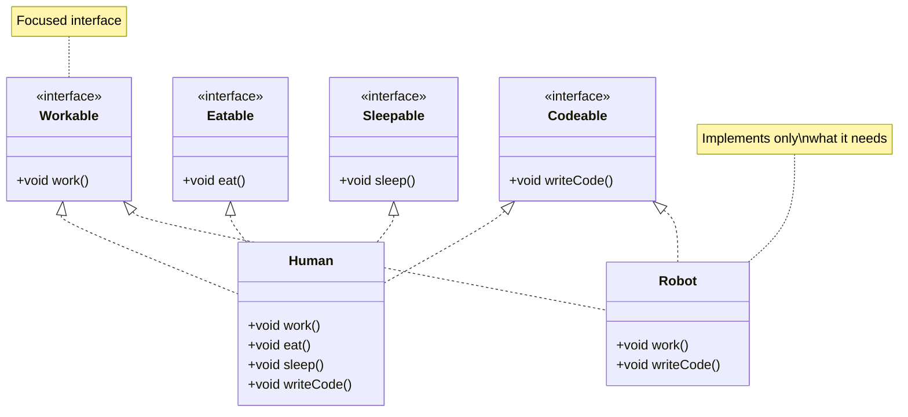
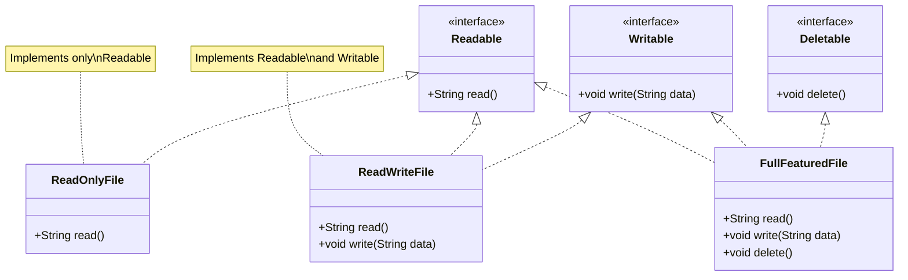

# Interface Segregation Principle - Fix

Let's fix the ISP violations by splitting fat interfaces into smaller, focused interfaces that classes can implement as needed.

## Fix 1: Worker Interface - Segregate by Capability

Instead of one fat `Worker` interface, we'll create multiple focused interfaces.

### Refactored Code

```java
// Segregated interfaces - each has a specific purpose
public interface Workable {
    void work();
}

public interface Eatable {
    void eat();
}

public interface Sleepable {
    void sleep();
}

public interface Breakable {
    void takeBreak();
}

public interface MeetingAttendable {
    void attendMeeting();
}

public interface Codeable {
    void writeCode();
}

public interface Designable {
    void designSystem();
}

public interface Manageable {
    void manageTeam();
}
```

### Implementations

```java
// Human implements all relevant interfaces
public class Human implements Workable, Eatable, Sleepable, 
                                Breakable, MeetingAttendable, 
                                Codeable, Designable, Manageable {
    @Override
    public void work() {
        System.out.println("Human is working");
    }
    
    @Override
    public void eat() {
        System.out.println("Human is eating");
    }
    
    @Override
    public void sleep() {
        System.out.println("Human is sleeping");
    }
    
    @Override
    public void takeBreak() {
        System.out.println("Human is taking a break");
    }
    
    @Override
    public void attendMeeting() {
        System.out.println("Human is attending a meeting");
    }
    
    @Override
    public void writeCode() {
        System.out.println("Human is writing code");
    }
    
    @Override
    public void designSystem() {
        System.out.println("Human is designing a system");
    }
    
    @Override
    public void manageTeam() {
        System.out.println("Human is managing a team");
    }
}

// Robot implements only what it needs
public class Robot implements Workable, MeetingAttendable, 
                               Codeable, Designable {
    @Override
    public void work() {
        System.out.println("Robot is working");
    }
    
    @Override
    public void attendMeeting() {
        System.out.println("Robot is attending a meeting");
    }
    
    @Override
    public void writeCode() {
        System.out.println("Robot is writing code");
    }
    
    @Override
    public void designSystem() {
        System.out.println("Robot is designing a system");
    }
    // No eat(), sleep(), takeBreak(), or manageTeam() - not needed!
}
```

### Using the Refactored Code

```java
public class WorkerManager {
    public void makeWork(Workable worker) {
        worker.work();
    }
    
    public void provideLunch(Eatable worker) {
        worker.eat();
    }
    
    public void sendToBreak(Breakable worker) {
        worker.takeBreak();
    }
}

// Usage
WorkerManager manager = new WorkerManager();

Human human = new Human();
manager.makeWork(human);        // Works
manager.provideLunch(human);    // Works
manager.sendToBreak(human);    // Works

Robot robot = new Robot();
manager.makeWork(robot);        // Works
// manager.provideLunch(robot); // Compile error - Robot doesn't implement Eatable
// manager.sendToBreak(robot);  // Compile error - Robot doesn't implement Breakable
```

## Fix 2: File Operations - Segregate by Operation Type

Split file operations into read, write, and management interfaces.

### Refactored Code

```java
// Segregated interfaces
public interface Readable {
    String read();
}

public interface Writable {
    void write(String data);
}

public interface Deletable {
    void delete();
}

public interface Renameable {
    void rename(String newName);
}

public interface Copyable {
    void copy(String destination);
}

public interface Moveable {
    void move(String destination);
}

public interface Compressable {
    void compress();
}

public interface Encryptable {
    void encrypt();
}
```

### Implementations

```java
// Read-only file implements only Readable
public class ReadOnlyFile implements Readable {
    private String content;
    
    public ReadOnlyFile(String content) {
        this.content = content;
    }
    
    @Override
    public String read() {
        return content;
    }
    // No other methods needed!
}

// Read-write file implements Readable and Writable
public class ReadWriteFile implements Readable, Writable {
    private String content;
    
    public ReadWriteFile(String content) {
        this.content = content;
    }
    
    @Override
    public String read() {
        return content;
    }
    
    @Override
    public void write(String data) {
        this.content = data;
    }
}

// Full-featured file implements multiple interfaces
public class FullFeaturedFile implements Readable, Writable, Deletable, 
                                         Renameable, Copyable, Moveable, 
                                         Compressable, Encryptable {
    private String content;
    private String name;
    
    @Override
    public String read() {
        return content;
    }
    
    @Override
    public void write(String data) {
        this.content = data;
    }
    
    @Override
    public void delete() {
        // Delete implementation
    }
    
    @Override
    public void rename(String newName) {
        this.name = newName;
    }
    
    @Override
    public void copy(String destination) {
        // Copy implementation
    }
    
    @Override
    public void move(String destination) {
        // Move implementation
    }
    
    @Override
    public void compress() {
        // Compress implementation
    }
    
    @Override
    public void encrypt() {
        // Encrypt implementation
    }
}
```

## Fix 3: Printer Interface - Segregate by Function

Split printer functionality into separate interfaces.

### Refactored Code

```java
// Segregated interfaces
public interface Printable {
    void print(String document);
}

public interface Scannable {
    void scan();
}

public interface Faxable {
    void fax(String document);
}

public interface Copyable {
    void copy(String document);
}
```

### Implementations

```java
// Basic printer implements only Printable
public class BasicPrinter implements Printable {
    @Override
    public void print(String document) {
        System.out.println("Printing: " + document);
    }
    // No other methods needed!
}

// Multi-function printer implements all interfaces
public class MultiFunctionPrinter implements Printable, Scannable, 
                                              Faxable, Copyable {
    @Override
    public void print(String document) {
        System.out.println("Printing: " + document);
    }
    
    @Override
    public void scan() {
        System.out.println("Scanning document");
    }
    
    @Override
    public void fax(String document) {
        System.out.println("Faxing: " + document);
    }
    
    @Override
    public void copy(String document) {
        System.out.println("Copying: " + document);
    }
}
```

## Visualizing the Fixes

### Worker Interface Fix



### File Operations Fix



## Benefits of the Fixes

### 1. No Empty Implementations

Classes only implement methods they actually need. No more empty methods or exceptions.

### 2. Clear Contracts

Each interface has a clear, focused purpose. It's obvious what each interface is for.

### 3. Flexible Design

Classes can implement exactly the interfaces they need. You're not forced into a one-size-fits-all solution.

### 4. Compile-Time Safety

If you try to call a method that a class doesn't support, you get a compile error, not a runtime exception.

### 5. Easy to Extend

Adding new capabilities means adding new interfaces. Existing classes don't need to change.

### 6. Better Cohesion

Interfaces are cohesive - all methods in an interface are related to a single purpose.

## Using Multiple Interfaces

Classes can implement multiple interfaces to get exactly the functionality they need:

```java
// A developer robot that works and codes
public class DeveloperRobot implements Workable, Codeable {
    // Implementation
}

// A manager human that works, manages, and attends meetings
public class ManagerHuman implements Workable, Manageable, MeetingAttendable {
    // Implementation
}
```

## Summary

By segregating interfaces:

- **Small, focused interfaces** - Each interface has one clear purpose
- **Classes implement only what they need** - No forced implementations
- **No empty methods or exceptions** - All methods are meaningful
- **Clear contracts** - Obvious what each interface provides
- **Compile-time safety** - Errors caught at compile time, not runtime
- **Flexible design** - Classes can mix and match interfaces as needed

The interfaces are now properly segregated, following the Interface Segregation Principle.

Next, we'll explore the final SOLID principle: Dependency Inversion Principle.

