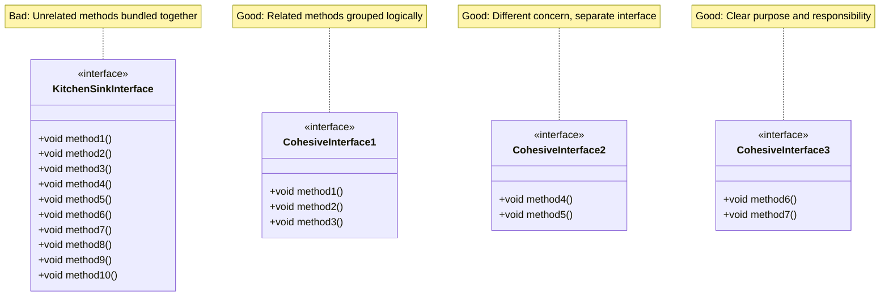

# Interface Segregation Principle - Provider Side

The **Provider Side** of the Interface Segregation Principle focuses on the perspective of those who *design* and *expose* interfaces - the API designers, library authors, and system architects. Basically:

**You write some code, that someone else will use.**

## The Provider Perspective

> **"I must define a contract that groups behaviors logically."**

When you're designing a system's public API or library interface, you need to organize functionality into cohesive, well-structured interfaces. This is about how the system is *defined* before anyone even writes the code to implement it.

## The Pressure: Cohesion

The main concern from the provider's perspective is **cohesion**. Interfaces should group related behaviors together, ensuring that all methods in an interface have a strong logical relationship to one another.

### The Problem

Creating a "Kitchen Sink" or "God Object" interface that bundles unrelated functionality leads to:
- Bloated APIs that are hard to understand
- Difficult mocking and testing (must mock 50 methods even if you only use 2)
- Confusing contracts that don't clearly communicate purpose
- Maintenance nightmares when the interface grows

**Example:** A single `IDocumentService` interface containing 50 methods for everything from printing to archiving to encryption makes the API hard to understand and use.

## The Solution: Interface Cohesion

Design interfaces based on functional clusters. Group methods that belong together logically, and separate concerns that are unrelated.

### Key Concept: Interface Cohesion

**Interface Cohesion** means ensuring that the methods in an interface have a strong logical relationship to one another. Methods should work together to fulfill a single, well-defined purpose.

For example:
- `IAuthentication` - Login, Logout, ValidateSession (all about authentication)
- `IAuthorization` - CheckPermissions, HasAccess, IsAuthorized (all about authorization)
- `IDocumentEditor` - Edit, Save, Undo, Redo (all about editing)
- `IDocumentArchiver` - Archive, Retrieve, ListArchived (all about archiving)

These are separate because authentication and authorization are different concerns, even though they're related.

## Example: Document Management System

Imagine you're the architect designing the core library for a **Document Management System**.

### Bad ISP: Kitchen Sink Interface

```java
// One massive interface with everything
public interface DocumentService {
    // Authentication
    void login(String username, String password);
    void logout();
    boolean isAuthenticated();
    
    // Document operations
    Document createDocument(String name);
    Document readDocument(String id);
    void updateDocument(String id, Document doc);
    void deleteDocument(String id);
    
    // Editing
    void editDocument(String id);
    void saveDocument(String id);
    void undo(String id);
    void redo(String id);
    
    // Archiving
    void archiveDocument(String id);
    Document retrieveArchived(String id);
    List<Document> listArchived();
    
    // Printing
    void printDocument(String id);
    void printPreview(String id);
    void setPrintSettings(String id, PrintSettings settings);
    
    // Encryption
    void encryptDocument(String id, String key);
    void decryptDocument(String id, String key);
    
    // Sharing
    void shareDocument(String id, String userId);
    void revokeAccess(String id, String userId);
    List<String> getSharedWith(String id);
    
    // ... 30 more methods
}
```

**Problems:**
1. **Hard to understand** - What does this interface do? Everything?
2. **Hard to mock** - Testing requires mocking 50+ methods
3. **Hard to implement** - Any class implementing this must handle all concerns
4. **Violates SRP** - The interface has multiple responsibilities

### Good ISP: Segregated by Function

```java
// Authentication - separate concern
public interface Authentication {
    void login(String username, String password);
    void logout();
    boolean isAuthenticated();
}

// Document CRUD operations
public interface DocumentRepository {
    Document createDocument(String name);
    Document readDocument(String id);
    void updateDocument(String id, Document doc);
    void deleteDocument(String id);
}

// Document editing
public interface DocumentEditor {
    void editDocument(String id);
    void saveDocument(String id);
    void undo(String id);
    void redo(String id);
}

// Document archiving
public interface DocumentArchiver {
    void archiveDocument(String id);
    Document retrieveArchived(String id);
    List<Document> listArchived();
}

// Document printing
public interface DocumentPrinter {
    void printDocument(String id);
    void printPreview(String id);
    void setPrintSettings(String id, PrintSettings settings);
}

// Document encryption
public interface DocumentEncryption {
    void encryptDocument(String id, String key);
    void decryptDocument(String id, String key);
}

// Document sharing
public interface DocumentSharing {
    void shareDocument(String id, String userId);
    void revokeAccess(String id, String userId);
    List<String> getSharedWith(String id);
}
```

**Benefits:**
1. **Clear purpose** - Each interface has a single, well-defined responsibility
2. **Easy to mock** - Test only what you need (e.g., mock `DocumentRepository` for repository tests)
3. **Easy to understand** - The API structure communicates the system's organization
4. **Flexible implementation** - Classes can implement only the interfaces they need

## Example: Testing and Mocking

The provider-side perspective becomes especially important when considering testing. We will cover this later in the course. But sometimes, when testing your code, you might have to swap out the concrete implementation of the interface with a "mock", or fake, implementation. If you have a large interface, this can be a pain. 

## Visualizing the Provider Side



## The Mindset

When following the provider-side approach:

- **Think:** "What functional clusters make sense? What behaviors belong together?"
- **Result:** You create interfaces based on logical groupings of related functionality
- **Outcome:** Clear, cohesive APIs that are easy to understand and use

## Design Guidelines

When designing interfaces from the provider perspective:

1. **Group by functionality** - Methods that work together should be in the same interface
2. **Separate concerns** - Different concerns (authentication vs. authorization) should be separate
3. **Consider usage patterns** - Methods that are often used together should be grouped
4. **Think about testing** - Will this interface be easy to mock for testing?
5. **Consider the API surface** - Does this interface communicate its purpose clearly?

## Benefits

Following ISP from the provider side provides:

1. **Clarity** - The API structure clearly communicates the system's organization
2. **Cohesion** - Related functionality is grouped together logically
3. **Maintainability** - Changes to one concern don't affect unrelated interfaces
4. **Testability** - Easier to mock and test focused interfaces
5. **Usability** - Developers can find and use the right interface for their needs

## Relationship to Single Responsibility Principle

The provider-side view of ISP is closely related to the **Single Responsibility Principle**. Each interface should have one reason to change - one cohesive set of related behaviors. If an interface has multiple unrelated responsibilities, it should be split.

## Summary

From the provider's perspective, ISP means:

- **Design interfaces based on functional clusters** - Group related behaviors together
- **Ensure Interface Cohesion** - All methods in an interface should have a strong logical relationship
- **Separate concerns** - Different concerns should be in different interfaces
- **Think "provided interface"** - What contract am I exposing to the world?

By following this approach, you create well-organized, maintainable APIs that are easy to understand, test, and use.

