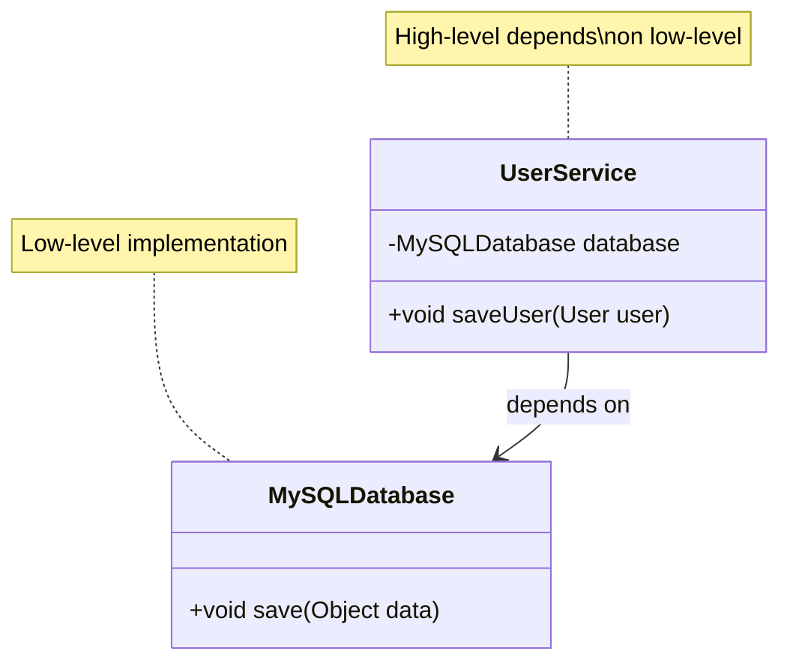
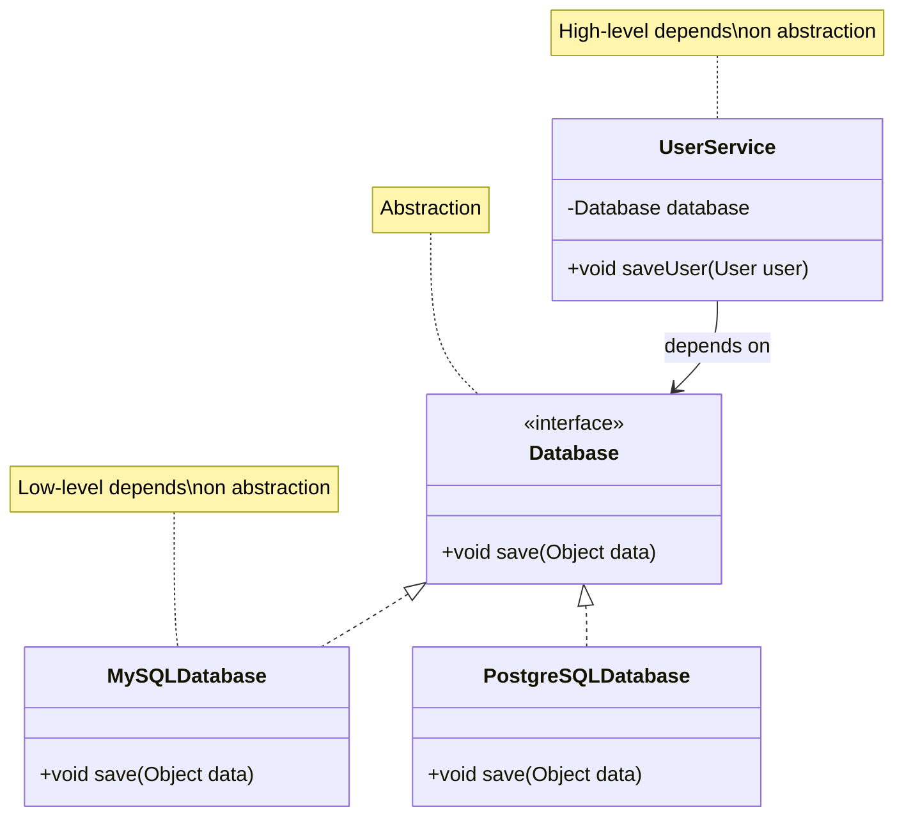

# Dependency Inversion Principle - Introduction

The **Dependency Inversion Principle (DIP)** is the fifth and final principle in SOLID. It guides how to structure dependencies between modules to achieve flexibility and maintainability.

## Definition

**High-level modules should not depend on low-level modules. Both should depend on abstractions.**

Additionally: **Abstractions should not depend on details. Details should depend on abstractions.**

## The Core Idea

Instead of high-level code depending directly on low-level implementations, both should depend on abstractions (interfaces or abstract classes). This "inverts" the typical dependency direction.

## Traditional Dependency Direction (Wrong)

In traditional design, high-level modules depend directly on low-level modules:

```
High-Level Module → Low-Level Module
```

**Example:**
- A `UserService` (high-level) directly depends on `MySQLDatabase` (low-level)
- If you want to switch to `PostgreSQLDatabase`, you must modify `UserService`

## Inverted Dependency Direction (Right)

With DIP, both depend on abstractions:

```
High-Level Module → Abstraction ← Low-Level Module
```

**Example:**
- `UserService` depends on `Database` interface (abstraction)
- `MySQLDatabase` implements `Database` interface
- `PostgreSQLDatabase` implements `Database` interface
- To switch databases, you only change which implementation is used

## What Are High-Level and Low-Level Modules?

### High-Level Modules

**High-level modules** contain business logic and policy decisions. They define what the system does.

Examples:
- `UserService` - Business logic for user operations
- `OrderProcessor` - Business logic for processing orders
- `PaymentHandler` - Business logic for handling payments

### Low-Level Modules

**Low-level modules** contain implementation details and infrastructure code. They define how things are done.

Examples:
- `MySQLDatabase` - Database implementation
- `FileLogger` - Logging implementation
- `EmailSender` - Email sending implementation

## The Inversion

The "inversion" refers to inverting the dependency direction:

**Before (Wrong):**
- High-level depends on low-level
- `UserService` depends on `MySQLDatabase`

**After (Right):**
- Both depend on abstraction
- `UserService` depends on `Database` interface
- `MySQLDatabase` depends on `Database` interface (implements it)

The dependency direction is "inverted" - high-level no longer points down to low-level, but both point to the abstraction.

## Benefits of DIP

Following the Dependency Inversion Principle provides several benefits:

### 1. Flexibility

You can swap implementations without modifying high-level code. Switch from MySQL to PostgreSQL by changing which implementation is used.

### 2. Testability

You can easily create mock implementations for testing. Test `UserService` with a `MockDatabase` instead of a real database.

### 3. Loose Coupling

High-level modules aren't tightly coupled to specific implementations. They depend on stable abstractions.

### 4. Maintainability

Changes to low-level implementations don't affect high-level code. Modify `MySQLDatabase` without touching `UserService`.

### 5. Extensibility

Add new implementations easily. Create `MongoDBDatabase` that implements `Database` interface.

## Visualizing DIP

Here's a diagram showing the difference:



**Problem:** High-level `UserService` depends directly on low-level `MySQLDatabase`.



**Solution:** Both high-level and low-level depend on the `Database` abstraction.

## How to Apply DIP

### 1. Identify Dependencies

Find where high-level modules depend on low-level modules.

### 2. Create Abstractions

Define interfaces or abstract classes that represent the contract.

### 3. Invert Dependencies

Make high-level modules depend on abstractions, and low-level modules implement them.

### 4. Use Dependency Injection

Pass implementations (dependencies) into high-level modules rather than creating them inside.

## Key Techniques

### 1. Use Interfaces

Define interfaces that low-level modules implement:

```java
public interface Database {
    void save(Object data);
    Object load(int id);
}
```

### 2. Dependency Injection

Pass dependencies into classes rather than creating them:

```java
// Wrong: Creating dependency inside
public class UserService {
    private MySQLDatabase database = new MySQLDatabase();
}

// Right: Injecting dependency
public class UserService {
    private Database database;
    
    public UserService(Database database) {
        this.database = database;
    }
}
```

### 3. Program to Interfaces

Code should depend on interfaces, not concrete classes:

```java
// Wrong: Depends on concrete class
public void process(MySQLDatabase db) { }

// Right: Depends on interface
public void process(Database db) { }
```

## When DIP Applies

DIP is especially important when:
- You need to swap implementations (different databases, loggers, etc.)
- You want to test code in isolation
- You need flexibility for future changes
- You're building reusable, maintainable code

## Relationship to Other Principles

DIP works closely with:
- **Open Closed Principle** - DIP enables OCP by allowing extension through new implementations
- **Liskov Substitution** - DIP relies on LSP to ensure implementations are substitutable
- **Interface Segregation** - DIP uses focused interfaces for dependencies

## Summary

- **Definition:** High-level modules shouldn't depend on low-level modules; both should depend on abstractions
- **Key idea:** Invert dependency direction - depend on interfaces, not implementations
- **Benefits:** Flexibility, testability, loose coupling, maintainability
- **Question to ask:** "Does this high-level code depend on a concrete implementation?"

Next, we'll look at examples of DIP violations and the problems they cause.

