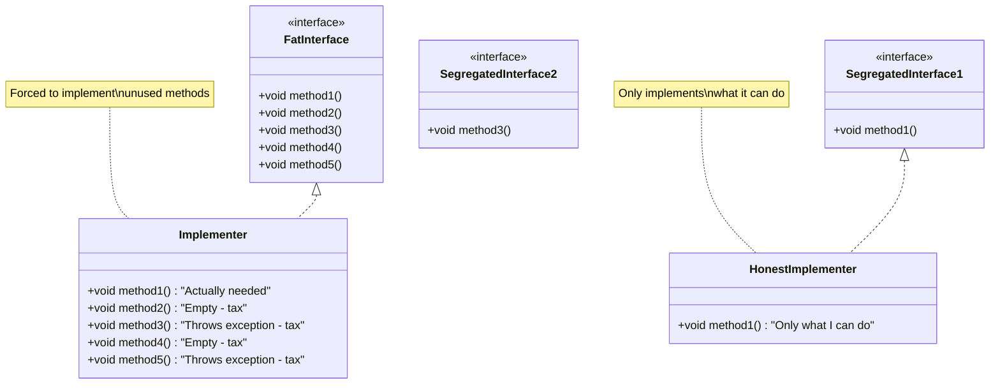

# Interface Segregation Principle - Implementer Side

The **Implementer Side** of the Interface Segregation Principle focuses on the perspective of classes that *implement* interfaces. This addresses the "Tax to Enter" problem - when a class wants to participate in a system but is forced to implement methods it cannot meaningfully support.

## The Implementer Perspective

> **"I can only fulfill a contract if it matches my actual physical or logical capabilities."**

When you're writing a class that implements an interface, you should only be required to implement methods that you can honestly and meaningfully support. If an interface requires methods your class cannot provide, you're forced to write "lying code" - empty methods, exceptions, or null returns.

## The Pressure: Liskov Substitution Principle (LSP)

The main concern from the implementer's perspective is the **Liskov Substitution Principle**. If you're forced to implement methods you can't support, your implementation becomes a "Revolting Implementer" - it can't properly fulfill the contract, violating LSP.

### The Problem: The "Tax to Enter"

The interface acts as a **gatekeeper** or a **slot** in a larger system. Your class wants to participate in the system (join the "Club"), but the doorman demands you implement everything - even capabilities you don't have.

**The "Tax to Enter" Problem:**
- You want your class to fit into a larger system (e.g., work with a foreach loop, participate in an event system, be recognized by a game engine)
- The system defines a slot (interface) that requires too many capabilities
- You're forced to implement empty methods, throw exceptions, or return null just to satisfy the compiler
- Your class carries dead weight and becomes confusing

## The Solution: Granular Interfaces

Granular interfaces allow the implementer to say, "I am a `ReadOnlyRepository`. I implement `IReadable`, but I simply *cannot* implement `IWritable`."

### Key Concept: Partial Implementation

**Partial Implementation** allows classes to pick and choose traits rather than being forced into a rigid hierarchy. A class can implement multiple small interfaces, selecting only the capabilities it actually has.

## Example 0: javafx.Application

This class is the abstract base class for your JavaFX application. The architects of this class has certainly done some consideration.

The class is abstract, so you extend it, rather the implementing an interface, but it is still worth looking at how the class is designed.

There is one _abstract_ method, `start(Stage primaryStage)`, which is the entry point for the application. You _have_ to provide an implementation of this method.\
But there are other methods, non-abstract, which you can optionally override. For example, you can override the `stop()` method to perform cleanup when the application is stopped.

You probably didn't know about this method, because you haven't needed it. If this method became a required part of the contract, you would have to implement it, and just leave it empty.

## Example 1: Game Object / Trigger Zone

Imagine you're writing a script for a video game engine. You want to create an invisible "Trigger Zone" (a box that triggers an event when the player walks into it).

To get the Game Engine to recognize your class, it requires you to implement the standard `IGameEntity` interface.

### Bad ISP: The "Tax"

```java
// The "Gatekeeper" Interface - requires everything
public interface IGameEntity {
    void render(Graphics g);       // Draw to screen
    void calculatePhysics();       // Handle gravity/collisions
    void playSound(String file);   // Audio
    void handleInput(Input i);     // Keyboard/Mouse
    void loadTexture(String path); // Visual assets
}

// Your Implementer Class - The Trigger Zone
public class InvisibleTrigger implements IGameEntity {
    // This is the ONLY thing you actually need:
    @Override
    public void calculatePhysics() {
        if (player.isTouching(this)) {
            triggerEvent();
        }
    }

    // --- The "Tax" you have to pay to fit into the system ---
    
    @Override
    public void render(Graphics g) {
        // I am invisible! I have nothing to render!
        // Do I leave this empty? Do I return null?
    }

    @Override
    public void playSound(String file) {
        throw new UnsupportedOperationException("I don't make sounds.");
    }

    @Override
    public void handleInput(Input i) {
        // I don't listen to keyboards.
    }

    @Override
    public void loadTexture(String path) {
        // I don't have a texture.
    }
}
```

**Problems:**
1. **Code Noise** - The class is 80% empty methods
2. **Confusion** - Other developers might wonder if the Trigger interacts with the Mouse
3. **Fragility** - If the system adds `onTouchScreenTap()` later, your class breaks even though it has nothing to do with touch screens

### Good ISP: Segregated Interfaces

```java
// Segregated interfaces based on capabilities
public interface IPhysicsEntity {
    void calculatePhysics();
}

public interface IRenderable {
    void render(Graphics g);
}

public interface IAudioEntity {
    void playSound(String file);
}

public interface IInputHandler {
    void handleInput(Input i);
}

public interface ITextureEntity {
    void loadTexture(String path);
}

// Your Implementer Class - Only implements what it needs
public class InvisibleTrigger implements IPhysicsEntity {
    @Override
    public void calculatePhysics() {
        if (player.isTouching(this)) {
            triggerEvent();
        }
    }
    // That's it! No empty methods, no exceptions, no lies.
}
```

**Benefits:**
- Clean, honest implementation
- No forced empty methods
- Clear about what the class actually does
- Easy to extend - can add `IRenderable` later if needed

## Example 2: Application Event System

Imagine you're building a system where objects can "listen" to what is happening in the main application window.

### Bad ISP: The "God" Listener

```java
// The "Gatekeeper" Interface
public interface IApplicationListener {
    void onMouseClicked(int x, int y);
    void onKeyPressed(char key);
    void onWindowResized(int width, int height);
    void onWifiConnectionLost();
    void onBatteryLow();
}

// Your Implementer - Auto-Save Feature
public class AutoSaveOnLowBattery implements IApplicationListener {
    
    // --- The ONLY reason we are here ---
    @Override
    public void onBatteryLow() {
        System.out.println("Battery low! Emergency save triggered...");
        saveData();
    }

    // --- The "Tax" to enter the system ---
    
    @Override
    public void onMouseClicked(int x, int y) {
        // I am a background process. I don't have a UI. 
        // Why are you telling me about mouse clicks?
    }

    @Override
    public void onKeyPressed(char key) {
        // Empty.
    }

    @Override
    public void onWindowResized(int width, int height) {
        // I don't care about the window size.
    }

    @Override
    public void onWifiConnectionLost() {
        // Not my job.
    }
}
```

**Why this hurts:**
1. **Code Noise** - The class is 80% empty methods
2. **Confusion** - Does the AutoSaver interact with the Mouse? You have to read the code to realize it does nothing
3. **Fragility** - If the system adds `onTouchScreenTap()` later, your class breaks even though it has nothing to do with touch screens

### Good ISP: Segregated Interfaces

```java
// Segregated interfaces based on event types
public interface IMouseListener {
    void onMouseClicked(int x, int y);
}

public interface IKeyboardListener {
    void onKeyPressed(char key);
}

public interface ISystemStateListener {
    void onWifiConnectionLost();
    void onBatteryLow();
}

public interface IWindowListener {
    void onWindowResized(int width, int height);
}

// Your Happy Implementer
public class AutoSaveOnLowBattery implements ISystemStateListener {
    
    @Override
    public void onBatteryLow() {
        saveData();
    }

    @Override
    public void onWifiConnectionLost() {
        // This is cohesive enough that I might actually want to handle this too!
        // (e.g., pause cloud sync)
    }
    // No empty methods! Clean, honest implementation.
}
```

**Benefits:**
- The class "fits into the system" without carrying GUI or Input baggage
- Clear about what it actually handles
- Can easily add more system state listeners if needed

## Example 3: Payment Gateway

Imagine a system that processes payments. The system is designed to handle everything from Credit Cards to Crypto.

### Bad ISP: One-Size-Fits-All

```java
// The Interface - requires everything
public interface IPaymentMethod {
    void processPayment();
    void validateCreditCardNumber();
    void calculateCryptoGasFees();
    void checkBankRoutingNumber();
}

// Your Implementer - PayPal
public class PayPalPayment implements IPaymentMethod {
    @Override
    public void processPayment() {
        // PayPal handles this
        paypalAPI.charge(amount);
    }
    
    // --- The "Tax" ---
    
    @Override
    public void validateCreditCardNumber() {
        // PayPal handles that internally, you don't see the number
        throw new UnsupportedOperationException("PayPal doesn't expose card validation");
    }
    
    @Override
    public void calculateCryptoGasFees() {
        // Irrelevant for PayPal
        throw new UnsupportedOperationException("PayPal doesn't use crypto");
    }
    
    @Override
    public void checkBankRoutingNumber() {
        // PayPal handles this internally
        throw new UnsupportedOperationException("Not applicable");
    }
}
```

**Problem:** Your class becomes messy because the "Entry Ticket" (the interface) required you to acknowledge behaviors you don't possess.

### Good ISP: Capability-Based Interfaces

```java
// Segregated interfaces
public interface IPaymentProcessor {
    void processPayment();
}

public interface ICreditCardValidator {
    void validateCreditCardNumber();
}

public interface ICryptoPaymentCalculator {
    void calculateCryptoGasFees();
}

public interface IBankPaymentValidator {
    void checkBankRoutingNumber();
}

// Your Implementer - Only what it can do
public class PayPalPayment implements IPaymentProcessor {
    @Override
    public void processPayment() {
        paypalAPI.charge(amount);
    }
    // That's it! No forced implementations of capabilities we don't have.
}
```

## Example 4: Read-Only File Storage

Consider a class for **Archived Cold Storage** (e.g., Write-Once-Read-Many optical disks).

### Bad ISP: Forced to Lie

```java
public interface IDocument {
    String read();
    void update(String content);
    void delete();
}

public class ArchivedColdStorage implements IDocument {
    @Override
    public String read() {
        return readFromOpticalDisc();
    }
    
    // --- The "Tax" - I physically cannot do this ---
    @Override
    public void update(String content) {
        // I physically cannot update this file; it is burned onto a disc.
        throw new UnsupportedOperationException("Cannot update write-once media");
    }
    
    @Override
    public void delete() {
        // I physically cannot delete this file.
        throw new UnsupportedOperationException("Cannot delete write-once media");
    }
}
```

**Problem:** The implementer is forced to lie. It has to implement methods that throw exceptions, making the system fragile and prone to runtime errors.

### Good ISP: Honest Implementation

```java
public interface IReadable {
    String read();
}

public interface IModifiable {
    void update(String content);
    void delete();
}

public class ArchivedColdStorage implements IReadable {
    @Override
    public String read() {
        return readFromOpticalDisc();
    }
    // No update() or delete() - I simply cannot do these things.
    // The interface doesn't force me to lie.
}
```

**Benefit:** Granular interfaces allow the implementer to say, "I am a `ReadOnlyRepository`. I implement `IReadable`, but I simply *cannot* implement `IModifiable`."

## Visualizing the Implementer Side



## The "Resume" Metaphor

To visualize how this works, imagine an interface is a **Job Description** and your class is the **Applicant**:

- **The Job (The Interface):** `IOfficeWorker`
  - Requirements: Type 80wpm, Answer Phones, *Fly a Helicopter*
- **The Applicant (Your Class/Implementer):** A Temp Secretary
  - Capabilities: Type 80wpm, Answer Phones
  - Goal: "I just want to fit into the office system and do work."

**The Violation (Bad ISP):**
The office refuses to hire the secretary unless they get a pilot's license. The secretary is forced to lie on their resume ("Sure, I can fly...") but if anyone actually asks them to fly (calls the method), the helicopter crashes (Runtime Error).

**The Solution (Good ISP):**
Split the job description into `ITypist` and `IPilot`. The secretary applies for `ITypist`. They now "fit into the system" without needing irrelevant skills.

## Benefits

Following ISP from the implementer side provides:

1. **Honesty** - Classes only promise what they can deliver
2. **Type Safety** - Compile-time errors instead of runtime exceptions
3. **No "Lying Code"** - No forced empty methods or exception-throwing stubs
4. **Clarity** - The class clearly communicates what it can and cannot do
5. **Flexibility** - Classes can join systems by implementing only relevant interfaces

## Relationship to Liskov Substitution Principle

The implementer-side view of ISP is closely related to the **Liskov Substitution Principle**. When you're forced to implement methods you can't support, your implementation becomes a "Revolting Implementer" that violates LSP. Segregated interfaces allow honest implementations that can properly fulfill their contracts.

## Summary

From the implementer's perspective, ISP means:

- **Only implement what you can do** - Don't promise capabilities you don't have
- **Avoid the "Tax to Enter"** - Don't force classes to implement irrelevant methods just to join a system
- **Use Partial Implementation** - Pick and choose traits through multiple small interfaces
- **Think "capability"** - What can my class actually do? What interfaces match those capabilities?

By following this approach, you create honest, maintainable implementations that clearly communicate their capabilities and limitations.

