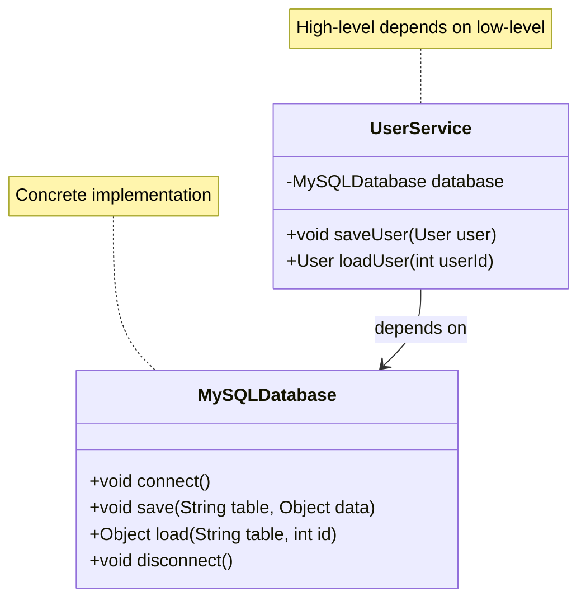

# Dependency Inversion Principle - Violations

Let's examine examples that violate the Dependency Inversion Principle and understand the problems they cause.

## Example 1: UserService Depending on MySQLDatabase

Consider a `UserService` that directly depends on a concrete `MySQLDatabase` class:

```java
public class MySQLDatabase {
    public void connect() {
        System.out.println("Connecting to MySQL database");
    }
    
    public void save(String table, Object data) {
        System.out.println("Saving to MySQL: " + table);
    }
    
    public Object load(String table, int id) {
        System.out.println("Loading from MySQL: " + table + ", ID: " + id);
        return null; // Simplified
    }
    
    public void disconnect() {
        System.out.println("Disconnecting from MySQL");
    }
}

public class UserService {
    private MySQLDatabase database;
    
    public UserService() {
        this.database = new MySQLDatabase();  // Direct dependency
        this.database.connect();
    }
    
    public void saveUser(User user) {
        database.save("users", user);
    }
    
    public User loadUser(int userId) {
        return (User) database.load("users", userId);
    }
    
    public void close() {
        database.disconnect();
    }
}
```

## The Problem

The `UserService` class violates DIP because:

1. **Direct dependency on concrete class** - `UserService` depends directly on `MySQLDatabase`
2. **Tight coupling** - Cannot use a different database without modifying `UserService`
3. **Hard to test** - Cannot easily test `UserService` without a real MySQL database
4. **Hard to change** - Switching to PostgreSQL requires modifying `UserService`

## Visualizing the Violation



## Problems Caused by This Violation

### 1. Cannot Swap Implementations

To switch from MySQL to PostgreSQL, you must modify `UserService`:

```java
// To use PostgreSQL, you must change UserService
public class UserService {
    private PostgreSQLDatabase database;  // Changed!
    
    public UserService() {
        this.database = new PostgreSQLDatabase();  // Changed!
        // ...
    }
}
```

**Problem:** High-level code must change when low-level implementation changes.

### 2. Hard to Test

Testing `UserService` requires a real MySQL database:

```java
@Test
public void testSaveUser() {
    UserService service = new UserService(...);  // Needs real MySQL!
    // Test code...
}
```

**Problem:** Cannot easily test in isolation or use mock databases.

### 3. Tight Coupling

`UserService` is tightly coupled to MySQL-specific details. Any change to `MySQLDatabase` might require changes to `UserService`.

### 4. Violates Open Closed Principle

Cannot extend the system (add new database types) without modifying existing code (`UserService`).

## Example 2: EmailService Depending on SMTPEmailSender

Here's another common violation:

```java
public class SMTPEmailSender {
    private String smtpServer;
    private int port;
    
    public SMTPEmailSender(String smtpServer, int port) {
        this.smtpServer = smtpServer;
        this.port = port;
    }
    
    public void sendEmail(String to, String subject, String body) {
        System.out.println("Sending email via SMTP to " + to);
        // SMTP-specific implementation
    }
}

public class NotificationService {
    private SMTPEmailSender emailSender;
    
    public NotificationService() {
        this.emailSender = new SMTPEmailSender("smtp.example.com", 587);
    }
    
    public void sendNotification(String userEmail, String message) {
        emailSender.sendEmail(userEmail, "Notification", message);
    }
}
```

**Problem:** `NotificationService` is tightly coupled to `SMTPEmailSender`. Cannot switch to a different email provider (e.g., SendGrid, Mailgun) without modifying `NotificationService`.

## Example 3: Logger Direct Dependency

```java
public class FileLogger {
    private String logFile;
    
    public FileLogger(String logFile) {
        this.logFile = logFile;
    }
    
    public void log(String message) {
        // Write to file
        System.out.println("Logging to file: " + message);
    }
}

public class OrderService {
    private FileLogger logger;
    
    public OrderService() {
        this.logger = new FileLogger("orders.log");  // Direct dependency
    }
    
    public void processOrder(Order order) {
        logger.log("Processing order: " + order.getId());
        // Process order...
    }
}
```

**Problem:** `OrderService` is coupled to `FileLogger`. Cannot switch to console logging, database logging, or cloud logging without modifying `OrderService`.


## Recognizing DIP Violations

Signs that code violates DIP:

1. **High-level classes create low-level objects** - Using `new` to create concrete dependencies
2. **Direct imports of concrete classes** - Importing specific implementations
3. **Cannot swap implementations** - Changing implementation requires modifying high-level code
4. **Hard to test** - Cannot easily inject mocks or test doubles
5. **Tight coupling** - High-level code knows about low-level implementation details

## Summary

DIP violations occur when:
- **High-level modules depend on low-level modules** - Direct dependencies on concrete classes
- **No abstractions** - No interfaces between high and low levels
- **Tight coupling** - Cannot change implementations without modifying high-level code
- **Hard to test** - Cannot easily inject test doubles

These violations cause:
- **Inflexibility** - Cannot swap implementations easily
- **Hard to test** - Requires real implementations for testing
- **Tight coupling** - Changes ripple through the system
- **Violations of other principles** - OCP, SRP

Next, we'll see how to fix these violations by introducing abstractions and inverting dependencies.

