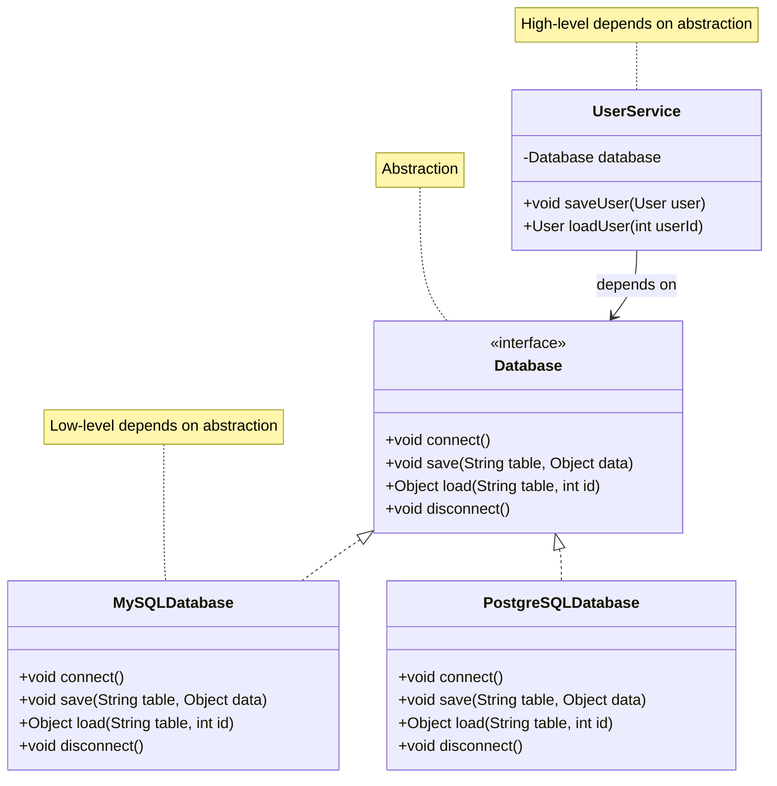
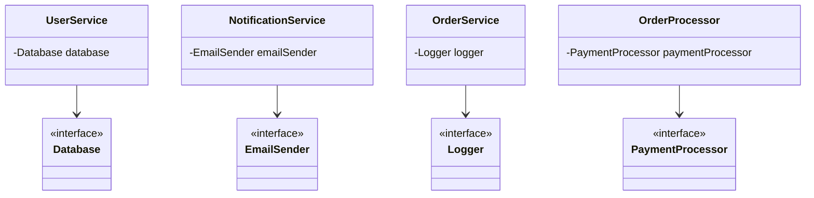

# Dependency Inversion Principle - Fix

Let's fix the DIP violations by introducing abstractions and inverting dependencies so high-level modules depend on interfaces rather than concrete implementations.

## Fix 1: UserService - Introduce Database Interface

Instead of `UserService` depending directly on `MySQLDatabase`, we'll introduce a `Database` interface.

### Refactored Code

```java
// Abstraction (interface)
public interface Database {
    void connect();
    void save(String table, Object data);
    Object load(String table, int id);
    void disconnect();
}

// Low-level implementation 1
public class MySQLDatabase implements Database {
    @Override
    public void connect() {
        System.out.println("Connecting to MySQL database");
    }
    
    @Override
    public void save(String table, Object data) {
        System.out.println("Saving to MySQL: " + table);
    }
    
    @Override
    public Object load(String table, int id) {
        System.out.println("Loading from MySQL: " + table + ", ID: " + id);
        return null;
    }
    
    @Override
    public void disconnect() {
        System.out.println("Disconnecting from MySQL");
    }
}

// Low-level implementation 2
public class PostgreSQLDatabase implements Database {
    @Override
    public void connect() {
        System.out.println("Connecting to PostgreSQL database");
    }
    
    @Override
    public void save(String table, Object data) {
        System.out.println("Saving to PostgreSQL: " + table);
    }
    
    @Override
    public Object load(String table, int id) {
        System.out.println("Loading from PostgreSQL: " + table + ", ID: " + id);
        return null;
    }
    
    @Override
    public void disconnect() {
        System.out.println("Disconnecting from PostgreSQL");
    }
}

// High-level module - depends on abstraction
public class UserService {
    private Database database;  // Depends on interface, not concrete class
    
    public UserService(Database database) {  // Dependency injection
        this.database = database;
        this.database.connect();
    }
    
    public void saveUser(User user) {
        database.save("users", user);
    }
    
    public User loadUser(int userId) {
        return (User) database.load("users", userId);
    }
    
    public void close() {
        database.disconnect();
    }
}
```

### Using the Refactored Code

```java
// Can use MySQL
Database mysqlDb = new MySQLDatabase();
UserService service1 = new UserService(mysqlDb);

// Can use PostgreSQL
Database postgresDb = new PostgreSQLDatabase();
UserService service2 = new UserService(postgresDb);

// Can switch implementations without modifying UserService!
```

## Fix 2: NotificationService - Introduce EmailSender Interface

### Refactored Code

```java
// Abstraction
public interface EmailSender {
    void sendEmail(String to, String subject, String body);
}

// Low-level implementation 1
public class SMTPEmailSender implements EmailSender {
    private String smtpServer;
    private int port;
    
    public SMTPEmailSender(String smtpServer, int port) {
        this.smtpServer = smtpServer;
        this.port = port;
    }
    
    @Override
    public void sendEmail(String to, String subject, String body) {
        System.out.println("Sending email via SMTP to " + to);
    }
}

// Low-level implementation 2
public class SendGridEmailSender implements EmailSender {
    private String apiKey;
    
    public SendGridEmailSender(String apiKey) {
        this.apiKey = apiKey;
    }
    
    @Override
    public void sendEmail(String to, String subject, String body) {
        System.out.println("Sending email via SendGrid to " + to);
    }
}

// High-level module - depends on abstraction
public class NotificationService {
    private EmailSender emailSender;  // Depends on interface
    
    public NotificationService(EmailSender emailSender) {  // Dependency injection
        this.emailSender = emailSender;
    }
    
    public void sendNotification(String userEmail, String message) {
        emailSender.sendEmail(userEmail, "Notification", message);
    }
}
```

## Fix 3: OrderService - Introduce Logger Interface

### Refactored Code

```java
// Abstraction
public interface Logger {
    void log(String message);
}

// Low-level implementations
public class FileLogger implements Logger {
    private String logFile;
    
    public FileLogger(String logFile) {
        this.logFile = logFile;
    }
    
    @Override
    public void log(String message) {
        System.out.println("Logging to file [" + logFile + "]: " + message);
    }
}

public class ConsoleLogger implements Logger {
    @Override
    public void log(String message) {
        System.out.println("Console log: " + message);
    }
}

public class DatabaseLogger implements Logger {
    private Database database;
    
    public DatabaseLogger(Database database) {
        this.database = database;
    }
    
    @Override
    public void log(String message) {
        database.save("logs", message);
    }
}

// High-level module - depends on abstraction
public class OrderService {
    private Logger logger;  // Depends on interface
    
    public OrderService(Logger logger) {  // Dependency injection
        this.logger = logger;
    }
    
    public void processOrder(Order order) {
        logger.log("Processing order: " + order.getId());
        // Process order...
    }
}
```

## Fix 4: OrderProcessor - Introduce PaymentProcessor Interface

### Refactored Code

```java
// Abstraction
public interface PaymentProcessor {
    boolean processPayment(double amount);
}

// Low-level implementations
public class StripePaymentProcessor implements PaymentProcessor {
    private String apiKey;
    
    public StripePaymentProcessor(String apiKey) {
        this.apiKey = apiKey;
    }
    
    @Override
    public boolean processPayment(double amount) {
        System.out.println("Processing payment via Stripe: $" + amount);
        return true;
    }
}

public class PayPalPaymentProcessor implements PaymentProcessor {
    private String clientId;
    private String secret;
    
    public PayPalPaymentProcessor(String clientId, String secret) {
        this.clientId = clientId;
        this.secret = secret;
    }
    
    @Override
    public boolean processPayment(double amount) {
        System.out.println("Processing payment via PayPal: $" + amount);
        return true;
    }
}

// High-level module - depends on abstraction
public class OrderProcessor {
    private PaymentProcessor paymentProcessor;  // Depends on interface
    
    public OrderProcessor(PaymentProcessor paymentProcessor) {  // Dependency injection
        this.paymentProcessor = paymentProcessor;
    }
    
    public void checkout(Order order) {
        if (paymentProcessor.processPayment(order.getTotal())) {
            // Complete order
            System.out.println("Order completed");
        }
    }
}
```

## Visualizing the Fixes

### Database Dependency Fix



### Complete System Fix



## Benefits of the Fixes

### 1. Easy to Swap Implementations

Switch implementations without modifying high-level code:

```java
// Use MySQL
UserService service1 = new UserService(new MySQLDatabase());

// Switch to PostgreSQL - no code changes needed!
UserService service2 = new UserService(new PostgreSQLDatabase());
```

### 2. Easy to Test

Inject mock implementations for testing:

```java
// Mock database for testing
public class MockDatabase implements Database {
    private List<Object> savedData = new ArrayList<>();
    
    @Override
    public void save(String table, Object data) {
        savedData.add(data);
    }
    
    // Other methods...
}

// Test with mock
@Test
public void testSaveUser() {
    MockDatabase mockDb = new MockDatabase();
    UserService service = new UserService(mockDb);
    // Test code...
}
```

### 3. Loose Coupling

High-level modules aren't coupled to specific implementations. They depend on stable interfaces.

### 4. Follows Open Closed Principle

Add new implementations (e.g., `MongoDBDatabase`) without modifying existing code.

### 5. Flexible Configuration

Choose implementations at runtime or through configuration:

```java
// Choose implementation based on configuration
Database database = config.getDatabaseType().equals("mysql") 
    ? new MySQLDatabase() 
    : new PostgreSQLDatabase();
UserService service = new UserService(database);
```

## Using Dependency Injection

The fixes use **dependency injection** - passing dependencies into classes rather than creating them inside:

```java
// Wrong: Creating dependency inside
public class UserService {
    private MySQLDatabase database = new MySQLDatabase();
}

// Right: Injecting dependency
public class UserService {
    private Database database;
    
    public UserService(Database database) {
        this.database = database;
    }
}
```

## Summary

By introducing abstractions and inverting dependencies:

- **High-level modules depend on abstractions** - Interfaces, not concrete classes
- **Low-level modules implement abstractions** - Concrete classes implement interfaces
- **Dependency injection** - Dependencies are passed in, not created inside
- **Easy to swap** - Change implementations without modifying high-level code
- **Easy to test** - Inject mocks or test doubles
- **Loose coupling** - High-level code doesn't know about implementation details

The dependencies are now inverted, following the Dependency Inversion Principle.

## Conclusion

You've now learned all five SOLID principles:

- **S** - Single Responsibility Principle
- **O** - Open Closed Principle
- **L** - Liskov Substitution Principle
- **I** - Interface Segregation Principle
- **D** - Dependency Inversion Principle

These principles work together to help you create maintainable, flexible, and robust software. Apply them thoughtfully in your designs, and remember: they're guidelines to help you make better decisions, not rigid rules that must always be followed.

