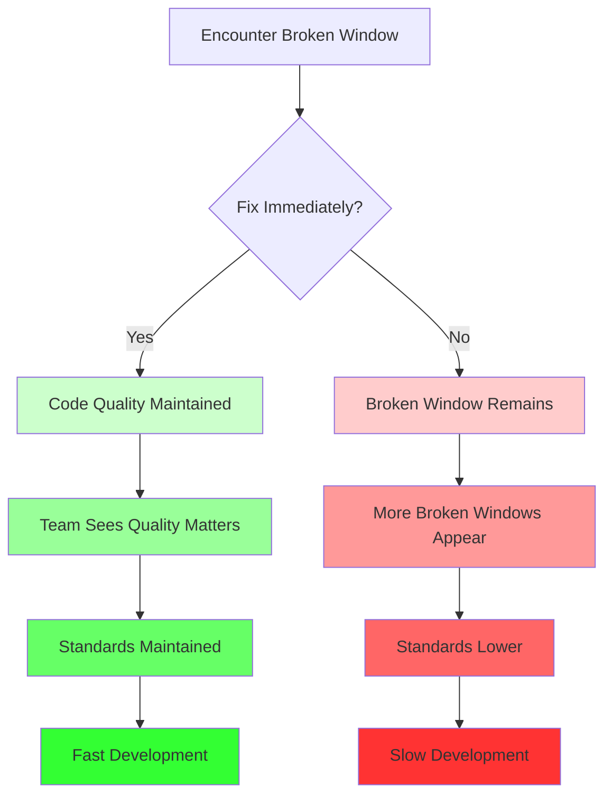

# The Solution: Fixing Broken Windows

The solution to the Broken Window Principle is straightforward: **fix problems immediately and prevent new ones from appearing**.

## The Core Strategy

1. **Fix problems as you encounter them**
2. **Don't introduce new broken windows**
3. **Establish and maintain standards**
4. **Create a culture of quality**

## Strategy 1: Fix Problems Immediately

When you encounter a broken window, fix it right away:

### During Development

```java
// You're working on a feature and see this:
public void processOrder(Order order) {
    if (order.getTotal() > 1000) {  // Magic number!
        applyDiscount(order);
    }
}

// Fix it immediately:
public void processOrder(Order order) {
    private static final double DISCOUNT_THRESHOLD = 1000.0;
    
    if (order.getTotal() > DISCOUNT_THRESHOLD) {
        applyDiscount(order);
    }
}
```

**Rule:** If you touch code with a broken window, fix it.

### During Code Review

```java
// Code being reviewed has a TODO:
public void createUser(User user) {
    // TODO: Add validation
    saveUser(user);
}

// Don't approve it. Request a fix:
// "Please add validation before approving. Let's not leave TODOs in the code."
```

**Rule:** Don't approve code with broken windows.

### During Refactoring

```java
// You're refactoring and discover dead code:
public class UserService {
    public void oldCreateUser(User user) {  // Never called
        // 50 lines of code
    }
    
    public void createUser(User user) {
        // Current implementation
    }
}

// Remove the dead code:
public class UserService {
    public void createUser(User user) {
        // Current implementation
    }
}
```

**Rule:** Clean up related problems you discover.

## Strategy 2: Don't Introduce New Broken Windows

Be disciplined about not creating new problems:

### Write Clean Code from the Start

```java
// Good: Clean code
public class OrderProcessor {
    private static final double DISCOUNT_THRESHOLD = 1000.0;
    
    public void processOrder(Order order) {
        if (order.getTotal() > DISCOUNT_THRESHOLD) {
            applyDiscount(order);
        }
        saveOrder(order);
    }
}

// Bad: Creating a broken window
public class OrderProcessor {
    public void processOrder(Order order) {
        if (order.getTotal() > 1000) {  // Magic number - broken window!
            applyDiscount(order);
        }
        saveOrder(order);
    }
}
```

### Complete Your Work

```java
// Bad: Leaving TODOs
public void createUser(User user) {
    // TODO: Add validation
    saveUser(user);
}

// Good: Complete implementation
public void createUser(User user) {
    validateUser(user);
    saveUser(user);
}

private void validateUser(User user) {
    if (user == null) {
        throw new IllegalArgumentException("User cannot be null");
    }
    if (user.getEmail() == null || user.getEmail().isEmpty()) {
        throw new IllegalArgumentException("User email is required");
    }
}
```

## Strategy 3: Establish and Maintain Standards

Create clear standards and enforce them:

### Coding Standards

Define and document:
- **Naming conventions** - camelCase, PascalCase, etc.
- **Formatting rules** - Indentation, spacing, line length
- **Code structure** - Method length, class organization
- **Documentation** - When and how to document code

### Tools to Enforce Standards

- **Linters** - Automatically catch style violations
- **Formatters** - Automatically format code consistently
- **Pre-commit hooks** - Prevent committing code that violates standards
- **CI/CD checks** - Fail builds if standards aren't met

### Example: Using a Linter

```java
// Linter catches this:
public void processOrder(Order order) {
    if (order.getTotal() > 1000) {  // Warning: Magic number
        applyDiscount(order);
    }
}

// Developer fixes it:
public void processOrder(Order order) {
    private static final double DISCOUNT_THRESHOLD = 1000.0;
    
    if (order.getTotal() > DISCOUNT_THRESHOLD) {
        applyDiscount(order);
    }
}
```

## Strategy 4: Create a Culture of Quality

Build a team culture that values quality:

### Lead by Example

- Fix broken windows you encounter
- Write clean code
- Don't approve code with problems
- Take time to do things right

### Encourage Others

- Praise clean code in code reviews
- Thank teammates for fixing problems
- Share knowledge about best practices
- Make quality a team value

### Make It Easy

- Provide tools and automation
- Create clear guidelines
- Offer training and resources
- Remove barriers to quality

## Strategy 5: Regular Maintenance

Schedule time for maintenance:

### Code Cleanup Sessions

Dedicate time to:
- Removing dead code
- Fixing code smells
- Resolving TODOs
- Improving documentation

### Refactoring Sprints

Periodically:
- Refactor problematic areas
- Improve code structure
- Update dependencies
- Modernize code patterns

## The "Boy Scout Rule": The Antidote

The solution to the Broken Windows Theory is often cited as the **Boy Scout Rule**, popularized in *The Pragmatic Programmer*:

> **"Always leave the code better than you found it."**

This rule is the antidote to the psychological drift toward FLUID. By fixing small problems immediately, you signal to the rest of the team: **"We care about quality here."** This stops the entropy and prevents the FLUID principles from taking over.

### The Rule in Practice

Every time you work on code:
- **Fix at least one problem** you encounter (a bad variable name, a magic number, a TODO)
- **Improve at least one thing** (extract a method, add a constant, improve naming)
- **Don't make it worse** (don't add new broken windows)

### Examples of Applying the Rule

#### Example 1: Fixing a TODO

```java
// You're adding a new feature to this class:
public class UserService {
    public void createUser(User user) {
        // TODO: Add validation  // Broken window!
        saveUser(user);
    }
}

// Apply the Boy Scout Rule:
public class UserService {
    public void createUser(User user) {
        validateUser(user);  // Fixed the broken window!
        saveUser(user);
    }
    
    private void validateUser(User user) {
        if (user == null) {
            throw new IllegalArgumentException("User cannot be null");
        }
    }
}
```

#### Example 2: Fixing Bad Naming

```java
// You encounter this while working on a feature:
public class OrderProcessor {
    public void process(Order data) {  // 'data' is a broken window!
        // Process order
    }
}

// Apply the Boy Scout Rule:
public class OrderProcessor {
    public void process(Order order) {  // Fixed the naming!
        // Process order
    }
}
```

#### Example 3: Fixing a Compiler Warning

```java
// You see a compiler warning:
public class UserService {
    public void createUser(User user) {
        String name = user.getName();  // Warning: unused variable
        saveUser(user);
    }
}

// Apply the Boy Scout Rule:
public class UserService {
    public void createUser(User user) {
        // Removed unused variable - fixed the warning!
        saveUser(user);
    }
}
```

### How the Boy Scout Rule Prevents FLUID

By fixing broken windows immediately, you prevent the slide into FLUID:

- **Prevents Fused Responsibilities (F)** - Fixing mixed concerns early keeps classes focused
- **Prevents Limitless Modification (L)** - Fixing direct changes encourages proper extension
- **Prevents Unreliable Subtypes (U)** - Fixing exception-throwing methods maintains contracts
- **Prevents Inflated Interfaces (I)** - Fixing fat interfaces keeps them focused
- **Prevents Direct Dependencies (D)** - Fixing hardcoded dependencies encourages injection

**The key:** Each small fix reinforces SOLID principles and prevents FLUID from taking hold.

## Balancing Act

The principle doesn't mean:

- **Perfectionism** - Don't refactor everything you touch
- **Feature freeze** - Don't stop development for cleanup
- **Analysis paralysis** - Don't overthink every decision

It means:

- **Fix what you see** - Address problems in code you're working on
- **Don't add problems** - Write clean code from the start
- **Maintain standards** - Keep the codebase consistent
- **Be practical** - Balance quality with delivery

## Visualizing the Solution



## Summary

To fix broken windows:

1. **Fix problems immediately** - Don't let them accumulate
2. **Don't introduce new problems** - Write clean code from the start
3. **Establish standards** - Create and enforce coding standards
4. **Build quality culture** - Make quality a team value
5. **Regular maintenance** - Schedule time for cleanup
6. **Follow the Boy Scout Rule** - Leave code better than you found it

By following these strategies, you maintain code quality and prevent the downward spiral of technical debt.

