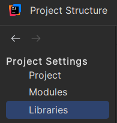
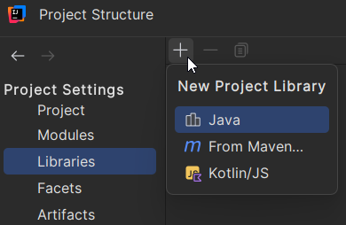
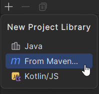
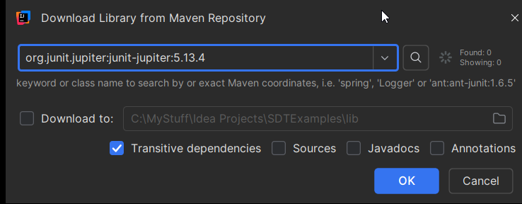

# Setting Up JUnit 5 in IntelliJ (Built-in Compiler)

This setup uses IntelliJ's built-in project system, not Gradle or Maven.

## Step 1: Open Project Structure

In IntelliJ:


Go to **File -> Project Structure...**


Open the **Libraries** section.



## Step 2: Add JUnit 5 Library


Click **+** to add a library.  



Choose **From Maven...**  



Input the JUnit Jupiter (for example `org.junit.jupiter:junit-jupiter:5.13.4`, at the time of writing, or google latest version). Searching will not do anything, not for me at least. Slightly inconvenient! So, just click <kbd>OK</kbd>.



When you have clicked <kbd>OK</kbd>, you should see another prompt asking you to select the module you want to add the library to:


Click <kbd>OK</kbd>.

Even though this says "From Maven", you are only downloading the library jars into IntelliJ's project settings. You are still using IntelliJ's built-in compiler setup.

<!-- SCREENSHOT: Add library dialog showing junit-jupiter dependency -->

## Step 3: Verify Imports Work

Create a temporary class and type:

```java
import org.junit.jupiter.api.Test;
```

If IntelliJ resolves the import with no error, setup is complete.


