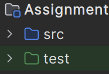
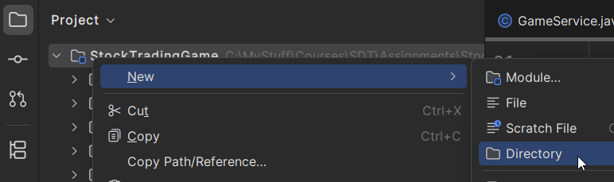
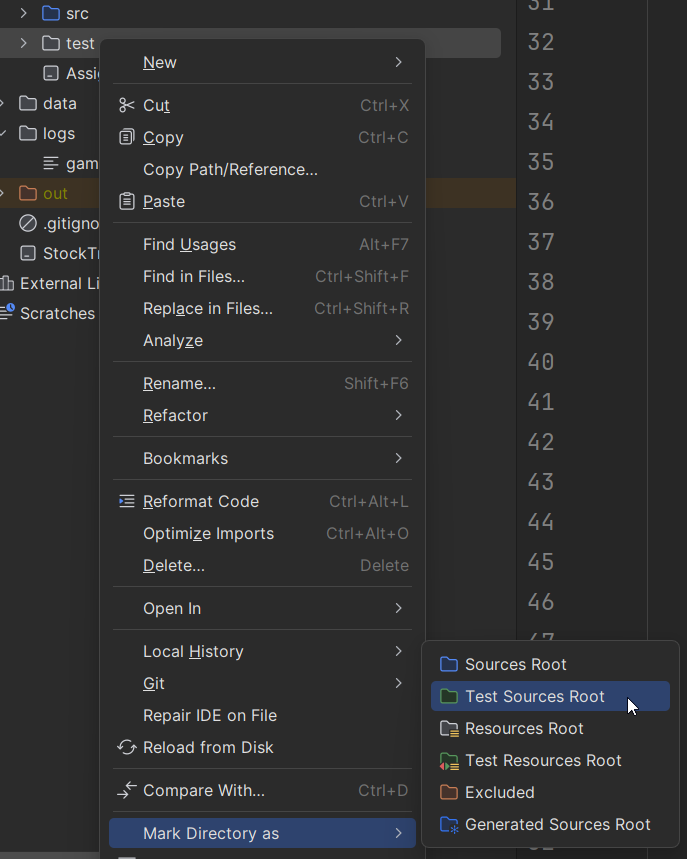

# Adding a Test Folder

JUnit tests should live in a dedicated test source folder, separate from your main code.

A common layout is:

```
src/
  ...
test/
  ...
```

Your src folder will have one color, while the test folder will have another color (commonly green, but depends on your theme).



## Create the Folder

In IntelliJ, create `src/test` if it does not already exist, under your module.  



Right-click the folder.  



Choose **Mark Directory as -> Test Sources Root**.

<!-- SCREENSHOT: Context menu with Mark Directory as Test Sources Root -->

When marked correctly, IntelliJ treats classes in that folder as test code and enables JUnit run icons.

## Why This Matters

- Keeps test code separate from production code.
- Helps IntelliJ discover and run tests automatically.
- Avoids accidental mixing of test-only dependencies in main code.
