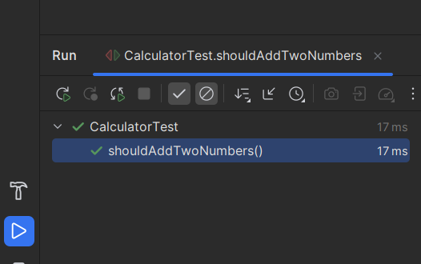
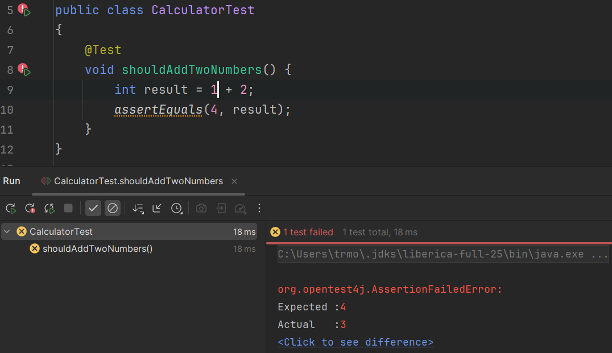
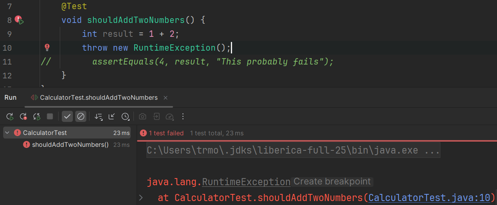

# Your First Test Class

Now create a simple test class in `test`.

## Example Test Class

Notice we import packages from the `junit.jupiter.api`.  
The first one is the for the `@Test` annotation.  
The second one is a _static import_ for the `assertEquals` method. If you don't make the import static, you will have to prefix the method call with the class name, i.e. `Assertions.assertEquals(4, result);`. The static import is a bit more convenient.

The test method is annotated with `@Test`. This tells JUnit that this method is a test method, to be run by the test runner.

The method name is `shouldAddTwoNumbers`. This is a good naming convention for test methods. It tells what the test is doing. 

The method body is a simple calculation, and the `assertEquals` method is used to verify the result.

If the result is not as expected, the test will fail, and the test is marked as red.


```java
import org.junit.jupiter.api.Test;

import static org.junit.jupiter.api.Assertions.assertEquals;

public class CalculatorTest {

    @Test
    void shouldAddTwoNumbers() {
        int result = 2 + 2;
        assertEquals(4, result);
    }
}
```

## Run the Test

Click the green run icon next to the test method or class.


Notice the single green arrow next to the test method. Clicking this play arrow, will run _only_ this test method.

Next to the class, you can see two green arrows, overlapping. Clicking this icon will run _all_ the test methods in the class.

You may also right click anywhere under your test folder structure, and select "Run all tests", or "Run tests in ...". This will run all tests under the selected folder. It allows you to run _all_ your tests, or just a subset, if you are focusing on a specific part of the code.

When running the tests, you should see a tab pane at the bottom of IntelliJ, showing the test results.



- A **green** result means pass.
- A **Yellow** result means an assertion failed.
- A **Red** result means an exception was thrown.

When you have many tests, organized by folders, you will see this tree structure as well, in the tests tab pane.\
If any test failed, all parent folders will be marked as yellow, until the root folder is reached. This easily allows you to navigate to the failing test.


## What a Failing Test Looks Like

If you change the assert to `assertEquals(5, result)`, the test fails.

When an assertion failes, you get some extra information about the test, and the assertion that failed:



Most assert methods have an overload which allows you to provide a custom message, to be displayed in case of failure.

```java
@Test{3}
void shouldAddTwoNumbers() {
    int result = 1 + 2;
    assertEquals(4, result, "This probably fails");
}
```

This message is one of the most important debugging clues when a test fails.

## Breaking code

If you have a failure in your code, and get an unexpected exception thrown, the test is colored red. This indicates an error, not a failed assertion.

