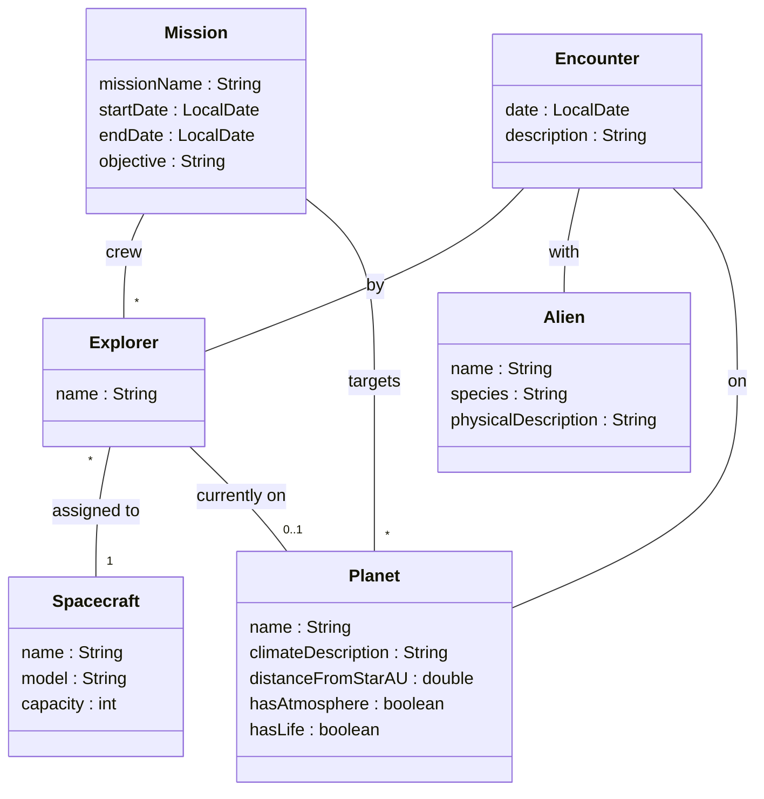

# The Case: Space Explorer System

Throughout this learning path, we'll use a **Space Explorer** system as our running example. This system tracks space exploration missions, the explorers who undertake them, the spacecraft they use, the planets they visit, and the alien life forms they encounter. Yes, I am reusing an old classic.

## The Domain

The Space Explorer system manages the following entities:

| Entity | Description |
|--------|-------------|
| **Planet** | Celestial bodies that can be explored. Each planet has characteristics like climate, distance from its star, and whether it has an atmosphere or life. |
| **Alien** | Extraterrestrial life forms that explorers might encounter. Each alien belongs to a species and has physical characteristics. |
| **Explorer** | Human space explorers who travel to planets and make discoveries. Each explorer is assigned to a spacecraft and may be on a planet. |
| **Spacecraft** | Vehicles used for space travel. Each spacecraft has a name, model, and passenger capacity. |
| **Mission** | Organized exploration expeditions. A mission has a crew of explorers and targets specific planets to visit. |
| **Encounter** | Records of meetings between explorers and aliens. Documents when, where, and what happened during the encounter. |

## Domain Model

Here is a rough sketch of the domain model showing all entities and their relationships. 

## Understanding the Relationships

Let's break down what each relationship means:

### Explorer → Spacecraft
An explorer is **assigned to** a spacecraft. This is their "home base" vehicle for missions. One spacecraft can have multiple explorers assigned to it.

### Explorer → Planet
An explorer can be **currently on** a planet. This tracks their physical location during exploration.

### Mission → Explorer (crew)
A mission has a **crew** of explorers. Multiple explorers work together on a mission. An explorer could potentially be part of multiple missions over time.

### Mission → Planet (targets)
A mission **targets** specific planets to visit and explore. A single mission might visit several planets.

### Encounter → Explorer, Alien, Planet
An encounter records that a specific **explorer** met a specific **alien** **on** a specific **planet**. It's a record of an event that links three entities together.

## The Challenge

Currently, our domain model shows the attributes and relationships, but it's missing something crucial: **How do we uniquely identify each entity?**

- If two missions are both called "Deep Space Survey", how do we tell them apart?
- When an Encounter references an Explorer, how exactly does it "point to" that explorer?
- If we save a Mission to a file and load it later, how do we reconnect it to its crew members?

These are the questions we'll answer in the following pages. We'll add **primary keys** to identify each entity, and **foreign keys** to create the links between them. These two concepts are discussed in detail in your database course, but we need to visit them here, as we are now working with entities in our domain model.

## Using This Case

Throughout this learning path, we'll use different parts of this domain to illustrate concepts:

- **Primary Keys**: We'll add IDs to `Planet` and `Spacecraft`
- **Foreign Keys**: We'll show how `Explorer` links to `Spacecraft`, and how `Mission` links to its crew
- **Finding by ID**: We'll implement lookups for planets and resolving mission crews

Let's begin by understanding what primary keys are and why we need them.

