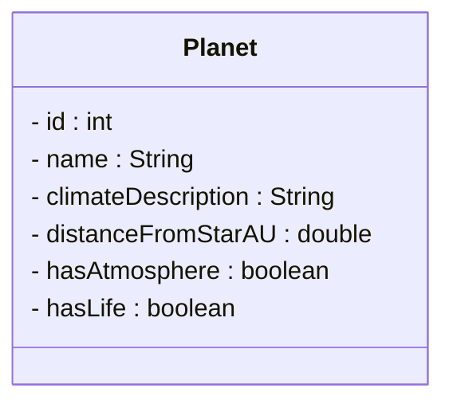

# Primary Keys

A **primary key** is an attribute that uniquely identifies each instance of an entity. No two instances can have the same primary key value.

## Characteristics of a Primary Key

A good primary key has these properties:

| Property | Description |
|----------|-------------|
| **Unique** | No two entities can have the same key value |
| **Immutable** | The key value never changes once assigned |
| **Non-null** | Every entity must have a key value |
| **Simple** | Preferably a single attribute (not a combination) |

Most of the time, we just use an auto-incremented integer as the primary key. But sometimes the real world provides us with an obvious identifier, like an ISBN number for a book.

## Types of Primary Keys

There are two main approaches to choosing a primary key:

### Natural Keys

A **natural key** is an attribute that already exists in the real world and naturally identifies the entity.

Examples:
- **ISBN** for books (International Standard Book Number)
- **CPR number** for Danish citizens
- **VIN** for vehicles (Vehicle Identification Number)
- **Email address** for user accounts (sometimes)

**Advantages:**
- Meaningful to humans
- Already exists, no need to generate

**Disadvantages:**
- May change (email addresses change, companies rebrand)
- May not be truly unique (duplicate ISBNs exist due to errors)
- May be sensitive data (CPR numbers shouldn't be exposed)
- May not exist for all entities (not all products have barcodes)

If your selected primary key falls into one of the disadvantages, you should not use it, and instead read below.

### Surrogate Keys

A **surrogate key** is an artificial identifier created specifically to serve as the primary key. It has no business meaning.

Examples:
- Auto-incremented integers: 1, 2, 3, 4, ...
- UUIDs: `550e8400-e29b-41d4-a716-446655440000`
- Random strings: `abc123xyz`

**Advantages:**
- Guaranteed unique (system controls generation)
- Never needs to change
- Simple and consistent across all entities
- No sensitive data concerns

**Disadvantages:**
- No inherent meaning
- Requires storage overhead (it's an extra field in the entity)

## Which Should You Use?

For most applications, **surrogate keys are recommended**. Here's why:

1. **Consistency** - Every entity gets an ID the same way
2. **Stability** - IDs never change, even if business data changes
3. **Simplicity** - Just an integer, easy to work with
4. **Privacy** - No sensitive data in the key

Natural keys can be useful as **secondary identifiers** (for lookups), but the primary key should typically be a surrogate.

For example, you may have a forum app, where each user has a unique username. But they are allowed to change their username. Most of your code will probably just use the username for lookups, like "look at the profile for user with username 'johndoe'". But you should still include a surrogate key to ensure the entity's history is preserved.

An attribute that is unique, but not the primary key, is called an **alternate key**.

## Back to Our Case: Planet

In the Space Explorer system, consider the `Planet` entity:

```
Planet
├── name: "Kepler-442b"
├── climateDescription: "Temperate"
├── distanceFromStarAU: 0.4
├── hasAtmosphere: true
└── hasLife: false
```

**Why not use `name` as the primary key?**

1. Two planets might have the same name (discovered independently by different agencies)
2. A planet might be renamed after discovery
3. A planet might not have a name yet ("Unknown Planet #47")

**Solution: Add a surrogate key**

```
Planet
├── id: 1                        ← Primary Key
├── name: "Kepler-442b"
├── climateDescription: "Temperate"
├── distanceFromStarAU: 0.4
├── hasAtmosphere: true
└── hasLife: false
```

Now we can uniquely identify this planet as "Planet 1", regardless of what its name is or whether it changes.

## Primary Keys in UML

In UML class diagrams, we typically show the primary key as the first attribute. And generally give it the name `id`.



Some conventions mark the primary key with `{PK}` or underline it, but for simplicity, we'll just put it first and use `id` as the name.

## Summary

- A **primary key** uniquely identifies each entity instance
- **Natural keys** come from the real world but can be problematic
- **Surrogate keys** are artificial IDs that we control
- For most Java applications, use **auto-incremented integers** as surrogate keys
- Always put the `id` field first in your class

Next, we'll see how to implement primary keys in Java code.

