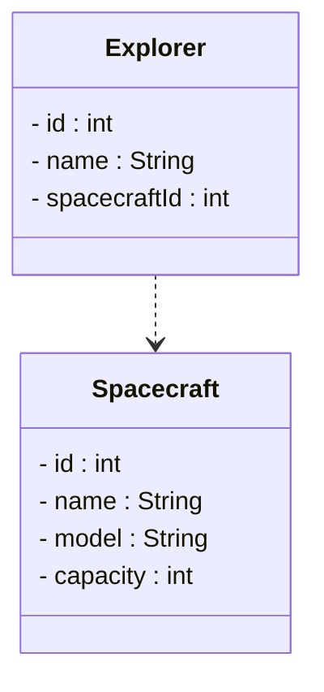

# Foreign Keys

Now that each entity has a primary key, we can create relationships between entities. A **foreign key** is a field in one entity that references the primary key of another entity.

## The Concept

Think of a foreign key as a "pointer" or "reference" to another entity, but instead of pointing directly to the object, it stores the ID of that object.

On previous semester we used associations to create relationships between entities. And while these are still valid in Object Oriented Design, and sometimes great for your domain entities, they cannot easily be converted to the storage model, of either a database or a file (which we will use).

**Foreign keys**

A foreign key is a field in one entity that references the primary key of another entity. That's it. One entity references another entity. 

**Real-world analogy:**

Your exam paper doesn't contain your entire student record. Instead, it has your **student ID** written on it. The examiner can use that ID to look up your full record in the student system.

- Your student ID on the exam paper = **foreign key**
- Your full record in the student database = **referenced entity**
- Your student ID in the database = **primary key**

## Visualizing Foreign Keys

Let's look at how an `Explorer` relates to a `Spacecraft`:

**Without foreign keys (object reference, association):**

Here, one object "includes" the other object. We have a group or cluster of objects, commonly known as an object graph. Imagine multiple real world objects tied together with a string. You pull on one object, and all objects are pulled along.

```
Explorer object                    Spacecraft object
┌─────────────────┐               ┌─────────────────┐
│ name: "Neil"    │               │ id: 1           │
│ spacecraft: ───────────────────>│ name: "Apollo"  │
└─────────────────┘               │ model: "CSM"    │
                                  └─────────────────┘
```

**With foreign keys:**

With foreign keys, we do not have that "string", there is no association, your objects do not actually know about each other. The object graph is broken. Instead, each object just has a little label to tell you which other object it is "imaginarily" tied to (in databases this is enforced, but not in your Java code).

```
Explorer object                    Spacecraft object
┌─────────────────┐               ┌─────────────────┐
│ id: 1           │               │ id: 1           │
│ name: "Neil"    │               │ name: "Apollo"  │
│ spacecraftId: 1 │ ─ ─ ─ ─ ─ ─ ─ │ model: "CSM"    │
└─────────────────┘               └─────────────────┘
```

The `spacecraftId` value `1` **refers to** the Spacecraft with `id = 1`. It's an indirect reference through the ID.

## Why Use Foreign Keys?

You might wonder: "Why not just store the actual object reference?"

In pure Java with objects in memory, you often **do** store object references. But foreign keys become essential when:

### 1. Persistence (Saving to Files/Databases)

When you save data to a file, you can't save an object reference - it's just a memory address. Instead, you save the ID:

```
// File: explorers.txt
1,Neil,1
2,Buzz,1

// File: spacecraft.txt  
1,Apollo,CSM,3
```

When loading, you use the foreign key (spacecraftId = 1) to reconnect the Explorer to the correct Spacecraft.

### 2. Large Data Sets

If you have millions of records, keeping all objects in memory isn't practical. Foreign keys let you load only what you need.

This code illustrates how we load a single specific mission, and then _only_ load the explorers that are part of that mission.

```java
// Load just the mission
Mission mission = loadMission(5);

// Later, if needed, resolve the crew
for (int explorerId : mission.getCrewIds()) 
{
    Explorer e = loadExplorer(explorerId);
    // process explorer...
}
```

## Foreign Keys in Our Case

Let's see where foreign keys appear in the Space Explorer domain:

### Explorer → Spacecraft

An explorer is assigned to a spacecraft:

```
Explorer
├── id: 1
├── name: "Neil Armstrong"
└── spacecraftId: 1          ← new attribute, foreign key to Spacecraft
```

### Mission → Explorers (One-to-Many)

A mission has multiple crew members:

```
Mission
├── id: 1
├── missionName: "Apollo 11"
├── objective: "Moon landing"
└── crewIds: [1, 2, 3]       ← Foreign keys to Explorers
```

### Encounter → Explorer, Alien, Planet

An encounter references three different entities:

```
Encounter
├── id: 1
├── date: "1969-07-20"
├── description: "First contact..."
├── explorerId: 1            ← Foreign key to Explorer
├── alienId: 5               ← Foreign key to Alien
└── planetId: 3              ← Foreign key to Planet
```

## UML Notation

In UML, when using foreign keys, we show the ID field explicitly and can indicate the relationship:



In this diagram `spacecraftId` is a foreign key that references the `id` field of the `Spacecraft` entity.

The arrow shows the _conceptual_ relationship, and the `spacecraftId` field is the foreign key that implements it.

## Naming Convention

A common convention for foreign key field names:

| Related Entity | Foreign Key Field |
|----------------|-------------------|
| Spacecraft | spacecraftId |
| Planet | planetId |
| Explorer | explorerId |
| Alien | alienId |

Simply take the entity name (lowercase) and append `Id`.

For collections (one-to-many):
- `crewIds` (list of explorer IDs)
- `targetPlanetIds` (list of planet IDs)