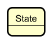
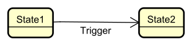
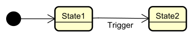
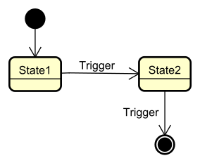
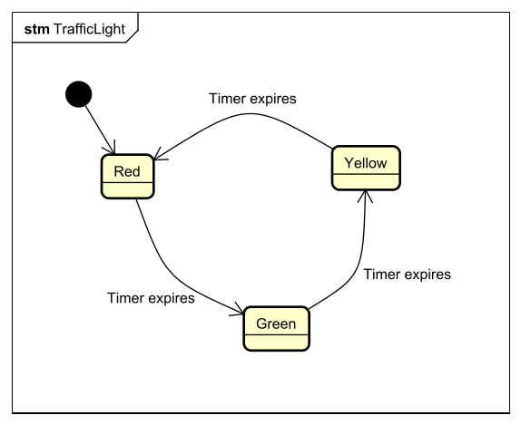
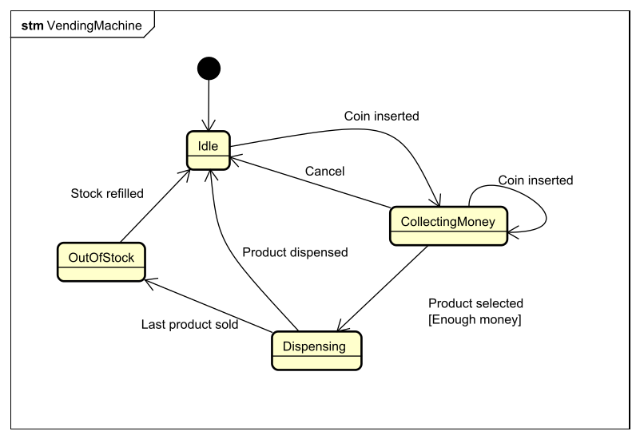
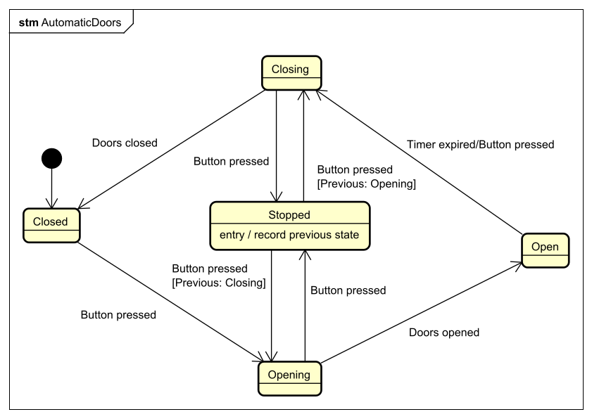

# State Diagrams

State diagrams (also called state machine diagrams or statecharts) are a visual way to represent state machines. They show the states an entity can be in and how it transitions between them.

## What is a State Diagram?

A **state diagram** is a UML diagram that visualizes a state machine. It shows:

- **States** - Represented as rounded rectangles
- **Transitions** - Represented as arrows between states
- **Events** - Labels on transitions that trigger the change
- **Initial state** - A filled circle showing where the entity starts
- **Final state** - A circle with a filled center showing where the entity can end (optional)

## Basic Notation

### States

States are represented as **rounded rectangles** with the state name inside:

A state represents a condition or situation that an entity can be in. The entity can _only be in one state at a time_.

### Transitions

Transitions are represented as **arrows** connecting states:

The arrow shows that the entity can move from State1 to State2. The arrow is usually labeled with the event or condition that triggers the transition.

### Initial State

The **initial state** is shown as a **filled circle** with an arrow pointing to the first state:

This indicates where the entity starts when it's first created.

### Final State

A **final state** (_if applicable_) is shown as a **circle with a filled center**:

This indicates a state where the entity's lifecycle ends. Not all state machines have final states.

Not all state machines have a final state!

## Example: Traffic Light

Let's create a state diagram for a traffic light:

This shows:
- The traffic light starts in the **Red** state
- It transitions to **Green** when the timer expires
- It transitions to **Yellow** when the timer expires
- It transitions back to **Red** when the timer expires
- The cycle repeats

## Example: Door Lock

Here's a state diagram for a door lock:

This shows:
- The door starts **Locked**
- It becomes **Unlocked** when a key is inserted and turned
- It becomes **Locked** again when the key is turned to the lock position
- The door can reach a final state when opened (if we consider the door being removed as the end)

## Example: Simple Vending Machine

Here's a more complex example - a simple vending machine:

This shows:
- The machine starts **Idle**
- When a coin is inserted, it moves to **CollectingMoney**
- It can stay in **CollectingMoney** if more coins are inserted, or cancel to return to **Idle**
- When enough money is collected and a product is selected, it moves to **Dispensing**. Notice the guard condition `[enough money]` on the transition.
- After dispensing, it returns to **Idle**
- The user can cancel from **CollectingMoney**, returning to **Idle**
- The machine can be **OutOfStock** and return to **Idle** when refilled

## Example: Automatic garage door

Here's a state diagram for an automatic garage door:

This shows:

- The door starts **Closed**
- It opens when the button is pressed, i.e. the door is  opening.
- When open, the doors will begin closing either when the timer expires, or when the button is pressed again.
- If the doors are opening or closing, pressing the button will stop this. Pressing the button again will reverse the direction of the door movement.

Notice again the guard conditions.

Also notice the Stopped state, it has an "entry action" to record which state we came from. When entering this state, we record the state we came from. This is required to figure out which direction the door should move in when the button is pressed again. Actions are covered in details on a later page.

## Example: Super Mario
Characters in games often have states. For example, a rough state diagram for Super Mario can be:

## Drawing State Diagrams

When creating a state diagram:

1. **Identify all states** - List all possible conditions the entity can be in
2. **Identify the initial state** - Determine where the entity starts
3. **Identify transitions** - Determine how the entity moves between states
4. **Label transitions** - Add events or conditions that trigger transitions
5. **Check for completeness** - Ensure all valid transitions are shown
6. **Check for invalid transitions** - Make sure impossible transitions are not included
