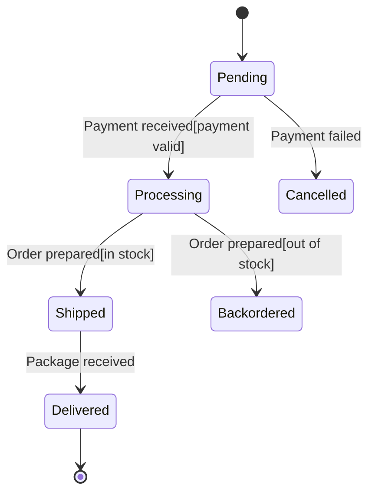

# Guards

Guards are an advanced feature of state machines that add **conditions** to transitions.  
Even if an event happens, the transition only occurs if the guard condition is satisfied.

## What is a Guard?

A **guard** is a boolean condition that must be true for a transition to occur.

- If the guard is **true**, the transition is allowed.
- If the guard is **false**, the transition is **blocked** and the state does not change.

The event still happens, but the state machine decides whether to move to a new state based on the guard.

### Guard Characteristics

- **Boolean condition** – Guards evaluate to true or false.
- **Prevents transitions** – If the guard is false, the transition does not occur.
- **Event still occurs** – The event happens, but the state stays the same.
- **Explicit conditions** – Guards make the requirements for transitions clear and visible.

## Guard Notation

In state diagrams, guards are written in **square brackets** after the event name:

```
State1 ──── Event[Guard] ───> State2
```

This means:

> When `Event` occurs **and** `Guard` is true, transition from `State1` to `State2`.

If the event occurs but the guard is false, the transition is not taken and the state machine remains in `State1`.


## Example: Order with Guards

Guards are also useful in order processing systems.

Imagine an order that should only move to **Processing** if the payment is valid:



Here we have several guards:

- `Payment received[payment valid]`
  - Only move from `Pending` to `Processing` if the payment is valid.
- `Order prepared[in stock]`
  - Only move from `Processing` to `Shipped` if the items are in stock.
- `Order prepared[out of stock]`
  - If the items are not in stock, move to `Backordered` instead.

The same event (`Order prepared`) can lead to **different target states** depending on which guard is true.

## Why Guards Are Useful

Guards help you:

- **Control transitions** – Only allow transitions when certain conditions are met.
- **Express business rules** – Encode domain rules directly in the state machine.
- **Avoid invalid behavior** – Prevent transitions when preconditions are not satisfied.
- **Keep diagrams readable** – Instead of adding many extra states, you can use guards to express conditions.