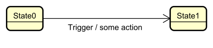
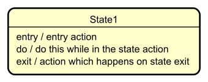
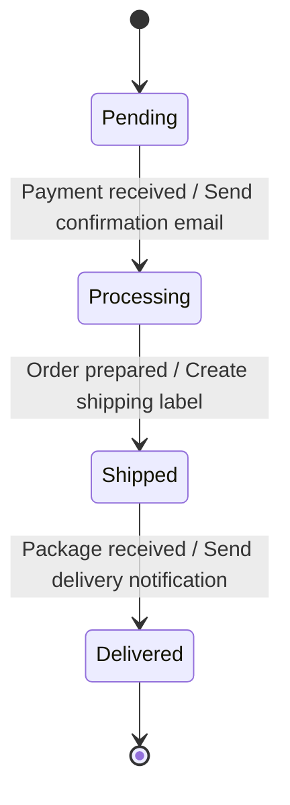
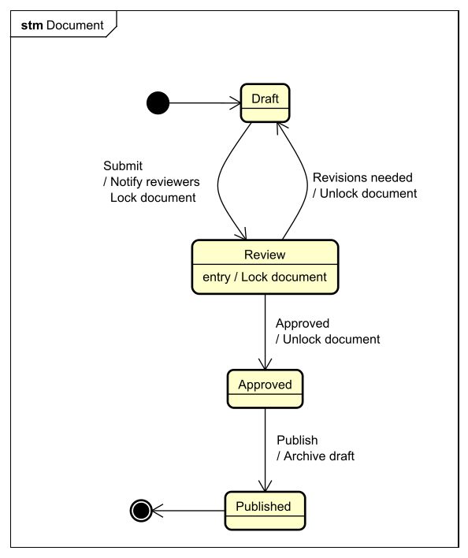
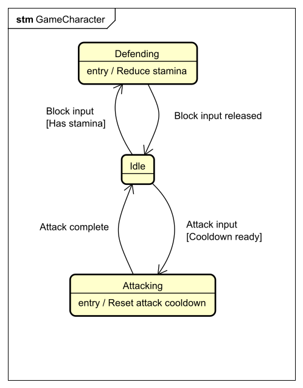

# Actions

Actions are an advanced feature of state machines that add **behavior** to transitions and states.\
They describe **what happens** when a transition occurs or when a state is entered or exited.

## What is an Action?

An **action** is an operation or behavior that occurs:

- **During a transition** from one state to another, or
- **When entering** a state, or
- **When leaving** a state.

Actions do **not** decide whether the transition is allowed – that is the job of **guards**.  
Actions describe what the state machine **does** when a transition or state change happens.

## Types of Actions

There are three common types of actions:

1. **Transition actions** – Occur during the transition between states.
2. **Entry actions** – Occur when entering a state.
3. **Exit actions** – Occur when leaving a state.
4. **Continuous actions** – Occur continuously while in a state.

## Action Notation

In state diagrams, actions are written after a **forward slash** on transitions:



For entry and exit actions, we write them inside the state:



- `entry / ...` – Runs when the state is entered.
- `do / ...` – Runs continuously while in the state.
- `exit / ...` – Runs when the state is left.

## Transition Actions

A **transition action** is an action that occurs during the move from one state to another.

### Example: Order Processing with Transition Actions



**Actions:**

- When transitioning to `Processing`: **Send confirmation email**  
  (e.g., notify the customer that the payment was received.)

- When transitioning to `Shipped`: **Create shipping label**  
  (e.g., generate label for the package.)

- When transitioning to `Delivered`: **Send delivery notification**  
  (e.g., inform the customer that the package has arrived.)

These actions occur **as part of the transition** between states.

## Entry Actions

An **entry action** runs automatically whenever a state is entered, no matter which transition led to that state.

### Example: Document Workflow with Entry Actions



**Entry actions for `Review` state:**

- **Lock document** – Prevents editing while the document is under review.

These actions run **every time** the document enters the `Review` state, regardless of which transition brought it there.

## Exit Actions

An **exit action** runs automatically whenever a state is left, regardless of which transition is taken.

### Example: Game Character with Exit Actions



**Exit actions:**

- Leaving `Attacking`: **Reset attack cooldown**  
  (Ensures the character cannot attack again immediately.)

- Leaving `Defending`: **Reset defense stamina**  
  (Restores or updates defense-related values.)

These actions run whenever the character leaves the given state, no matter which target state it goes to.

## Combining Guards and Actions

Actions are often used together with **guards**:

```
State1 ──── Event[Guard] / Action ───→ State2
```

- The **guard** controls **whether** the transition is allowed.
- The **action** describes **what** happens if the transition occurs.

## When to Use Actions

Use actions when you need to:

- Perform **side effects** (send emails, update logs, trigger other systems).
- Show **notifications** or messages to users.
- Handle **resource management** (allocate or release resources).
- Do **initialization** when entering a state.
- Do **cleanup** when leaving a state.
- Keep behavior **close to the states and transitions** that cause it.

## Summary

- **Actions** describe what happens during transitions or when entering/leaving states.
- **Transition actions** run while moving from one state to another.
- **Entry actions** run every time a state is entered.
- **Exit actions** run every time a state is left.
- **Do actions** run continuously while in a state.
- Actions can be combined with guards to create clear, expressive state machine behavior.

Together with guards, actions make state machines not only describe **where** an entity can go, but also **what happens** along the way.