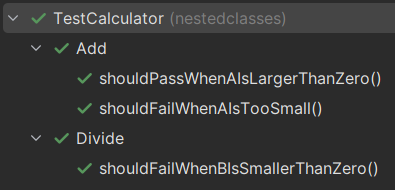

# Nested classes as organization

Nested classes can be used to organize tests into logical groups. This is useful when you have a lot of tests, and you want to be able to easily find the tests you are looking for.

It also organizes the test runner view according to the nested structure.

Here is a basic example:

```java
public class TestCalculator
{
    @Nested 
    class Add
    {
        @Test
        public void shouldFailWhenAIsTooSmall(){
        }

        @Test
        public void shouldPassWhenAIsLargerThanZero(){
        }

        //.. more tests for Add
    }

    @Nested 
    class Divide
    {
        @Test
        public void shouldFailWhenBIsSmallerThanZero(){
        }

        //.. more tests for Divide
    }
}
```

Here, I have a class, `TestCalculator`, which will contain unit tests for the `Calculator` class.

I then create a nested class, `Add`, which will contain unit tests for the `add` method of the `Calculator` class.

And another nested class, `Divide`, which will contain unit tests for the `divide` method of the `Calculator` class.

I could further nest classes inside `Add` for success and failure scenarios, or something else.

The output then organizes the tree accordingly:



I have personally played a bit with this approach, but did not really find the right structure.