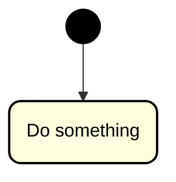

# The start

Every activity diagram must have a start. 

> There should be _exactly one_ start.

This is represented by a black circle, with an arrow leading to the first activity.

```mermaid
flowchart TD
    Start((( ))) --> A(Do something)

    classDef activityBox fill:#ffffe0,stroke:#000000,stroke-width:2px,color:#000000,rx:10,ry:10
    class A activityBox
    
    style Start fill:#000000,stroke:#000000
```
