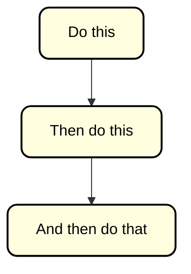

# Sequence

A sequence is multiple activities, or steps, one after another. You draw them as arrows, from one activity to the next.

1) Do this
2) Then do this
3) And then do that

And here is the diagram, which shows the sequence of activities.

