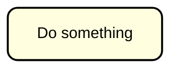
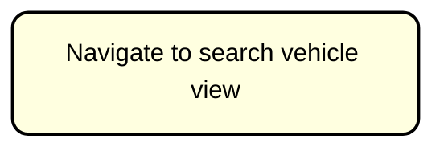

# The activity itself

Any activity (single step, or action) is in a box, with the (short!) description of the activity inside.

Here is an activity, which shows that the user does something.

Here is an activity, which shows that the user navigates to a search vehicle view.

So, an activity is a box with a description inside.