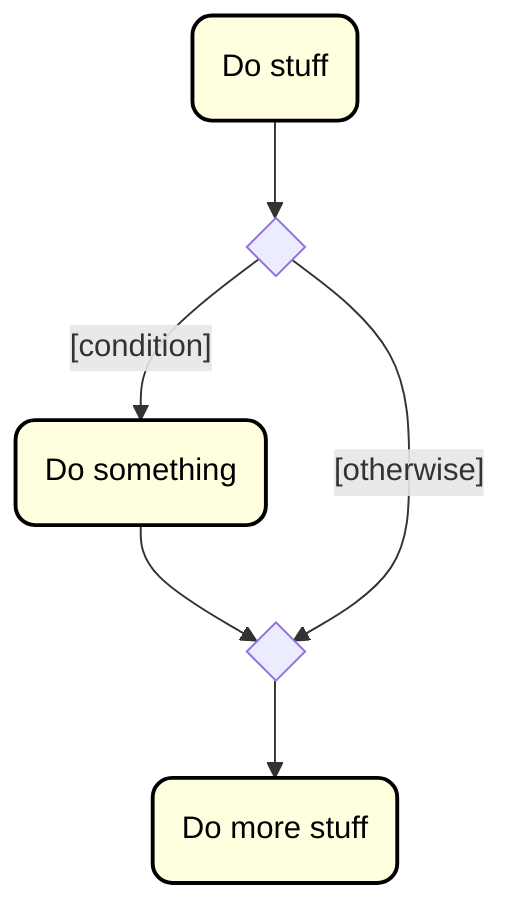

# Single selection (if)

This represents what you know from Java as an if-statement: Conditionally do something. If the condition is true, do something. If the condition is false, don't do that something.

In Java it could look like this:

```java
// do stuff
if (condition) {
    // do something
}
// do more stuff
```

Or in a textual form:

1) Do stuff
2) If condition is true, do something
3) Do more stuff

And finally, in the diagram. This branching is drawn as a diamond, with at least two arrows coming out of it. 

We put the condition inside brackets `[ ]`, close to the arrow that represent the true branch. You generally put something like `[otherwise]` on the other arrow, which means "if the condition is false".

It looks like this:




