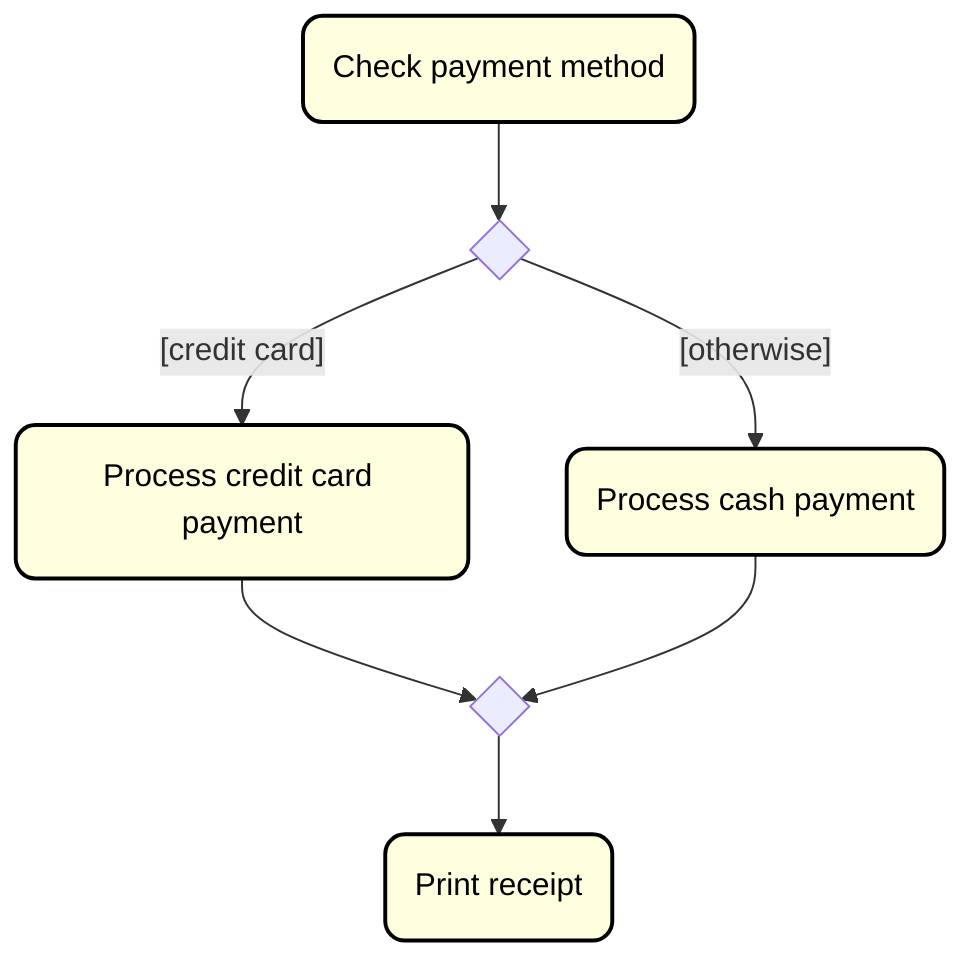

# The double selection (if-else)

This represents an if-else situation. Where the preivous pages was about conditionally doing _something_, or skipping that _something_, we are now doing _this thing_ or _that thing_.

In Java it is an if-else statement.

And in a UML activity diagram, it is a diamond, with two arrows coming out of it. We put the condition inside brackets `[ ]`, close to the arrow that represent the true branch. You generally put something like `[otherwise]` on the other arrow, which means "if the condition is false". This time the `[otherwise]` just goes to another activity.

Here is an example:

