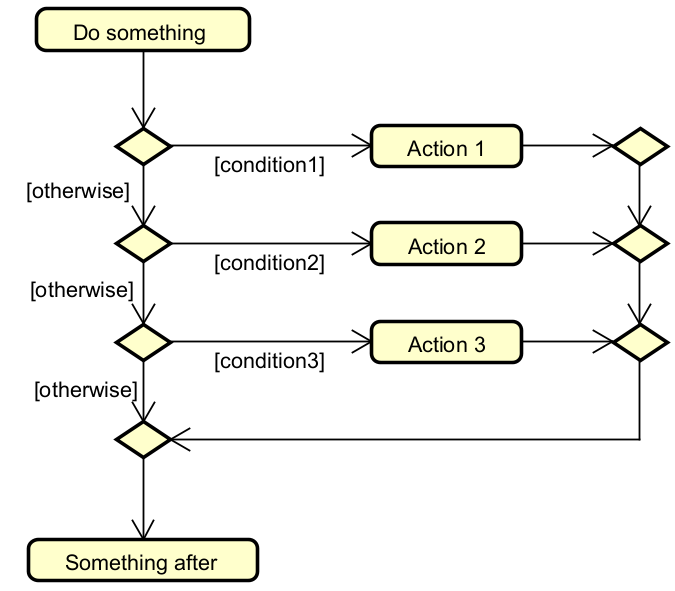

# Multiple selection (switch)

This is a way to represent something like a switch, or several if-elseif-elseif-else statements. 

We do this by chaining several diamonds after each other. It is not super pretty, but it works.

Here is a generalized example:

