# Repetition (loops)

Repetitions in Java is done wih some type of loop, for, while, do-while, or for-each.

We can also represent loops in a UML activity diagram.

We represent the loop with the selection diamond, and the loop action as an activity box.

Here is an example:

```mermaid
%%{init: {'flowchart': {'curve': 'stepAfter'}}}%%
flowchart TD
    Start((( ))) --> A(Do something)
    A --> B{ }
    B -- "[condition]" --> C(Loop action)
    C --> B
    B -- "[otherwise]" --> D(Outside loop action)

    classDef activityBox fill:#ffffe0,stroke:#000000,stroke-width:2px,color:#000000,rx:10,ry:10
    class A,C,D activityBox
    style Start fill:#000000,stroke:#000000
```

So, after each "Loop action", we go back to the selection, and check the condition again. If the condition is true, we do the loop action again. If the condition is false, we do the outside loop action.

This was a "pre-test" loop. First the condition is checked, and if it is true, the loop action is executed.

How would you do a "post-test" loop? Where the loop action is executed first, and then the condition is checked? That's left as an exercise for the reader.