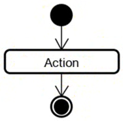

# The end node

Every activity diagram must have an end. I would prefer a single end node, but I guess you _can_ have multiple end nodes.

They are represented as a black dot (i.e. the start node) with a black circle around it.

Like this:

