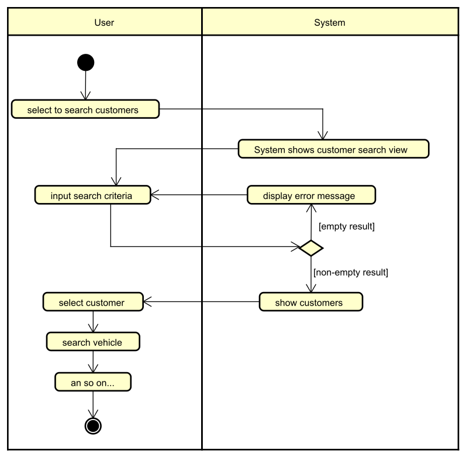

# Swimlanes

The last part of this learning path is about swimlanes. These are optional, use them when it makes sense.

Remember from use case descriptions, we also had swimlanes in the main sequence, to clarify the user's action, and the system's reaction.

You can do something similar in an activity diagram, create two vertical columns (or horizontal rows) to separate the different "lanes".

Then place the nodes in the appropriate lane.

Here is an example:

